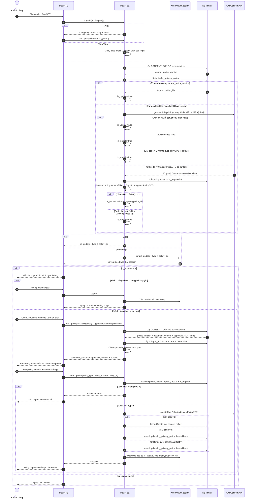

# TÀI LIỆU ĐẶC TẢ YÊU CẦU CHỨC NĂNG

**Giải pháp cập nhật và quản lý Consent khách hàng trên Imuzik**

Biểu mẫu rút gọn - áp dụng cho yêu cầu thay đổi/nâng cấp chức năng trên hệ thống đang vận hành.

| Thông tin | Nội dung |
|---|---|
| Tên yêu cầu / dự án | Cập nhật và quản lý Consent khách hàng trên Imuzik |
| Phiên bản | 1.1 |
| Ngày ban hành | 05/10/2026 |
| PIC | SơnLH21 |
| Trạng thái | Baseline phát triển - cập nhật sau review Dev |

## 1. Lịch sử thay đổi

| Ngày | Phiên bản | PIC | Phạm vi thay đổi | Mô tả |
|---|---|---|---|---|
| 05/10/2026 | 1.0 | SơnLH21 | Toàn bộ tài liệu | Ban hành baseline giải pháp Consent Imuzik để triển khai FE/BE/DB và tích hợp CM |
| 05/10/2026 | 1.1 | SơnLH21 | Mục 2-5 | Cập nhật sau review Dev: chuẩn hóa mã lỗi; phân tách xác thực App và Web/Wap; cập nhật popup nhóm tuổi theo design; bổ sung menu xem lại chính sách; chốt `log_privacy_policy` tại DB `imuzik`; chuẩn hóa cấu trúc Phụ lục dạng JSON string |

## 2. Thông tin tổng quan

### 2.1 Hiện trạng và mục tiêu thay đổi

Imuzik hiện có module xác nhận chính sách gồm các API `GET policy/check-policy`, `GET policy/list-policy`, `POST policy/policy` và bảng `policy`. Luồng hiện tại sử dụng dữ liệu tại `vt_member` để quyết định trạng thái popup.

Yêu cầu mới cập nhật luồng Consent theo hướng:

- Imuzik tự quản lý version, Văn bản Consent, Phụ lục và rule điều khoản tại DB Imuzik.
- CM là hệ thống tích hợp để kiểm tra/lưu 06 giá trị Consent theo số thuê bao.
- Trạng thái Consent local được quản lý tại `log_privacy_policy`; không sử dụng `vt_member.is_update_policy`/`vt_member.policy_id` làm source of truth cho luồng mới.
- Văn bản Consent gồm 01 nội dung HTML dùng chung và 02 Phụ lục tương ứng nhóm tuổi; mỗi Phụ lục được lưu dưới dạng JSON string.
- Khách hàng tự xác nhận nhóm tuổi bằng các button trên popup **Xác minh người dùng** trước khi tải nội dung Consent.
- App thực hiện kiểm tra Consent qua API bằng `token`; Web/Wap sử dụng session, thực hiện kiểm tra một lần ngay sau đăng nhập và layout chỉ đọc kết quả trong session.
- Bổ sung điểm truy cập trên menu để khách hàng xem lại chính sách đã Consent; `GET policy/check-policy` trả thêm `type` và danh sách policy đã Consent để phục vụ hiển thị.
- Imuzik quyết định việc hiển thị popup/cho phép tiếp tục đăng nhập; không sử dụng `consent`, `displayConsent`, `systemType` của CM để quyết định nghiệp vụ.

### 2.2 Phạm vi

**Trong phạm vi**

- Web, Wapsite và App Imuzik.
- Đăng nhập bằng số điện thoại.
- Kiểm tra có cần Consent khi đăng nhập:
  - App: FE gọi `GET policy/check-policy` bằng `token` sau khi đăng nhập thành công.
  - Web/Wap: BE thực hiện logic kiểm tra một lần ngay sau đăng nhập, lưu kết quả vào session; layout không gọi/retry API `check-policy` bằng token.
- Chọn nhóm tuổi: `type=0` từ 16 tuổi trở lên; `type=1` dưới 16 tuổi.
- Button **Không phải bây giờ** tại popup xác minh người dùng: thực hiện logout và quay lại màn hình đăng nhập.
- Hiển thị Văn bản Consent, Phụ lục theo nhóm tuổi và danh sách 06 điều khoản.
- Lưu lựa chọn Consent tại CM và `log_privacy_policy` local.
- Quản lý `current_policy_version` tại Imuzik.
- Hiển thị menu để khách hàng xem lại chính sách đã Consent ở chế độ chỉ xem.

**Ngoài phạm vi**

- Đăng nhập Google/Facebook và các kênh ngoài Web/Wap/App Imuzik.
- CMS quản trị Văn bản Consent/Phụ lục.
- Thu thập hoặc xác minh thông tin người giám hộ cho khách hàng dưới 16 tuổi.
- Chức năng thay đổi hoặc rút Consent sau khi đăng nhập.
- Cơ chế đồng bộ bù CM khi SAVE CM thất bại nhưng Consent local đã được ghi nhận.

### 2.3 Thuật ngữ viết tắt

| STT | Thuật ngữ | Mô tả |
|---:|---|---|
| 1 | Imuzik FE | Frontend Website/Wapsite/App Imuzik |
| 2 | Imuzik BE | Backend Imuzik xử lý nghiệp vụ Consent |
| 3 | CM | Hệ thống quản lý tập trung dữ liệu Consent |
| 4 | Consent | Xác nhận/lựa chọn của khách hàng đối với các mục đích xử lý dữ liệu cá nhân |
| 5 | `current_policy_version` | Version Consent hiện hành do Imuzik quản lý |
| 6 | `policy_version` | Version Consent được ghi nhận tại thời điểm khách hàng xác nhận |
| 7 | Policy bắt buộc | Policy active có `is_required=1`; khách hàng bắt buộc Consent để được tiếp tục |
| 8 | `policy.name` | Key nghiệp vụ/tích hợp tương ứng trực tiếp với 06 field Consent của CM |
| 9 | `type` | Nhóm tuổi: `0` từ 16 tuổi trở lên; `1` dưới 16 tuổi |
| 10 | Session Web/Wap | Phiên đăng nhập phía Web/Wap dùng để lưu trạng thái `is_update` và dữ liệu Consent phục vụ layout/menu |

### 2.4 Tài liệu tham khảo

| STT | Tài liệu | Mục đích sử dụng |
|---:|---|---|
| 1 | PYC cập nhật Văn bản Consent Imuzik | Nguồn yêu cầu nghiệp vụ Imuzik |
| 2 | PYC-64913 - API CM kiểm tra/lưu Consent | Contract và xử lý tích hợp CM |
| 3 | Văn bản chấp thuận xử lý và bảo vệ dữ liệu cá nhân tại VTT | Nội dung Văn bản Consent và 06 mục đích xử lý dữ liệu |
| 4 | API/FE Consent MyClip | Tham chiếu cơ chế version, local log, nội dung HTML và Phụ lục |
| 5 | API xác nhận chính sách.xml | Hiện trạng API Imuzik |
| 6 | FE xác nhận chính sách.xml | Hiện trạng FE Imuzik |

### 2.5 Thành phần thay đổi

| Thành phần | Xử lý |
|---|---|
| `GET policy/check-policy` | Reuse endpoint cho App; response bổ sung `type`, `policy_ids`. Web/Wap không gọi endpoint này bằng token từ layout mà chạy cùng logic kiểm tra ngay sau login và lưu kết quả vào session |
| `GET policy/list-policy` | Reuse endpoint; bổ sung `type`; App xác thực bằng token, Web/Wap xác thực theo session; trả Văn bản Consent HTML, Phụ lục JSON string theo `type` và danh sách policy active |
| `POST policy/policy` | Reuse endpoint; bổ sung `type`, `policy_version`; App xác thực bằng token, Web/Wap xác thực theo session; validate version/policy bắt buộc, gọi `updateCustPolicy`, sau đó ghi `log_privacy_policy` |
| Popup xác minh người dùng | Cập nhật theo design: 02 button nhóm tuổi và action **Không phải bây giờ**; không có radio/button **Tiếp tục** |
| Menu Chính sách | Bổ sung điểm truy cập để khách hàng xem lại chính sách đã Consent; không cho phép thay đổi/rút Consent trong phạm vi tài liệu |
| `policy` | Reuse bảng hiện tại; dùng `name`, `description`, `is_required`, `is_editable`, `is_active`, `sortorder` |
| `CONSENT_CONFIG` | Quản lý `policy_version`, Văn bản Consent, 02 Phụ lục dạng JSON string và trạng thái current/active |
| `log_privacy_policy` | Bổ sung tại DB `imuzik` để lưu snapshot Consent local theo user/MSISDN/version/type |
| `vt_member.is_update_policy`, `vt_member.policy_id` | Không sử dụng làm source of truth cho nghiệp vụ Consent mới |

### 2.6 Nguyên tắc giải pháp

- `policy.id` là khóa kỹ thuật dùng trong API; `policy.name` là key mapping CM; `sortorder` chỉ xác định thứ tự Điều khoản 1-6.
- `is_required` xác định điều khoản bắt buộc; `is_editable` chỉ xác định trạng thái tick mặc định trên FE. Chi tiết xử lý kỹ thuật giá trị field do Dev triển khai theo cấu trúc hiện tại.
- `CONSENT_CONFIG` có 01 Văn bản Consent HTML dùng chung và 02 Phụ lục theo `type`; mỗi Phụ lục lưu trong một field dưới dạng JSON string gồm `title`, `warning`, `parent_content`, `confirm_content`.
- BE chọn đúng Phụ lục theo `type` và trả nguyên chuỗi `appendix_content`; FE parse JSON string để render.
- App dùng `token`; Web/Wap dùng session. Layout Web/Wap chỉ đọc trạng thái Consent từ session, không gọi/retry `GET policy/check-policy`.
- `GET policy/check-policy` trả thêm `type`, `policy_ids` để phục vụ chức năng xem lại chính sách.
- `policy_version` trả tại `GET policy/list-policy` phải được FE gửi lại khi `POST policy/policy`; BE kiểm tra version này vẫn là version current trước khi lưu Consent.
- `policy_version` được xác lập khi INSERT bản ghi `CONSENT_CONFIG` mới; UPDATE bản ghi hiện tại không tự tăng version.
- Local log cùng `current_policy_version` được công nhận là đã hoàn tất Consent mà không đối chiếu lại `confirm_ids`.
- `getCustPolicy` và `updateCustPolicy` tuân thủ rule retry/fallback mô tả tại Mục 3.

## 3. Yêu cầu về chức năng

### 3.1 UC01 - Kiểm tra và xác nhận Consent khi đăng nhập Imuzik

#### 3.1.1 Mô tả chung

| Thông tin | Nội dung |
|---|---|
| Actor chính | Khách hàng đăng nhập Imuzik bằng số điện thoại |
| Mục đích / Mô tả | Kiểm tra dữ liệu Consent hiện có, đối chiếu với rule/version của Imuzik và yêu cầu khách hàng xác nhận lại khi chưa đáp ứng |
| Hệ thống thực hiện | Imuzik FE, Imuzik BE, session Web/Wap, DB Imuzik, CM |
| Trigger | Khách hàng đăng nhập thành công bằng số điện thoại |
| Điều kiện đầu vào | Imuzik xác định được user/MSISDN; hệ thống đọc được cấu hình Consent hiện hành |
| Điều kiện đầu ra thành công | Khách hàng đáp ứng rule Consent hiện hành và tiếp tục vào Home |
| Điều kiện đầu ra chưa xác nhận | Khách hàng nhấn **Không phải bây giờ** → logout và quay lại màn hình đăng nhập |
| Điều kiện đầu ra không thành công | Không cho vào Home khi khách hàng chưa đáp ứng rule bắt buộc hoặc API/hệ thống Imuzik trả lỗi không thuộc case fallback đã mô tả |
| Link Figma | N/A |

#### 3.1.2 Sơ đồ luồng Sequence Diagram



#### 3.1.3 Mô tả luồng xử lý

##### 3.1.3.1 Mapping API Imuzik hiện tại vào luồng mới

| Bước nghiệp vụ | API/DB sử dụng | Xử lý chính | Thay đổi so với hiện trạng |
|---|---|---|---|
| Kiểm tra có cần Consent | App: `GET policy/check-policy`; Web/Wap: logic check sau login; `CONSENT_CONFIG`; `log_privacy_policy`; CM `getCustPolicy` | Lấy `current_policy_version` → check local log → chỉ gọi CM khi chưa có log hoặc local khác version → xác định `is_update`, `type`, `policy_ids` | Web/Wap không gọi API bằng token; lưu kết quả vào session để layout sử dụng |
| Chọn nhóm tuổi | Popup **Xác minh người dùng** | KH bấm trực tiếp button `16 tuổi trở lên` hoặc `Dưới 16 tuổi`; bấm **Không phải bây giờ** thì logout | Không dùng radio/button **Tiếp tục** |
| Lấy Văn bản, Phụ lục và điều khoản | `GET policy/list-policy?type=...`; `CONSENT_CONFIG`; bảng `policy` | Lấy Văn bản HTML → chọn Phụ lục JSON string theo `type` → lấy policy active theo `sortorder` → trả dữ liệu cho FE | FE parse `appendix_content`; App dùng token, Web/Wap dùng session |
| Xác nhận Consent | `POST policy/policy`; CM `updateCustPolicy`; `log_privacy_policy` | Validate `policy_version` + policy bắt buộc → build 06 field CM → SAVE CM → ghi local log | Không gọi `getCustPolicy` lần 2 trước SAVE; Web/Wap xóa cờ `is_update` trong session khi thành công |
| Xem lại chính sách | Menu **Chính sách**; dữ liệu `type`, `policy_ids` từ check/session; `GET policy/list-policy` | Hiển thị Văn bản/Phụ lục và các policy đã Consent ở chế độ chỉ xem | Không cho thay đổi/rút Consent trong phạm vi hiện tại |

**Nguyên tắc chung**

- `policy.name` lưu trực tiếp key CM và được dùng để mapping field trong `custPolicyDTO`.
- `policy.sortorder` xác định thứ tự Điều khoản 1-6 và thứ tự hiển thị.
- `is_required` xác định policy khách hàng bắt buộc phải Consent để được đi tiếp.
- `is_editable` chỉ xác định trạng thái mặc định tick của policy trên FE; không tham gia quyết định `is_update`.
- `CONSENT_CONFIG.document_content` là 01 Văn bản Consent HTML dùng chung cho cả 02 nhóm tuổi.
- `CONSENT_CONFIG.appendix_type_0_content` và `appendix_type_1_content` lưu Phụ lục dưới dạng JSON string; BE trả nguyên chuỗi tương ứng dưới field `appendix_content`, FE thực hiện parse để hiển thị.
- App xác thực API bằng `token`; Web/Wap xác định user bằng session.
- Không sử dụng `is_required_display` hoặc `policy_key`.
- `consent`, `displayConsent`, `systemType` từ CM không dùng để quyết định nghiệp vụ Imuzik trong phạm vi hiện tại.

##### Bước 1 - Imuzik FE/BE: Kiểm tra Consent sau khi đăng nhập

Sau khi khách hàng đăng nhập thành công bằng số điện thoại, hệ thống thực hiện kiểm tra Consent theo từng kênh.

###### Bước 1.1 - App: FE gọi API kiểm tra Consent

**API**

```http
GET policy/check-policy
```

**Request**

| Field | Bắt buộc | Nguồn | Mô tả |
|---|---:|---|---|
| `token` | Có | API `authenticate/index` | Token xác thực người dùng; BE sử dụng để xác định user/MSISDN |
| `authorization_code` | Không | Cơ chế authorization hiện tại | Giữ theo contract API hiện tại |

Ví dụ:

```http
GET policy/check-policy?token=<token>&authorization_code=<authorization_code>
```

FE không tự đánh giá trạng thái Consent. Toàn bộ logic xác định `is_update`, `type`, `policy_ids` được xử lý tại Imuzik BE ở Bước 2.

###### Bước 1.2 - Web/Wap: Kiểm tra Consent theo session

Sau khi đăng nhập thành công, Imuzik BE thực hiện **một lần** logic kiểm tra Consent tại Bước 2 và lưu kết quả vào session Web/Wap:

- `is_update`;
- `type`;
- `policy_ids`.

Layout Web/Wap chỉ đọc trạng thái trong session để quyết định hiển thị popup; **không gọi `GET policy/check-policy` bằng token và không thực hiện retry API từ layout**.

Rule retry khi Imuzik BE tích hợp CM tại Bước 2.3 vẫn giữ nguyên.

##### Bước 2 - Imuzik BE: Xử lý kiểm tra Consent

###### Bước 2.1 - Lấy cấu hình Consent hiện hành từ DB

Bổ sung bảng `CONSENT_CONFIG` theo mô tả tại mục 4.1.3 để quản lý version, Văn bản Consent và Phụ lục.

Imuzik BE thực hiện:

1. Query bản ghi `CONSENT_CONFIG` đang `is_current=1` và `status=active`.
2. Lấy `policy_version` của bản ghi này và gán nội bộ thành `current_policy_version`.
3. Nếu lỗi truy vấn DB **hoặc truy vấn thành công nhưng không tồn tại cấu hình current/active** → coi là lỗi cấu hình/hệ thống, dừng xử lý và trả `errorCode=000001`.

**Output nội bộ**

```text
current_policy_version = <CONSENT_CONFIG.policy_version của bản ghi current>
```

###### Bước 2.2 - Kiểm tra `log_privacy_policy`

Bảng `log_privacy_policy` được lưu tại DB `imuzik` theo mô tả tại mục 4.1.4.

Imuzik BE thực hiện kiểm tra thông tin Consent của user:

- **TH1: Không tồn tại bản ghi của user đăng nhập:**
  - User chưa từng thực hiện Consent tại Imuzik → chuyển Bước 2.3 để gọi CM kiểm tra Consent tập trung.

- **TH2: Có bản ghi và `log_privacy_policy.policy_version = current_policy_version`:**
  - User đã thực hiện Consent version mới nhất tại Imuzik.
  - Xác định `is_update=false`.
  - Lấy `type = log_privacy_policy.type`.
  - Lấy `policy_ids` từ `log_privacy_policy.confirm_ids`.

- **TH3: Có bản ghi và `log_privacy_policy.policy_version != current_policy_version`:**
  - User chưa thực hiện Consent version mới nhất tại Imuzik → chuyển Bước 2.3 để gọi CM kiểm tra Consent tập trung.
  - Giữ `type` của bản ghi local gần nhất để phục vụ thông tin hiển thị nếu cần; không dùng `confirm_ids` cũ để quyết định `is_update`.

###### Bước 2.3 - Thực hiện gọi hàm `getCustPolicy` bên CM

**API**

```soap
getCustPolicy
```

**Request**

```text
isdn = <MSISDN của user đang đăng nhập>
```

**Response**

CM trả response SOAP, Imuzik chỉ sử dụng các dữ liệu sau cho luồng kiểm tra Consent:

```json
{
  "code": "0",
  "description": "success",
  "custPolicyDTO": {
    "provideProduct": "1",
    "supportCustomer": "1",
    "improveQuality": "1",
    "marketingAdvertising": "0",
    "researchMarket": "0",
    "tradePromotion": "0",
    "createDatetime": "2026-10-02T15:02:49+07:00"
  }
}
```

**Xử lý kết quả gọi CM**

1. `code = 0` và `custPolicyDTO` có dữ liệu:
   - Lấy danh sách `policy.name` thỏa mãn:
     - `policy.is_active = 1`;
     - `policy.is_required = 1`.
   - Đối chiếu từng `policy.name` với field cùng tên trong `custPolicyDTO` do CM trả về.
   - Nếu tất cả các field tương ứng đều có giá trị `1`:
     - Xác định User đã Consent đầy đủ các điều khoản bắt buộc.
     - Response `is_update=false`.
   - Nếu có ít nhất một field tương ứng có giá trị khác `1` hoặc không có giá trị:
     - Xác định User chưa Consent đầy đủ các điều khoản bắt buộc.
     - Response `is_update=true`.
   - `custPolicyDTO.createDatetime` tạm thời giữ lại để phục vụ đánh giá rule reconcile/version; không sử dụng để quyết định `is_update` trong phạm vi tài liệu này.

2. `code = 0` nhưng `custPolicyDTO` không có dữ liệu (`null`/rỗng):
   - Xác định User chưa Consent đầy đủ các điều khoản bắt buộc.
   - Response `is_update=true`.

3. CM trả `code != 0`:
   - Xác định User chưa Consent đầy đủ các điều khoản bắt buộc.
   - Response `is_update=true`.

4. Timeout/lỗi server/lỗi kết nối:
   - Retry tối đa 3 lần gọi `getCustPolicy`.
   - Nếu trong quá trình retry nhận được response từ CM thì xử lý theo mục 1, 2 hoặc 3 tương ứng.
   - Nếu sau 3 lần vẫn lỗi kỹ thuật thì xác định `is_update=false`.

**Dữ liệu bổ sung phục vụ response/menu Chính sách**

- Nếu xác định `is_update=false` từ local log cùng version → `type` và `policy_ids` lấy từ `log_privacy_policy`.
- Nếu xác định `is_update=false` từ dữ liệu CM → `policy_ids` được mapping từ các policy active có field CM tương ứng bằng `1`; `type` lấy từ local log gần nhất nếu có, nếu chưa từng có local log thì trả `null`.
- Nếu fallback `is_update=false` do CM lỗi kỹ thuật sau 3 lần và không có local log → `type=null`, `policy_ids=[]`.
- Không tự suy diễn `type` từ dữ liệu CM.

**Các mã `code != 0` CM đã xác định trong luồng chỉ truyền `isdn`**

| Code CM | Description |
|---|---|
| `PYC_62335_1` | `Phải truyền một trong hai tham số isdn hoặc idNo` |
| `PYC_62335_3` | `Thuê bao không tồn tại hoặc không hoạt động trên hệ thống` |
| `PYC_62335_5` | `Không tìm thấy thông tin giấy tờ của khách hàng` |

`PYC_62335_2` và `PYC_62335_4` chỉ phát sinh khi truyền `idNo`/`idType`, không thuộc request Imuzik hiện tại.

##### Bước 3 - Imuzik BE/FE: Trả kết quả kiểm tra Consent

###### Bước 3.1 - App: Response `GET policy/check-policy` thành công

**Response**

```json
{
  "errorCode": "000000",
  "message": "Successful",
  "data": {
    "is_update": false,
    "type": 0,
    "policy_ids": [1, 2, 3]
  }
}
```

Trong đó:

- `is_update=false`: khách hàng đã đáp ứng điều kiện Consent hiện hành → FE không hiển thị popup, tiếp tục luồng đăng nhập/Home.
- `is_update=true`: cần thực hiện luồng Consent → chuyển Bước 4, FE hiển thị popup **Xác minh người dùng**.
- `type`: nhóm tuổi đã được ghi nhận tại local log; có thể `null` nếu chưa có dữ liệu nhóm tuổi local.
- `policy_ids`: danh sách `policy.id` đã Consent được xác định từ local log hoặc mapping dữ liệu CM theo Bước 2.3.

###### Bước 3.2 - Web/Wap: Lưu kết quả vào session

Imuzik BE lưu `is_update`, `type`, `policy_ids` vào session sau khi hoàn tất Bước 2.

- Layout đọc `is_update` trong session để quyết định hiển thị popup.
- Không gọi/retry `GET policy/check-policy` từ layout.
- Khi khách hàng xác nhận Consent thành công, hệ thống xóa cờ `is_update` trong session và cập nhật `type`, `policy_ids` theo Consent vừa lưu.

###### Bước 3.3 - Response lỗi của API App hiện tại

Các response dưới đây áp dụng cho trường hợp App gọi `GET policy/check-policy`.

| `errorCode` | `message` | Trường hợp | Xử lý FE |
|---|---|---|---|
| `000001` | `Hệ thống đang bận, vui lòng thử lại sau.` | Lỗi kết nối/xử lý DB Imuzik | Hiển thị lỗi hệ thống; không tiếp tục luồng Consent |
| `000003` | `Unknown method` | Gọi sai HTTP method, khác `GET` | Hiển thị lỗi kỹ thuật/không tiếp tục xử lý |
| `300002` | `Invalid authorization code` | Có truyền `authorization_code` nhưng không hợp lệ/hết hiệu lực | Dừng xử lý; thực hiện lại cơ chế authorization theo luồng hiện tại |
| `000002` | `Require login.` | Không truyền `token`/không có thông tin đăng nhập hợp lệ | Yêu cầu đăng nhập lại |
| `000008` | `Token không hợp lệ.` | `token` không tồn tại hoặc hết hiệu lực | Yêu cầu đăng nhập lại |

Web/Wap xử lý trạng thái đăng nhập theo session hiện tại; không phát sinh lỗi token từ layout.

##### Bước 4 - Imuzik FE: Hiển thị popup Xác minh người dùng

Khi kết quả kiểm tra Consent xác định `is_update=true`, FE hiển thị popup theo design **Xác minh người dùng**.

**Nội dung hiển thị**

- Tiêu đề: **Xác minh người dùng**.
- Nội dung hướng dẫn: **"Vui lòng xác nhận người dùng. Đối với trẻ em dưới 16 tuổi cần có sự đồng ý của cha, mẹ, người giám hộ về việc xử lý dữ liệu cá nhân khi sử dụng dịch vụ Imuzik. Đối với người bị mất/hạn chế năng lực hành vi dân sự vui lòng ra các cửa hàng của Viettel để được hỗ trợ."**

| Thành phần | Giá trị nghiệp vụ | Xử lý |
|---|---|---|
| **16 tuổi trở lên** | `type=0` | Khách hàng bấm button → FE ghi nhận `type=0` và chuyển ngay Bước 5 |
| **Dưới 16 tuổi** | `type=1` | Khách hàng bấm button → FE ghi nhận `type=1` và chuyển ngay Bước 5 |
| **Không phải bây giờ** | Không ghi nhận `type` | Logout khách hàng và quay lại màn hình đăng nhập |

**Xử lý tại FE**

- Không sử dụng radio chọn nhóm tuổi.
- Không có button **Tiếp tục**.
- Việc bấm một trong hai button nhóm tuổi đồng thời là thao tác chọn `type` và tiếp tục lấy nội dung Consent.
- Khi bấm **Không phải bây giờ**:
  - Web/Wap: kết thúc session đăng nhập;
  - App: thực hiện logout theo cơ chế hiện tại;
  - điều hướng về màn hình đăng nhập;
  - không cho khách hàng tiếp tục vào Home trong phiên đăng nhập hiện tại.

##### Bước 5 - Imuzik FE: Gọi API lấy Văn bản Consent và danh sách policy

Sau khi khách hàng bấm một trong hai button nhóm tuổi tại Bước 4, FE gọi API lấy Văn bản Consent, Phụ lục và danh sách policy tương ứng.

**API**

```http
GET policy/list-policy
```

**Request**

| Field/Context | App | Web/Wap | Mô tả |
|---|---|---|---|
| `type` | Bắt buộc | Bắt buộc | `0`: từ 16 tuổi trở lên; `1`: dưới 16 tuổi |
| `token` | Bắt buộc | Không truyền | App dùng token từ `authenticate/index`; Web/Wap xác định user theo session |
| `authorization_code` | Không bắt buộc | Theo cơ chế hiện tại nếu có | Giữ theo contract hiện tại |

Ví dụ App:

```http
GET policy/list-policy?type=0&token=<token>&authorization_code=<authorization_code>
```

Ví dụ Web/Wap:

```http
GET policy/list-policy?type=0
```

Request Web/Wap sử dụng session đăng nhập hiện tại để xác định user.

##### Bước 6 - Imuzik BE: Xử lý lấy Văn bản Consent, Phụ lục và danh sách policy

Imuzik BE thực hiện:

1. Validate thông tin request:
   - Request sử dụng đúng method `GET`;
   - App: `token` được truyền và còn hiệu lực;
   - Web/Wap: session đăng nhập còn hiệu lực;
   - `authorization_code` hợp lệ nếu có truyền;
   - `type ∈ {0,1}`.
2. Query bản ghi `CONSENT_CONFIG` đang `is_current=1` và `status=active`.
3. Lấy `policy_version` của bản ghi và gán nội bộ thành `current_policy_version`.
4. Lấy `document_content` - Văn bản Consent HTML dùng chung cho cả 02 nhóm tuổi.
5. Căn cứ `type` để lấy Phụ lục:
   - `type = 0` → lấy chuỗi `appendix_type_0_content`;
   - `type = 1` → lấy chuỗi `appendix_type_1_content`.
6. Trả nguyên chuỗi Phụ lục đã chọn ra field `appendix_content`; BE không tách thành nhiều field con.
7. Lấy danh sách policy thỏa mãn `policy.is_active = 1`, sắp xếp theo `policy.sortorder ASC`.
8. Nếu toàn bộ dữ liệu hợp lệ → trả response thành công cho FE; xử lý response tại Bước 7.1.
9. Nếu phát sinh lỗi → trả response lỗi tương ứng cho FE; xử lý response tại Bước 7.2.

**Truy vấn policy**

```sql
SELECT id, description, is_required, is_editable
FROM policy
WHERE is_active = 1
ORDER BY sortorder ASC;
```

**Các trường hợp lỗi**

| `errorCode` | `message` | Trường hợp |
|---|---|---|
| `000001` | `Hệ thống đang bận, vui lòng thử lại sau.` | Lỗi truy vấn DB hoặc không tồn tại `CONSENT_CONFIG` đang `is_current=1`, `status=active` |
| `000003` | `Unknown method` | Request sử dụng method khác `GET` |
| `300002` | `Invalid authorization code` | Có truyền `authorization_code` nhưng không hợp lệ/hết hiệu lực |
| `000002` | `Require login.` | App không truyền token hoặc Web/Wap không có session đăng nhập hợp lệ |
| `000008` | `Token không hợp lệ.` | Token App không tồn tại hoặc hết hiệu lực |
| `130004` | `Nhóm tuổi không hợp lệ.` | Không truyền `type` hoặc `type` không thuộc `{0,1}` |
| `130005` | `Không tìm thấy Văn bản Consent hiện hành.` | `CONSENT_CONFIG.document_content` không có dữ liệu |
| `130006` | `Không tìm thấy Phụ lục Consent phù hợp.` | Không có nội dung Phụ lục tương ứng với `type` khách hàng đã chọn |
| `130007` | `Không tìm thấy danh sách điều khoản Consent.` | Không tồn tại policy có `is_active = 1` |

##### Bước 7 - Imuzik FE: Xử lý response `GET policy/list-policy`

###### Bước 7.1 - Response thành công

**Response**

```json
{
  "errorCode": "000000",
  "message": "Successful",
  "data": {
    "policy_version": "<current_policy_version>",
    "type": 0,
    "document_content": "<HTML Văn bản Consent>",
    "appendix_content": "{\"title\":\"Văn bản chấp thuận về việc xử lý và bảo vệ dữ liệu cá nhân\",\"warning\":\"\",\"parent_content\":\"Tôi xác nhận đã đọc, hiểu và đồng ý đối với toàn bộ nội dung và các mục đích xử lý dữ liệu theo quy định tại Văn bản chấp thuận về xử lý và bảo vệ dữ liệu cá nhân.\",\"confirm_content\":\"\"}",
    "policies": [
      {
        "id": 1,
        "description": "<Nội dung điều khoản>",
        "is_required": 1,
        "is_editable": 0
      }
    ]
  }
}
```

Trong đó:

- `policy_version`: version Consent hiện hành lấy từ `CONSENT_CONFIG`.
- `document_content`: 01 Văn bản Consent HTML dùng chung, không phụ thuộc `type`.
- `appendix_content`: chuỗi JSON của Phụ lục đã được BE chọn theo `type`.
- Cấu trúc JSON trong `appendix_content` gồm:
  - `title`;
  - `warning`;
  - `parent_content`;
  - `confirm_content`.
- FE parse chuỗi `appendix_content` để lấy các thành phần và render; BE không trả các nội dung Phụ lục thành nhiều field riêng.
- `is_required`: xác định policy bắt buộc khách hàng phải Consent để được tiếp tục.
- `is_editable`: xác định trạng thái mặc định tick của policy trên FE.
- `sortorder`: sử dụng tại BE để xác định thứ tự Điều khoản 1-6 và thứ tự trả danh sách policy; không bắt buộc trả về FE.
- `policy.name`: sử dụng tại BE để mapping với field cùng tên của CM; không bắt buộc trả về FE.

**Xử lý tại FE**

- Hiển thị `document_content` - Văn bản Consent dùng chung.
- Parse `appendix_content` và hiển thị nội dung Phụ lục tương ứng nhóm tuổi khách hàng đã chọn.
- Hiển thị danh sách policy theo đúng thứ tự BE trả về.
- Thiết lập trạng thái tick mặc định của từng policy theo `is_editable`.
- Bổ sung control **Xác nhận chung** dạng tick chọn trên popup:
  - khi khách hàng tick **Xác nhận chung** → FE tự động tick toàn bộ policy đang hiển thị, bao gồm policy bắt buộc và không bắt buộc;
  - sau khi tick toàn bộ, FE tiếp tục áp dụng rule kiểm tra `is_required` để xác định trạng thái button **Xác nhận/Đồng ý**.
- Kiểm tra các policy có `is_required = 1`:
  - nếu còn ít nhất một policy bắt buộc chưa được tick → disable button **Xác nhận/Đồng ý**;
  - nếu toàn bộ policy bắt buộc đã được tick → enable button **Xác nhận/Đồng ý**.
- Các policy có `is_required = 0` không ảnh hưởng điều kiện cho phép khách hàng tiếp tục.

Khi khách hàng nhấn **Xác nhận/Đồng ý** → chuyển Bước 8.

###### Bước 7.2 - Response lỗi

FE xử lý response lỗi của `GET policy/list-policy` như sau:

| `errorCode` | `message` | Xử lý FE |
|---|---|---|
| `000001` | `Hệ thống đang bận, vui lòng thử lại sau.` | Hiển thị lỗi hệ thống; không hiển thị nội dung Consent để xác nhận |
| `000003` | `Unknown method` | Hiển thị lỗi kỹ thuật; không tiếp tục xử lý |
| `300002` | `Invalid authorization code` | Dừng xử lý; thực hiện lại cơ chế authorization theo luồng hiện tại |
| `000002` | `Require login.` | Yêu cầu khách hàng đăng nhập lại |
| `000008` | `Token không hợp lệ.` | App yêu cầu khách hàng đăng nhập lại |
| `130004` | `Nhóm tuổi không hợp lệ.` | Quay lại popup **Xác minh người dùng** để khách hàng chọn lại nhóm tuổi |
| `130005` | `Không tìm thấy Văn bản Consent hiện hành.` | Hiển thị lỗi hệ thống; không cho tiếp tục xác nhận Consent |
| `130006` | `Không tìm thấy Phụ lục Consent phù hợp.` | Hiển thị lỗi hệ thống; không cho tiếp tục xác nhận Consent |
| `130007` | `Không tìm thấy danh sách điều khoản Consent.` | Hiển thị lỗi hệ thống; không cho tiếp tục xác nhận Consent |

**Ví dụ response lỗi**

```json
{
  "errorCode": "130004",
  "message": "Nhóm tuổi không hợp lệ.",
  "data": null
}
```

##### Bước 8 - Imuzik FE: Gọi API lưu Consent

Sau khi khách hàng hoàn tất lựa chọn policy và nhấn **Xác nhận/Đồng ý** tại Bước 7, FE gửi nhóm tuổi, `policy_version` đã được hiển thị và danh sách policy khách hàng đã Consent về Imuzik BE.

**API**

```http
POST policy/policy
```

**Request**

| Field/Context | App | Web/Wap | Mô tả |
|---|---|---|---|
| `token` | Bắt buộc | Không truyền | App dùng token từ `authenticate/index`; Web/Wap xác định user theo session |
| `authorization_code` | Không bắt buộc | Theo cơ chế hiện tại nếu có | Giữ theo contract API hiện tại |
| `type` | Bắt buộc | Bắt buộc | Giá trị khách hàng đã chọn tại Bước 4 |
| `policy_version` | Bắt buộc | Bắt buộc | Version Consent khách hàng đã được hiển thị tại Bước 7 |
| `policy_id` | Bắt buộc | Bắt buộc | Danh sách `policy.id` khách hàng đã tick, phân tách bằng dấu `,` |

Ví dụ App:

```json
{
  "token": "<token>",
  "authorization_code": "<authorization_code>",
  "type": 0,
  "policy_version": "1.0",
  "policy_id": "1,2,3"
}
```

Web/Wap gửi các trường nghiệp vụ `type`, `policy_version`, `policy_id` và sử dụng session hiện tại để xác định user/MSISDN.

FE gửi lại đúng `policy_version` đã nhận tại Bước 7. Imuzik BE sử dụng giá trị này để kiểm tra khách hàng đang xác nhận đúng version Consent hiện hành trước khi lưu.

Sau khi FE gửi request → chuyển Bước 9.

##### Bước 9 - Imuzik BE: Xử lý và validate thông tin Consent

Sau khi nhận request `POST policy/policy`, Imuzik BE thực hiện:

1. Validate thông tin request:
   - Request sử dụng đúng method `POST`;
   - App: `token` được truyền, còn hiệu lực và xác định được user/MSISDN;
   - Web/Wap: session đăng nhập còn hiệu lực và xác định được user/MSISDN;
   - `authorization_code` hợp lệ nếu có truyền;
   - `type ∈ {0,1}`;
   - `policy_version` được truyền;
   - `policy_id` đúng định dạng. Nếu sai định dạng → trả `130002`.
2. Lấy bản ghi `CONSENT_CONFIG` đang `is_current=1` và `status=active`, xác định `current_policy_version`.
3. So sánh `policy_version` FE gửi lên với `current_policy_version`:
   - Nếu khác nhau → trả `130009`, không gọi CM.
   - Nếu giống nhau → tiếp tục xử lý.
4. Kiểm tra toàn bộ `policy_id` truyền lên tồn tại và có `policy.is_active = 1`:
   - Nếu có ID không tồn tại/không active → trả `130003`, không gọi CM.
5. Lấy danh sách policy bắt buộc thỏa mãn:
   - `policy.is_active = 1`;
   - `policy.is_required = 1`.
6. Kiểm tra toàn bộ policy bắt buộc có trong danh sách `policy_id` khách hàng gửi lên:
   - Nếu thiếu ít nhất một policy bắt buộc → trả `130008`, không gọi CM.
   - Nếu đầy đủ → tiếp tục xử lý.
7. Nếu toàn bộ dữ liệu hợp lệ → chuyển Bước 10 để build dữ liệu và gọi CM lưu Consent.

**Lưu ý**

- `130002` giữ đúng ý nghĩa hiện trạng: `Sai định dạng tham số truyền vào!`.
- `130003` giữ đúng ý nghĩa hiện trạng: `Nhập id không tồn tại!`.
- `type` và `policy_version` request đã được validate được lưu tại `log_privacy_policy`, qua đó xác định đúng Phụ lục/version khách hàng đã được hiển thị/xác nhận tại thời điểm Consent.

##### Bước 10 - Imuzik BE: Gọi hàm `updateCustPolicy` bên CM

Sau khi validate thành công, Imuzik BE build `custPolicyDTO` đủ 06 field và gọi hàm `updateCustPolicy` bên CM.

**Nguyên tắc mapping**

- Lấy `policy.name` để xác định field tương ứng trong `custPolicyDTO`.
- Nếu `policy.id` có trong danh sách `policy_id` khách hàng đã Consent → field CM cùng tên = `1`.
- Nếu `policy.id` không có trong danh sách `policy_id` khách hàng đã Consent → field CM cùng tên = `0`.

Ví dụ:

```json
{
  "provideProduct": "1",
  "supportCustomer": "1",
  "improveQuality": "1",
  "marketingAdvertising": "0",
  "researchMarket": "0",
  "tradePromotion": "0"
}
```

**API**

```soap
updateCustPolicy
```

**Request**

```text
isdn = <MSISDN của user đang đăng nhập>
custPolicyDTO = <06 giá trị Consent>
```

**Xử lý kết quả gọi CM**

1. CM trả `code = 0`:
   - Xác định lưu Consent CM thành công.
   - Chuyển Bước 11 để ghi nhận Consent tại Imuzik.

2. CM trả `code != 0`:
   - Không retry do đã nhận được response nghiệp vụ từ CM.
   - Ghi log `code`/`description` để phục vụ theo dõi lỗi tích hợp.
   - Không block luồng Consent; vẫn chuyển Bước 11 để ghi nhận Consent local tại Imuzik.

3. Timeout/lỗi server/lỗi kết nối:
   - Retry tối đa 3 lần gọi `updateCustPolicy`.
   - Nếu trong quá trình retry nhận được response từ CM → xử lý theo mục 1 hoặc 2 tương ứng.
   - Nếu sau 3 lần vẫn lỗi kỹ thuật → không block luồng Consent, vẫn chuyển Bước 11 để ghi nhận Consent local.

**Các mã `code != 0` của `updateCustPolicy` đã xác định**

| Code CM | Description | Ghi chú |
|---|---|---|
| `PYC_64913_1` | `Tham số truyền vào không đủ (isdn)` | Theo thiết kế Imuzik luôn truyền `isdn`; nếu phát sinh cần ghi log cảnh báo lỗi tích hợp |
| `PYC_64913_2` | `Thuê bao không tồn tại hoặc không hoạt động trên hệ thống` | Lỗi nghiệp vụ phía CM |
| `PYC_64913_3` | `Không tìm thấy thông tin giấy tờ của khách hàng` | Lỗi nghiệp vụ phía CM |
| `PYC_64913_4` | `Tham số truyền vào không đủ (custPolicyDTO)` | Theo thiết kế Imuzik luôn truyền `custPolicyDTO`; nếu phát sinh cần ghi log cảnh báo lỗi tích hợp |
| `PYC_64913_5` | `Không tìm thấy thông tin giấy tờ của khách hàng` | Lỗi nghiệp vụ phía CM |

Các mã lỗi CM trên **không trả trực tiếp về FE và không làm thất bại luồng Consent local** trong phương án hiện tại.

##### Bước 11 - Imuzik BE: Ghi nhận Consent tại `log_privacy_policy`

Bảng `log_privacy_policy` được lưu tại DB **`imuzik`**. Imuzik BE ghi nhận Consent local sau khi request `POST policy/policy` đã validate hợp lệ, bao gồm các trường hợp:

- `updateCustPolicy` trả `code = 0`;
- `updateCustPolicy` trả `code != 0`;
- CM timeout/lỗi server/lỗi kết nối sau tối đa 3 lần retry nhưng vẫn không thành công.

**Dữ liệu lưu**

| Field | Giá trị |
|---|---|
| `user_id` | User đang đăng nhập |
| `isdn` | MSISDN của user |
| `confirm_ids` | Danh sách `policy.id` khách hàng đã Consent |
| `is_consent` | `1` |
| `type` | Nhóm tuổi khách hàng đã chọn; đồng thời xác định Phụ lục đã hiển thị |
| `policy_version` | `policy_version` FE gửi lên và đã được BE validate bằng `current_policy_version` |
| `created_at` | Thời điểm tạo bản ghi |
| `updated_at` | Thời điểm cập nhật bản ghi |

**Xử lý DB**

- Nếu user chưa có bản ghi → INSERT.
- Nếu user đã có bản ghi → UPDATE bản ghi hiện tại theo Consent mới nhất.
- Nếu ghi `log_privacy_policy` thành công → chuyển Bước 12.1.
- Nếu ghi DB lỗi → trả response lỗi cho FE → xử lý tại Bước 12.2.

##### Bước 12 - Imuzik BE/FE: Trả response và xử lý response `POST policy/policy`

###### Bước 12.1 - Response thành công

Sau khi ghi `log_privacy_policy` thành công, Imuzik BE trả response thành công cho FE.

**Response**

```json
{
  "errorCode": "000000",
  "message": "Successful",
  "data": null
}
```

**Xử lý tại FE**

- Đóng popup Consent.
- Xác định khách hàng đã hoàn tất luồng Consent.
- Web/Wap: xóa cờ `is_update` trong session; cập nhật `type`, `policy_ids` theo Consent vừa lưu để phục vụ menu **Chính sách**.
- Tiếp tục luồng đăng nhập và điều hướng vào Home.

###### Bước 12.2 - Response lỗi

FE xử lý response lỗi của `POST policy/policy` như sau:

| `errorCode` | `message` | Trường hợp | Xử lý FE |
|---|---|---|---|
| `000001` | `Hệ thống đang bận, vui lòng thử lại sau.` | Lỗi kết nối/xử lý DB Imuzik | Giữ popup Consent; hiển thị lỗi hệ thống; không tiếp tục vào Home |
| `000003` | `Unknown method` | Gọi sai HTTP method, khác `POST` | Hiển thị lỗi kỹ thuật; không tiếp tục xử lý |
| `300002` | `Invalid authorization code` | Có truyền `authorization_code` nhưng không hợp lệ/hết hiệu lực | Dừng xử lý; thực hiện lại cơ chế authorization theo luồng hiện tại |
| `000002` | `Require login.` | Không truyền `token`/không có thông tin đăng nhập hợp lệ | Yêu cầu đăng nhập lại |
| `000008` | `Token không hợp lệ.` | `token` truyền lên không tồn tại hoặc hết hiệu lực | Yêu cầu đăng nhập lại |
| `130002` | `Sai định dạng tham số truyền vào!` | `policy_id` không đúng định dạng | Giữ popup Consent; hiển thị lỗi; không gọi CM |
| `130003` | `Nhập id không tồn tại!` | Có `policy_id` không tồn tại hoặc không active | Giữ popup Consent; hiển thị lỗi; không gọi CM |
| `130008` | `Vui lòng xác nhận đầy đủ các điều khoản bắt buộc.` | Thiếu ít nhất một policy bắt buộc có `is_required=1` | Giữ popup Consent; hiển thị lỗi; không gọi CM |
| `130009` | `Văn bản Consent đã được cập nhật. Vui lòng tải lại nội dung.` | `policy_version` FE gửi lên khác `current_policy_version` | Giữ popup; tải lại nội dung Consent hiện hành trước khi cho phép xác nhận lại |

Các trường hợp CM trả `code!=0` hoặc lỗi kỹ thuật sau retry được xử lý fallback local tại Bước 10-11, không trả lỗi CM trực tiếp về FE. FE chỉ đóng popup và tiếp tục vào Home khi nhận response thành công `errorCode=000000` từ Imuzik BE.

#### 3.1.4 Màn hình liên quan

<p align="center">
  <br>
  <b>MH01 – Popup Xác minh người dùng</b>
</p>

**MH01 - Popup Xác minh người dùng**

| STT | Thành phần | Loại | Giá trị/Xử lý | Mô tả |
|---:|---|---|---|---|
| 1 | Xác minh người dùng | Title | Hiển thị cố định | Tiêu đề popup theo design |
| 2 | Nội dung hướng dẫn | Text | Hiển thị cố định | `Vui lòng xác nhận người dùng. Đối với trẻ em dưới 16 tuổi cần có sự đồng ý của cha, mẹ, người giám hộ về việc xử lý dữ liệu cá nhân khi sử dụng dịch vụ Imuzik. Đối với người bị mất/hạn chế năng lực hành vi dân sự vui lòng ra các cửa hàng của Viettel để được hỗ trợ.` |
| 3 | 16 tuổi trở lên | Button | `type=0` | Bấm button → ghi nhận `type=0` và gọi luồng lấy nội dung Consent |
| 4 | Dưới 16 tuổi | Button | `type=1` | Bấm button → ghi nhận `type=1` và gọi luồng lấy nội dung Consent |
| 5 | Không phải bây giờ | Action/Button | Logout | Kết thúc phiên đăng nhập và quay lại màn hình đăng nhập |

Popup **không có radio chọn nhóm tuổi và không có button Tiếp tục**.

**MH02 - Popup/Văn bản Consent**

<p align="center">
  <br>
  <b>MH02 – Popup/Văn bản Consent</b>
</p>

| STT | Thành phần | Loại dữ liệu | Nguồn | Mặc định | Mô tả |
|---:|---|---|---|---|---|
| 1 | Nội dung Văn bản Consent | HTML/WebView | `CONSENT_CONFIG.document_content` | Theo version hiện hành | 01 Văn bản dùng chung cho cả 02 nhóm tuổi |
| 2 | Nội dung Phụ lục | Nội dung parse từ JSON string | `appendix_content` | Theo nhóm tuổi đã chọn | FE parse `title`, `warning`, `parent_content`, `confirm_content` để hiển thị |
| 3 | Điều khoản 1 | Checkbox | `policy` / `provideProduct` | Theo `is_editable` | Bắt buộc/tùy chọn theo `is_required` |
| 4 | Điều khoản 2 | Checkbox | `policy` / `supportCustomer` | Theo `is_editable` | Bắt buộc/tùy chọn theo `is_required` |
| 5 | Điều khoản 3 | Checkbox | `policy` / `improveQuality` | Theo `is_editable` | Bắt buộc/tùy chọn theo `is_required` |
| 6 | Điều khoản 4 | Checkbox | `policy` / `marketingAdvertising` | Theo `is_editable` | Bắt buộc/tùy chọn theo `is_required` |
| 7 | Điều khoản 5 | Checkbox | `policy` / `researchMarket` | Theo `is_editable` | Bắt buộc/tùy chọn theo `is_required` |
| 8 | Điều khoản 6 | Checkbox | `policy` / `tradePromotion` | Theo `is_editable` | Bắt buộc/tùy chọn theo `is_required` |
| 9 | Xác nhận chung | Checkbox | Người dùng chọn | Chưa chọn | Khi tick, FE tự động tick toàn bộ policy đang hiển thị |
| 10 | Xác nhận/Đồng ý | Button | `is_required` | Disable nếu còn policy bắt buộc chưa Consent | Khi bấm, FE gửi `type` + `policy_version` + danh sách `policy_id` sang BE để validate và lưu CM |
| 11 | Thông báo lỗi | Message | Imuzik BE | Không có | Hiển thị khi request/validation/lưu Consent thất bại |

**MH03 - Menu Chính sách / Xem lại chính sách đã Consent**

| STT | Thành phần | Loại | Nguồn | Mô tả |
|---:|---|---|---|---|
| 1 | Chính sách | Menu item | Menu sau đăng nhập | Khách hàng bấm để xem lại chính sách đã Consent |
| 2 | Nhóm tuổi | Readonly | `type` từ `check-policy`/session | Chỉ hiển thị khi có dữ liệu local; không cho chỉnh sửa |
| 3 | Văn bản Consent | Readonly | `GET policy/list-policy` | Hiển thị Văn bản Consent hiện hành |
| 4 | Phụ lục | Readonly | `appendix_content` theo `type` | Hiển thị khi `type` có dữ liệu; FE parse JSON string |
| 5 | Các policy đã Consent | Readonly | `policy_ids` từ `check-policy`/session | Đánh dấu các policy tương ứng; không cho thay đổi/rút Consent |

#### 3.1.5 Business Rules

| Rule ID | Mô tả quy tắc | Ghi chú |
|---|---|---|
| BR01 | CM chỉ được sử dụng như nguồn lưu và trả dữ liệu Consent; Imuzik tự quyết định nghiệp vụ hiển thị/chặn | Không phụ thuộc `consent`/`displayConsent` CM |
| BR02 | `is_required` là rule duy nhất xác định policy khách hàng phải Consent để được đi tiếp | Không sử dụng `is_required_display` |
| BR03 | Nếu `getCustPolicy` trả `code=0` nhưng `custPolicyDTO` không có dữ liệu thì không công nhận đã Consent | `is_update=true` |
| BR04 | Mỗi `policy_version` có 01 Văn bản Consent chính dạng HTML dùng chung cho cả 02 nhóm tuổi | Lưu tại `CONSENT_CONFIG.document_content` |
| BR05 | Mỗi `policy_version` có 02 Phụ lục theo nhóm tuổi; mỗi Phụ lục lưu dưới dạng JSON string gồm `title`, `warning`, `parent_content`, `confirm_content` | BE trả nguyên `appendix_content`; FE parse để hiển thị |
| BR06 | Khách hàng chỉ được vào Home khi đã đáp ứng Consent hiện hành; nếu chưa muốn xác nhận có thể bấm **Không phải bây giờ** để logout và quay lại màn hình đăng nhập | Không cho bỏ qua Consent để tiếp tục phiên đăng nhập |
| BR07 | Nếu local log cùng `current_policy_version` → `is_update=false`; nếu chưa có log hoặc khác version mới gọi CM để kiểm tra | Không đối chiếu lại `confirm_ids` khi local đã cùng version |
| BR08 | `consent`, `displayConsent`, `systemType` của CM không dùng để quyết định nghiệp vụ | Imuzik tự quyết định theo DB local + 06 field CM |
| BR09 | Khi chưa có local log và CM đáp ứng toàn bộ policy active/required, Consent có thể được công nhận | `policy_ids` mapping từ CM; `type=null` nếu chưa có local type |
| BR10 | Văn bản Consent, Phụ lục và version do Imuzik quản lý riêng | CM không lưu `policyVersion` của Imuzik |
| BR11 | `policy_version` được xác lập khi INSERT bản ghi `CONSENT_CONFIG` mới | UPDATE bản ghi hiện tại không tự tăng version |
| BR12 | Nhóm tuổi do người dùng tự chọn; lưu local Imuzik, không lưu CM | `type=0/1` |
| BR13 | Người dưới 16 tuổi trong phạm vi hiện tại chỉ khác Phụ lục hiển thị; không thu thập/xác minh định danh người giám hộ | Theo phạm vi đã chốt |
| BR14 | Khi submit hợp lệ, BE ưu tiên SAVE CM; nếu CM trả `code!=0` hoặc lỗi kỹ thuật sau 3 retry thì vẫn ghi local và cho phép tiếp tục | Không có pending/resync trong phạm vi hiện tại |
| BR15 | `GET policy/list-policy` trả `document_content`, `appendix_content`, policy có `is_required`, `is_editable`; FE dùng `is_required` cho điều kiện đi tiếp | FE không hard-code policy bắt buộc |
| BR15.1 | `policy.name` của 06 policy phải chứa đúng key CM; `sortorder` xác định thứ tự Điều khoản 1-6 | Không suy ra mapping CM theo `policy.id` |
| BR15.2 | `is_editable` chỉ mang semantics trạng thái tick mặc định; chi tiết kỹ thuật giá trị field do Dev xử lý theo code/data hiện tại | BA không định nghĩa thêm mapping kỹ thuật 0/1 |
| BR15.3 | FE phải gửi lại `policy_version` đã nhận từ `GET policy/list-policy`; BE chỉ lưu khi version này bằng `current_policy_version` | Khác version trả `130009` |
| BR16 | Không gọi `getCustPolicy` lần 2 ngay trước `updateCustPolicy` | Chấp nhận rủi ro concurrent update trong phạm vi hiện tại |
| BR16.1 | `getCustPolicy`: `code!=0` → `is_update=true`; lỗi kỹ thuật sau 3 retry → `is_update=false`. `updateCustPolicy`: `code!=0` hoặc lỗi kỹ thuật sau 3 retry → vẫn ghi local | `code!=0` không retry; lỗi kỹ thuật retry tối đa 3 lần |
| BR17 | Local log Consent lưu tại DB `imuzik` và được cập nhật/ghi đè snapshot hiện hành | Không lưu `log_privacy_policy` tại `imuziklog` |
| BR18 | App kiểm tra Consent bằng token; Web/Wap kiểm tra một lần sau login và lưu `is_update`, `type`, `policy_ids` vào session | Layout Web/Wap không gọi/retry `check-policy` bằng token |
| BR19 | Khi Web/Wap xác nhận Consent thành công, xóa cờ `is_update` trong session và cập nhật `type`, `policy_ids` theo Consent vừa lưu | Phục vụ layout/menu |
| BR20 | `GET policy/check-policy` trả thêm `type`, `policy_ids` cho App; Web/Wap lưu dữ liệu tương đương vào session | Dùng cho menu xem lại chính sách |
| BR21 | Menu **Chính sách** chỉ cho xem; không cho thay đổi/rút Consent | Nếu `type=null`, không tự suy diễn nhóm tuổi từ CM và không hiển thị Phụ lục theo nhóm tuổi |
| BR22 | Mã `130002` giữ nghĩa `Sai định dạng tham số truyền vào!`; mã `130003` giữ nghĩa `Nhập id không tồn tại!` | Các mã lỗi mới bắt đầu từ `130004` |
| BR23 | Phạm vi kênh: Web, Wap, App Imuzik; đăng nhập bằng SĐT | Không Google/Facebook, không kênh khác |
| BR24 | Chức năng thay đổi/rút Consent sau đăng nhập không thuộc phạm vi tài liệu này | Menu Chính sách chỉ xem |

### 3.2 UC02 - Xem lại chính sách đã Consent

#### 3.2.1 Mô tả chung

Sau khi đăng nhập thành công, khách hàng có thể chọn menu **Chính sách** để xem lại nội dung Consent và các policy đã được ghi nhận.

| Nội dung | Xử lý |
|---|---|
| Nguồn `type`, `policy_ids` | App lấy từ response `GET policy/check-policy`; Web/Wap lấy từ session đã lưu sau login/Consent |
| Lấy nội dung Văn bản/Phụ lục | Nếu `type` có dữ liệu, gọi `GET policy/list-policy?type=...` theo cơ chế auth của từng kênh |
| Hiển thị policy đã Consent | Đánh dấu các policy có `id` thuộc `policy_ids` ở trạng thái readonly |
| Quyền thao tác | Chỉ xem; không cho thay đổi/rút Consent |
| Trường hợp `type=null` | Không tự suy diễn nhóm tuổi từ CM; hiển thị thông tin policy đã ghi nhận và Văn bản chung, không hiển thị Phụ lục theo nhóm tuổi |

#### 3.2.2 Response dữ liệu phục vụ menu

`GET policy/check-policy`/session sử dụng cấu trúc dữ liệu:

```json
{
  "is_update": false,
  "type": 0,
  "policy_ids": [1, 2, 3]
}
```

Sau khi khách hàng xác nhận Consent thành công, Web/Wap cập nhật `type`, `policy_ids` trong session; App sử dụng dữ liệu vừa submit hoặc lấy lại qua `check-policy` ở lần kiểm tra tiếp theo.

## 4. Yêu cầu tích hợp và dữ liệu

### 4.1 Thiết kế dữ liệu

#### 4.1.1 Mapping 06 điều khoản với CM

| `sortorder` | `policy.name` | Field CM |
|---:|---|---|
| 1 | `provideProduct` | `custPolicyDTO.provideProduct` |
| 2 | `supportCustomer` | `custPolicyDTO.supportCustomer` |
| 3 | `improveQuality` | `custPolicyDTO.improveQuality` |
| 4 | `marketingAdvertising` | `custPolicyDTO.marketingAdvertising` |
| 5 | `researchMarket` | `custPolicyDTO.researchMarket` |
| 6 | `tradePromotion` | `custPolicyDTO.tradePromotion` |

`policy.id` chỉ dùng làm khóa kỹ thuật/API; không dùng để suy ra field CM.

#### 4.1.2 Bảng `policy` - reuse

| Field | Mục đích sử dụng |
|---|---|
| `id` | ID policy dùng trong `policy_id` |
| `name` | Key mapping trực tiếp với field CM |
| `description` | Nội dung điều khoản hiển thị |
| `is_required` | Xác định điều khoản bắt buộc Consent |
| `is_editable` | Trạng thái tick mặc định trên FE; chi tiết kỹ thuật do Dev xử lý theo code/data hiện tại |
| `is_active` | Trạng thái hiệu lực |
| `sortorder` | Thứ tự Điều khoản 1-6/hiển thị |

#### 4.1.3 Bảng `CONSENT_CONFIG`

| Field | Mô tả |
|---|---|
| `id` | Định danh cấu hình |
| `policy_version` | Version Consent; xác lập khi INSERT version mới |
| `document_content` | Văn bản Consent HTML dùng chung |
| `appendix_type_0_content` | JSON string Phụ lục cho `type=0` |
| `appendix_type_1_content` | JSON string Phụ lục cho `type=1` |
| `is_current` | `1`: version hiện hành |
| `status` | Trạng thái cấu hình; nghiệp vụ sử dụng bản ghi `active` |
| `created_at`, `updated_at` | Thời điểm tạo/cập nhật |

Cấu trúc logic của mỗi chuỗi Phụ lục:

```json
{
  "title": "Văn bản chấp thuận về việc xử lý và bảo vệ dữ liệu cá nhân",
  "warning": "",
  "parent_content": "Tôi xác nhận đã đọc, hiểu và đồng ý đối với toàn bộ nội dung và các mục đích xử lý dữ liệu theo quy định tại Văn bản chấp thuận về xử lý và bảo vệ dữ liệu cá nhân.",
  "confirm_content": ""
}
```

BE trả nguyên chuỗi tương ứng qua `appendix_content`; FE parse để render. UPDATE bản ghi hiện tại không tự tăng `policy_version`.

#### 4.1.4 Bảng `log_privacy_policy`

Bảng được lưu tại DB **`imuzik`**, không lưu tại `imuziklog`.

| Field | Mô tả |
|---|---|
| `id` | Định danh bản ghi |
| `user_id` | User Imuzik |
| `isdn` | Số thuê bao |
| `confirm_ids` | Danh sách `policy.id` đã xác nhận |
| `is_consent` | Trạng thái Consent local |
| `type` | Nhóm tuổi đã chọn |
| `policy_version` | Version tại thời điểm xác nhận |
| `created_at`, `updated_at` | Thời điểm tạo/cập nhật |

Mỗi user sử dụng một snapshot hiện hành: chưa có bản ghi thì INSERT, đã có thì UPDATE theo Consent mới nhất.

### 4.2 API/session nội bộ Imuzik

| API/Thành phần | Thay đổi chính |
|---|---|
| `GET policy/check-policy` | App gọi bằng token; trả `is_update`, `type`, `policy_ids` |
| Session Web/Wap | Sau login, BE chạy logic check một lần và lưu `is_update`, `type`, `policy_ids`; layout chỉ đọc session |
| `GET policy/list-policy` | Bổ sung `type`; App token/Web-Wap session; trả `policy_version`, `document_content`, `appendix_content` dạng JSON string, `policies[]` |
| `POST policy/policy` | Bổ sung `type`, `policy_version`; App token/Web-Wap session; validate version/policy bắt buộc, gọi CM và ghi local log |
| Menu Chính sách | Dùng `type`, `policy_ids` từ check/session và `list-policy` để hiển thị readonly |

`GET policy/list-policy` thay đổi cấu trúc `data` từ danh sách policy sang object chứa Văn bản/Phụ lục/danh sách policy; FE và BE phải release đồng bộ.

### 4.3 Tích hợp CM

| Operation | Rule xử lý |
|---|---|
| `getCustPolicy(isdn)` | `code=0` + có DTO: đối chiếu policy active/required; `code!=0` hoặc DTO rỗng → `is_update=true`; lỗi kỹ thuật retry tối đa 3 lần, vẫn lỗi → `is_update=false` |
| `updateCustPolicy(isdn, custPolicyDTO)` | `code=0` → ghi local; `code!=0` → không retry, vẫn ghi local; lỗi kỹ thuật retry tối đa 3 lần, vẫn lỗi → ghi local |

Mã lỗi CM chỉ ghi log tích hợp, không trả trực tiếp về FE trong nhánh fallback SAVE Consent.

### 4.4 Danh mục mã lỗi Consent Imuzik

| `errorCode` | `message` | Phạm vi |
|---|---|---|
| `130002` | `Sai định dạng tham số truyền vào!` | **Giữ mã hiện trạng** - `policy_id` sai định dạng |
| `130003` | `Nhập id không tồn tại!` | **Giữ mã hiện trạng** - `policy_id` không tồn tại/không active |
| `130004` | `Nhóm tuổi không hợp lệ.` | `type` thiếu hoặc ngoài `{0,1}` |
| `130005` | `Không tìm thấy Văn bản Consent hiện hành.` | Thiếu `document_content` |
| `130006` | `Không tìm thấy Phụ lục Consent phù hợp.` | Thiếu Phụ lục theo `type` |
| `130007` | `Không tìm thấy danh sách điều khoản Consent.` | Không có policy active |
| `130008` | `Vui lòng xác nhận đầy đủ các điều khoản bắt buộc.` | Thiếu policy `is_required=1` khi submit |
| `130009` | `Văn bản Consent đã được cập nhật. Vui lòng tải lại nội dung.` | `policy_version` submit khác current version |

## 5. Ràng buộc triển khai

| STT | Ràng buộc |
|---:|---|
| 1 | Phạm vi áp dụng: Web/Wap/App Imuzik, đăng nhập bằng số điện thoại. |
| 2 | App xác thực API Consent bằng token; Web/Wap xác thực theo session. Layout Web/Wap không gọi/retry `GET policy/check-policy` bằng token. |
| 3 | Web/Wap thực hiện check Consent một lần ngay sau login và lưu `is_update`, `type`, `policy_ids` vào session. Xác nhận thành công thì xóa cờ `is_update` và cập nhật dữ liệu phục vụ menu. |
| 4 | Button **Không phải bây giờ** tại popup Xác minh người dùng thực hiện logout và quay lại màn hình đăng nhập; không cho tiếp tục vào Home. |
| 5 | Imuzik tự quản lý version, Văn bản Consent, Phụ lục và rule policy; CM không quản lý `policyVersion` riêng cho Imuzik. |
| 6 | Phụ lục được lưu theo từng `type` dưới dạng JSON string gồm `title`, `warning`, `parent_content`, `confirm_content`; FE chịu trách nhiệm parse để render. |
| 7 | `log_privacy_policy` là source of truth local và được lưu tại DB `imuzik`, không lưu tại `imuziklog`. |
| 8 | `vt_member.is_update_policy` và `vt_member.policy_id` không còn là source of truth của luồng Consent mới. |
| 9 | `GET policy/list-policy` đổi cấu trúc response nên FE/BE phải release đồng bộ. |
| 10 | FE phải gửi `policy_version` đã nhận từ `GET policy/list-policy`; BE chỉ lưu khi version này bằng `current_policy_version`. |
| 11 | `policy_version` chỉ được xác lập khi INSERT bản ghi `CONSENT_CONFIG` mới; UPDATE bản ghi hiện tại không tự tăng version. |
| 12 | Local log chỉ được ghi sau khi khách hàng submit Consent hợp lệ qua `POST policy/policy`; nhánh `check-policy` công nhận Consent từ CM không tự tạo/nâng local log. |
| 13 | Khi `updateCustPolicy` trả `code!=0` hoặc lỗi kỹ thuật sau 3 lần retry, Imuzik vẫn ghi `log_privacy_policy` và cho phép tiếp tục đăng nhập. Không có cơ chế pending/resync CM trong phạm vi tài liệu này. |
| 14 | Khi local log có `policy_version = current_policy_version`, hệ thống trả `is_update=false` mà không đối chiếu lại `confirm_ids` hoặc gọi CM. |
| 15 | `GET policy/check-policy`/session trả thêm `type`, `policy_ids` để phục vụ menu xem lại chính sách. Nếu `type=null`, hệ thống không tự suy diễn nhóm tuổi từ CM. |
| 16 | Menu **Chính sách** chỉ cho xem; không cho thay đổi/rút Consent trong phạm vi hiện tại. |
| 17 | Không gọi `getCustPolicy` lần 2 ngay trước `updateCustPolicy`; chấp nhận rủi ro ghi đè lựa chọn khi nhiều dịch vụ cùng cập nhật 06 field CM. |
| 18 | `createDatetime` từ CM không được dùng để suy ra `policy_version` của Imuzik. |
| 19 | Không triển khai CMS Consent hoặc xác minh thông tin người giám hộ trong phạm vi tài liệu này. |
