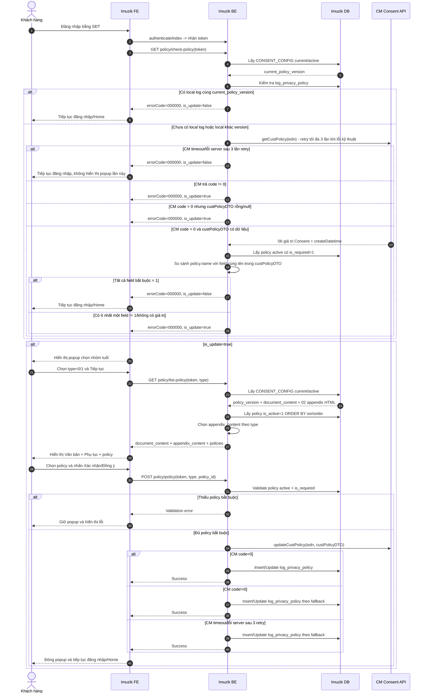

# TÀI LIỆU ĐẶC TẢ YÊU CẦU CHỨC NĂNG

**Giải pháp cập nhật và quản lý Consent khách hàng trên Imuzik**

Biểu mẫu rút gọn - áp dụng cho yêu cầu thay đổi/nâng cấp chức năng trên hệ thống đang vận hành.

| Thông tin | Nội dung |
|---|---|
| Tên yêu cầu / dự án | Cập nhật và quản lý Consent khách hàng trên Imuzik |
| Phiên bản | 1.0 |
| Ngày ban hành | 05/10/2026 |
| PIC | SơnLH21 |
| Trạng thái | Baseline phát triển |

## 1. Lịch sử thay đổi

| Ngày | Phiên bản | PIC | Phạm vi thay đổi | Mô tả |
|---|---|---|---|---|
| 05/10/2026 | 1.0 | SơnLH21 | Toàn bộ tài liệu | Ban hành baseline giải pháp Consent Imuzik để triển khai FE/BE/DB và tích hợp CM |

## 2. Thông tin tổng quan

### 2.1 Hiện trạng và mục tiêu thay đổi

Imuzik hiện có module xác nhận chính sách gồm các API `GET policy/check-policy`, `GET policy/list-policy`, `POST policy/policy` và bảng `policy`. Luồng hiện tại sử dụng dữ liệu tại `vt_member` để quyết định trạng thái popup.

Yêu cầu mới cập nhật luồng Consent theo hướng:

- Imuzik tự quản lý version, Văn bản Consent, Phụ lục và rule điều khoản tại DB Imuzik.
- CM là hệ thống tích hợp để kiểm tra/lưu 06 giá trị Consent theo số thuê bao.
- Trạng thái Consent local được quản lý tại `log_privacy_policy`; không sử dụng `vt_member.is_update_policy`/`vt_member.policy_id` làm source of truth cho luồng mới.
- Văn bản Consent gồm 01 nội dung HTML dùng chung và 02 Phụ lục HTML tương ứng nhóm tuổi.
- Khách hàng tự chọn nhóm tuổi trước khi tải nội dung Consent.
- Imuzik quyết định việc hiển thị popup/cho phép tiếp tục đăng nhập; không sử dụng `consent`, `displayConsent`, `systemType` của CM để quyết định nghiệp vụ.

### 2.2 Phạm vi

**Trong phạm vi**

- Web, Wapsite và App Imuzik.
- Đăng nhập bằng số điện thoại.
- Kiểm tra có cần Consent khi đăng nhập.
- Chọn nhóm tuổi: `type=0` từ 16 tuổi trở lên; `type=1` dưới 16 tuổi.
- Hiển thị Văn bản Consent, Phụ lục theo nhóm tuổi và danh sách 06 điều khoản.
- Lưu lựa chọn Consent tại CM và `log_privacy_policy` local.
- Quản lý `current_policy_version` tại Imuzik.

**Ngoài phạm vi**

- Đăng nhập Google/Facebook và các kênh ngoài Web/Wap/App Imuzik.
- CMS quản trị Văn bản Consent/Phụ lục.
- Thu thập hoặc xác minh thông tin người giám hộ cho khách hàng dưới 16 tuổi.
- Chức năng xem lại, thay đổi hoặc rút Consent sau khi đăng nhập.
- Cơ chế đồng bộ bù CM khi SAVE CM thất bại nhưng Consent local đã được ghi nhận.

### 2.3 Thuật ngữ viết tắt

| STT | Thuật ngữ | Mô tả |
|---:|---|---|
| 1 | Imuzik FE | Frontend Website/Wapsite/App Imuzik |
| 2 | Imuzik BE | Backend Imuzik xử lý nghiệp vụ Consent |
| 3 | CM | Hệ thống quản lý tập trung dữ liệu Consent |
| 4 | Consent | Xác nhận/lựa chọn của khách hàng đối với các mục đích xử lý dữ liệu cá nhân |
| 5 | `current_policy_version` | Version Consent hiện hành do Imuzik quản lý |
| 6 | `policy_version` | Version Consent được ghi nhận tại thời điểm khách hàng xác nhận |
| 7 | Policy bắt buộc | Policy active có `is_required=1`; khách hàng bắt buộc Consent để được tiếp tục |
| 8 | `policy.name` | Key nghiệp vụ/tích hợp tương ứng trực tiếp với 06 field Consent của CM |
| 9 | `type` | Nhóm tuổi: `0` từ 16 tuổi trở lên; `1` dưới 16 tuổi |

### 2.4 Tài liệu tham khảo

| STT | Tài liệu | Mục đích sử dụng |
|---:|---|---|
| 1 | PYC cập nhật Văn bản Consent Imuzik | Nguồn yêu cầu nghiệp vụ Imuzik |
| 2 | PYC-64913 - API CM kiểm tra/lưu Consent | Contract và xử lý tích hợp CM |
| 3 | Văn bản chấp thuận xử lý và bảo vệ dữ liệu cá nhân tại VTT | Nội dung Văn bản Consent và 06 mục đích xử lý dữ liệu |
| 4 | API/FE Consent MyClip | Tham chiếu cơ chế version, local log, nội dung HTML và Phụ lục |
| 5 | API xác nhận chính sách.xml | Hiện trạng API Imuzik |
| 6 | FE xác nhận chính sách.xml | Hiện trạng FE Imuzik |

### 2.5 Thành phần thay đổi

| Thành phần | Xử lý |
|---|---|
| `GET policy/check-policy` | Reuse endpoint; thay logic quyết định `is_update` theo `CONSENT_CONFIG` → `log_privacy_policy` → CM khi cần |
| `GET policy/list-policy` | Reuse endpoint; bổ sung `type`; trả Văn bản Consent HTML, Phụ lục HTML theo `type` và danh sách policy active |
| `POST policy/policy` | Reuse endpoint; bổ sung `type`; validate policy bắt buộc, gọi `updateCustPolicy`, sau đó ghi `log_privacy_policy` |
| `policy` | Reuse bảng hiện tại; dùng `name`, `description`, `is_required`, `is_editable`, `is_active`, `sortorder` |
| `CONSENT_CONFIG` | Bổ sung để quản lý `policy_version`, Văn bản Consent, 02 Phụ lục và trạng thái current/active |
| `log_privacy_policy` | Bổ sung để lưu snapshot Consent local theo user/MSISDN/version/type |
| `vt_member.is_update_policy`, `vt_member.policy_id` | Không sử dụng làm source of truth cho nghiệp vụ Consent mới |

### 2.6 Nguyên tắc giải pháp

- `policy.id` là khóa kỹ thuật dùng trong API; `policy.name` là key mapping CM; `sortorder` chỉ xác định thứ tự Điều khoản 1-6.
- `is_required` xác định điều khoản bắt buộc; `is_editable` chỉ xác định trạng thái tick mặc định trên FE.
- `CONSENT_CONFIG` có 01 Văn bản Consent HTML dùng chung và 02 Phụ lục HTML theo `type` cho mỗi version.
- FE render dữ liệu BE trả về; không tự parse article, không tự map policy sang field CM và không tự chọn Phụ lục theo index.
- Local log cùng `current_policy_version` được công nhận là đã hoàn tất Consent mà không đối chiếu lại `confirm_ids`.
- `getCustPolicy` và `updateCustPolicy` tuân thủ rule retry/fallback mô tả tại Mục 3.

## 3. Yêu cầu về chức năng

### 3.1 UC01 - Kiểm tra và xác nhận Consent khi đăng nhập Imuzik

#### 3.1.1 Mô tả chung

| Thông tin | Nội dung |
|---|---|
| Actor chính | Khách hàng đăng nhập Imuzik bằng số điện thoại |
| Mục đích / Mô tả | Kiểm tra dữ liệu Consent hiện có, đối chiếu với rule/version của Imuzik và yêu cầu khách hàng xác nhận lại khi chưa đáp ứng |
| Hệ thống thực hiện | Imuzik FE, Imuzik BE, DB/Cấu hình DB Imuzik, CM |
| Trigger | Khách hàng thực hiện đăng nhập bằng số điện thoại |
| Điều kiện đầu vào | Imuzik xác định được số thuê bao đăng nhập; hệ thống đọc được cấu hình Consent hiện hành |
| Điều kiện đầu ra thành công | Khách hàng đáp ứng rule Consent hiện hành và tiếp tục đăng nhập |
| Điều kiện đầu ra không thành công | Không cho hoàn tất đăng nhập khi khách hàng chưa đáp ứng rule bắt buộc hoặc API Imuzik trả lỗi nghiệp vụ/kỹ thuật không thuộc case fallback đã mô tả |
| Link Figma | N/A |

#### 3.1.2 Sơ đồ luồng Sequence Diagram



#### 3.1.3 Mô tả luồng xử lý

##### 3.1.3.1 Mapping API Imuzik hiện tại vào luồng mới

| Bước nghiệp vụ | API/DB sử dụng | Xử lý chính | Thay đổi so với hiện trạng |
|---|---|---|---|
| Kiểm tra có cần Consent | `GET policy/check-policy`; `CONSENT_CONFIG`; `log_privacy_policy`; CM `getCustPolicy` | Xác thực user → lấy `current_policy_version` → check local log → chỉ gọi CM khi chưa có log hoặc local khác version → trả `is_update` | Bỏ logic quyết định dựa trên `vt_member.created_at`/`vt_member.is_update_policy` |
| Chọn nhóm tuổi | FE local state | KH chọn `type=0/1` | Thực hiện ngay sau khi `check-policy` trả `is_update=true`, trước `GET policy/list-policy` |
| Lấy Văn bản, Phụ lục và điều khoản | `GET policy/list-policy?type=...`; `CONSENT_CONFIG`; bảng `policy` | Lấy 01 Văn bản Consent HTML dùng chung → chọn Phụ lục HTML theo `type` → lấy policy active theo `sortorder` → trả dữ liệu cho FE | FE không parse article JSON; BE trả `document_content`, `appendix_content`, `is_required`, `is_editable`; `policy.name` chỉ dùng nội bộ để map CM |
| Xác nhận Consent | `POST policy/policy`; CM `updateCustPolicy`; `log_privacy_policy` | Validate policy bắt buộc → build 06 field CM → SAVE CM → ghi local log theo rule đã chốt | Không gọi `getCustPolicy` lần 2 trước SAVE; không update `vt_member.is_update_policy` làm source of truth |

**Nguyên tắc chung**

- `policy.name` lưu trực tiếp key CM và được dùng để mapping field trong `custPolicyDTO`.
- `policy.sortorder` xác định thứ tự Điều khoản 1-6 và thứ tự hiển thị.
- `is_required` xác định policy khách hàng bắt buộc phải Consent để được đi tiếp.
- `is_editable` chỉ xác định trạng thái mặc định tick của policy trên FE; không tham gia quyết định `is_update` và không dùng để suy ra quyền khóa/mở checkbox.
- `CONSENT_CONFIG.document_content` là 01 Văn bản Consent HTML dùng chung cho cả 02 nhóm tuổi.
- `CONSENT_CONFIG.appendix_type_0_content` và `appendix_type_1_content` là 02 Phụ lục HTML; BE chọn đúng Phụ lục theo `type` và trả về FE dưới field `appendix_content`.
- Không sử dụng `is_required_display` hoặc `policy_key`.
- `consent`, `displayConsent`, `systemType` từ CM không dùng để quyết định nghiệp vụ Imuzik trong phạm vi hiện tại.

##### Bước 1 - Imuzik FE: Gọi API kiểm tra Consent

Sau khi khách hàng đăng nhập Imuzik thành công bằng số điện thoại, FE gọi API kiểm tra có cần hiển thị luồng Consent hay không.

**API**

```http
GET policy/check-policy
```

**Request**

| Field | Bắt buộc | Nguồn | Mô tả |
|---|---:|---|---|
| `token` | Có | API `authenticate/index` | Token xác thực người dùng; BE sử dụng để xác định user/MSISDN |
| `authorization_code` | Không | Cơ chế authorization hiện tại | Giữ theo contract API hiện tại |

Ví dụ:

```http
GET policy/check-policy?token=<token>&authorization_code=<authorization_code>
```

FE không tự đánh giá trạng thái Consent tại bước này. Toàn bộ logic xác định `is_update` được xử lý tại Imuzik BE ở Bước 2.

##### Bước 2 - Imuzik BE: Xử lý kiểm tra Consent

###### Bước 2.1 - Lấy cấu hình Consent hiện hành từ DB

Bổ sung bảng `CONSENT_CONFIG` theo mô tả tại mục 4.1.3 để quản lý version, Văn bản Consent và Phụ lục.

Imuzik BE thực hiện:

1. Query bản ghi `CONSENT_CONFIG` đang `is_current=1` và `status=active`.
2. Lấy `policy_version` của bản ghi này và gán nội bộ thành `current_policy_version`.
3. Nếu lỗi truy vấn DB **hoặc truy vấn thành công nhưng không tồn tại cấu hình current/active** → coi là lỗi cấu hình/hệ thống, dừng xử lý và trả `errorCode=000001`.

**Output nội bộ**

```text
current_policy_version = <CONSENT_CONFIG.policy_version của bản ghi current>
```

###### Bước 2.2 - Kiểm tra `log_privacy_policy`

Bổ sung bảng `log_privacy_policy` theo mô tả tại mục 4.1.4 để lưu snapshot Consent local.

Cập nhật dữ liệu các field trong bảng `policy` theo mô tả tại mục 4.1.2 để xác định các điều khoản khách hàng xác nhận.

Imuzik BE thực hiện kiểm tra thông tin Consent của user trong bảng `log_privacy_policy`:

- **TH1: Không tồn tại bản ghi của user đăng nhập:**
  - User chưa từng thực hiện Consent tại Imuzik → chuyển Bước 2.3 để gọi CM kiểm tra Consent tập trung.

- **TH2: Có tồn tại bản ghi của user đăng nhập và `log_privacy_policy.policy_version = current_policy_version`:**
  - User đã thực hiện Consent version mới nhất tại Imuzik → Response `is_update=false`.

- **TH3: Có tồn tại bản ghi của user đăng nhập và `log_privacy_policy.policy_version != current_policy_version`:**
  - User chưa thực hiện Consent version mới nhất tại Imuzik → chuyển Bước 2.3 để gọi CM kiểm tra Consent tập trung.

###### Bước 2.3 - Thực hiện gọi hàm `getCustPolicy` bên CM

**API**

```soap
getCustPolicy
```

**Request**

```text
isdn = <MSISDN của user đang đăng nhập>
```

**Response**

CM trả response SOAP, Imuzik chỉ sử dụng các dữ liệu sau cho luồng kiểm tra Consent:

```json
{
  "code": "0",
  "description": "success",
  "custPolicyDTO": {
    "provideProduct": "1",
    "supportCustomer": "1",
    "improveQuality": "1",
    "marketingAdvertising": "0",
    "researchMarket": "0",
    "tradePromotion": "0",
    "createDatetime": "2026-10-02T15:02:49+07:00"
  }
}
```

**Xử lý kết quả gọi CM**

1. `code = 0` và `custPolicyDTO` có dữ liệu:
   - Lấy danh sách `policy.name` thỏa mãn:
     - `policy.is_active = 1`;
     - `policy.is_required = 1`.
   - Đối chiếu từng `policy.name` với field cùng tên trong `custPolicyDTO` do CM trả về.
   - Nếu tất cả các field tương ứng đều có giá trị `1`:
     - Xác định User đã Consent đầy đủ các điều khoản bắt buộc.
     - Response `is_update=false`.
   - Nếu có ít nhất một field tương ứng có giá trị khác `1` hoặc không có giá trị:
     - Xác định User chưa Consent đầy đủ các điều khoản bắt buộc.
     - Response `is_update=true`.
   - `custPolicyDTO.createDatetime` tạm thời giữ lại để phục vụ đánh giá rule reconcile/version; không sử dụng để quyết định `is_update` trong phạm vi tài liệu này.

2. `code = 0` nhưng `custPolicyDTO` không có dữ liệu (`null`/rỗng):
   - Xác định User chưa Consent đầy đủ các điều khoản bắt buộc.
   - Response `is_update=true`.

3. CM trả `code != 0`:
   - Xác định User chưa Consent đầy đủ các điều khoản bắt buộc.
   - Response `is_update=true`.

4. Timeout/lỗi server/lỗi kết nối:
   - Retry tối đa 3 lần gọi `getCustPolicy`.
   - Nếu trong quá trình retry nhận được response từ CM thì xử lý theo mục 1, 2 hoặc 3 tương ứng.
   - Nếu sau 3 lần vẫn lỗi kỹ thuật thì `GET policy/check-policy` trả success với `is_update=false`.

**Các mã `code != 0` CM đã xác định trong luồng chỉ truyền `isdn`**

| Code CM | Description |
|---|---|
| `PYC_62335_1` | `Phải truyền một trong hai tham số isdn hoặc idNo` |
| `PYC_62335_3` | `Thuê bao không tồn tại hoặc không hoạt động trên hệt thống` |
| `PYC_62335_5` | `Không tìm thấy thông tin giấy tờ của khách hàng` |

`PYC_62335_2` và `PYC_62335_4` chỉ phát sinh khi truyền `idNo`/`idType`, không thuộc request Imuzik hiện tại.

##### Bước 3 - Imuzik BE/FE: Trả response và xử lý response `GET policy/check-policy`

###### Bước 3.1 - Response thành công

**Response**

```json
{
  "errorCode": "000000",
  "message": "Successful",
  "data": {
    "is_update": true
  }
}
```

Trong đó:

- `is_update=false`: khách hàng đã đáp ứng điều kiện Consent hiện hành → FE không hiển thị popup, tiếp tục luồng đăng nhập/Home, kết thúc luồng nghiệp vụ
- `is_update=true`: cần thực hiện luồng Consent → Chuyển sang bước 4, FE hiển thị **Popup xác nhận nhóm tuổi**. 

###### Bước 3.2 - Response lỗi của API Imuzik hiện tại

Các response dưới đây được giữ theo tài liệu XML của `GET policy/check-policy`.

| `errorCode` | `message` | Trường hợp | Xử lý FE |
|---|---|---|---|
| `000001` | `Hệ thống đang bận, vui lòng thử lại sau.` | Lỗi kết nối/xử lý DB Imuzik | Hiển thị lỗi hệ thống; không tiếp tục luồng Consent |
| `000003` | `Unknown method` | Gọi sai HTTP method, khác `GET` | Hiển thị lỗi kỹ thuật/không tiếp tục xử lý |
| `300002` | `Invalid authorization code` | Có truyền `authorization_code` nhưng không hợp lệ/hết hiệu lực | Dừng xử lý; thực hiện lại cơ chế authorization theo luồng hiện tại |
| `000002` | `Require login.` | Không truyền `token`/không có thông tin đăng nhập hợp lệ | Yêu cầu đăng nhập lại |
| `000008` | `Token không hợp lệ.` | `token` truyền lên không tồn tại hoặc hết hiệu lực | Yêu cầu đăng nhập lại |


##### Bước 4 - Imuzik FE: Hiển thị popup xác nhận nhóm tuổi

Khi `GET policy/check-policy` trả `is_update=true`, FE hiển thị popup để khách hàng xác nhận nhóm tuổi trước khi lấy Văn bản Consent.

**Nội dung hiển thị**

| Giá trị | Nhóm tuổi |
|---|---|
| `type = 0` | Từ 16 tuổi trở lên |
| `type = 1` | Dưới 16 tuổi |

**Xử lý tại FE**

- Mặc định chưa chọn nhóm tuổi.
- Button **Tiếp tục** disable khi chưa chọn nhóm tuổi.
- Sau khi khách hàng chọn một nhóm tuổi -> enable button **Tiếp tục**.
- Khi khách hàng nhấn **Tiếp tục** → chuyển Bước 5.


##### Bước 5 - Imuzik FE: Gọi API lấy Văn bản Consent và danh sách policy

Sau khi khách hàng xác nhận nhóm tuổi, FE gọi API lấy Văn bản Consent và danh sách policy tương ứng.

**API**

```http
GET policy/list-policy
```

**Request**

| Field | Bắt buộc | Nguồn | Mô tả |
|---|---:|---|---|
| `type` | Có | Giá trị khách hàng chọn tại Bước 4 | `0`: từ 16 tuổi trở lên; `1`: dưới 16 tuổi |
| `token` | Có | API `authenticate/index` | Token xác thực người dùng |
| `authorization_code` | Không | Cơ chế authorization hiện tại | Giữ theo contract API hiện tại |

Ví dụ:

```http
GET policy/list-policy?type=0&token=<token>&authorization_code=<authorization_code>
```

##### Bước 6 - Imuzik BE: Xử lý lấy Văn bản Consent, Phụ lục và danh sách policy

Imuzik BE thực hiện:

1. Validate thông tin request:
   - Request sử dụng đúng method `GET`;
   - `authorization_code` hợp lệ nếu có truyền;
   - `token` được truyền và còn hiệu lực;
   - `type ∈ {0,1}`.
2. Query bản ghi `CONSENT_CONFIG` đang `is_current=1` và `status=active`.
3. Lấy `policy_version` của bản ghi và gán nội bộ thành `current_policy_version`.
4. Lấy `document_content` - Văn bản Consent HTML dùng chung cho cả 02 nhóm tuổi.
5. Căn cứ `type` khách hàng đã chọn để lấy Phụ lục:
   - `type = 0` → lấy `appendix_type_0_content` và trả ra `appendix_content`;
   - `type = 1` → lấy `appendix_type_1_content` và trả ra `appendix_content`.
6. Lấy danh sách policy thỏa mãn `policy.is_active = 1`, sắp xếp theo `policy.sortorder ASC`.
7. Nếu toàn bộ dữ liệu hợp lệ → trả response thành công cho FE; xử lý response tại Bước 7.1.
8. Nếu phát sinh lỗi → trả response lỗi tương ứng cho FE; xử lý response tại Bước 7.2.

**Truy vấn policy**

```sql
SELECT id, description, is_required, is_editable
FROM policy
WHERE is_active = 1
ORDER BY sortorder ASC;
```

**Các trường hợp lỗi**

| `errorCode` | `message` | Trường hợp |
|---|---|---|
| `000001` | `Hệ thống đang bận, vui lòng thử lại sau.` | Lỗi truy vấn DB hoặc không tồn tại `CONSENT_CONFIG` đang `is_current=1`, `status=active` |
| `000003` | `Unknown method` | Request sử dụng method khác `GET` |
| `300002` | `Invalid authorization code` | Có truyền `authorization_code` nhưng không hợp lệ/hết hiệu lực |
| `000002` | `Require login.` | Không truyền `token`/không có thông tin đăng nhập hợp lệ |
| `000008` | `Token không hợp lệ.` | `token` không tồn tại hoặc hết hiệu lực |
| `130003` | `Nhóm tuổi không hợp lệ.` | Không truyền `type` hoặc `type` không thuộc `{0,1}` |
| `130004` | `Không tìm thấy Văn bản Consent hiện hành.` | `CONSENT_CONFIG.document_content` không có dữ liệu |
| `130005` | `Không tìm thấy Phụ lục Consent phù hợp.` | Không có nội dung Phụ lục tương ứng với `type` khách hàng đã chọn |
| `130006` | `Không tìm thấy danh sách điều khoản Consent.` | Không tồn tại policy có `is_active = 1` |


##### Bước 7 - Imuzik FE: Xử lý response `GET policy/list-policy`

###### Bước 7.1 - Response thành công

**Response**

```json
{
  "errorCode": "000000",
  "message": "Successful",
  "data": {
    "policy_version": "<current_policy_version>",
    "type": 0,
    "document_content": "<HTML Văn bản Consent>",
    "appendix_content": "<HTML Phụ lục tương ứng type>",
    "policies": [
      {
        "id": 1,
        "description": "<Nội dung điều khoản>",
        "is_required": 1,
        "is_editable": 0
      }
    ]
  }
}
```

Trong đó:

- `policy_version`: version Consent hiện hành lấy từ `CONSENT_CONFIG`.
- `document_content`: 01 Văn bản Consent HTML dùng chung, không phụ thuộc `type`.
- `appendix_content`: Phụ lục HTML đã được BE chọn theo `type`; FE không tự chọn Phụ lục theo index/cấu hình.
- `is_required`: xác định policy bắt buộc khách hàng phải Consent để được tiếp tục.
- `is_editable`: xác định trạng thái mặc định tick của policy trên FE.
- `sortorder`: sử dụng tại BE để xác định thứ tự Điều khoản 1-6 và thứ tự trả danh sách policy; không bắt buộc trả về FE.
- `policy.name`: sử dụng tại BE để mapping với field cùng tên của CM; không bắt buộc trả về FE.

**Xử lý tại FE**

- Hiển thị `document_content` - Văn bản Consent dùng chung.
- Hiển thị `appendix_content` - Phụ lục tương ứng nhóm tuổi khách hàng đã chọn tại Bước 4.
- Hiển thị danh sách policy theo đúng thứ tự BE trả về.
- Thiết lập trạng thái tick mặc định của từng policy theo `is_editable`.
- Không sử dụng `is_editable` để xác định quyền khóa/mở checkbox; field này chỉ dùng cho trạng thái tick mặc định theo cấu hình DB.
- Bổ sung control **Xác nhận chung** dạng tick chọn trên popup:
  - khi khách hàng tick **Xác nhận chung** → FE tự động tick toàn bộ policy đang hiển thị, bao gồm policy bắt buộc và không bắt buộc;
  - sau khi tick toàn bộ, FE tiếp tục áp dụng rule kiểm tra `is_required` để xác định trạng thái button **Xác nhận/Đồng ý**.
- Kiểm tra các policy có `is_required = 1`:
  - nếu còn ít nhất một policy bắt buộc chưa được tick → disable button **Xác nhận/Đồng ý**;
  - nếu toàn bộ policy bắt buộc đã được tick → enable button **Xác nhận/Đồng ý**.
- Các policy có `is_required = 0` không ảnh hưởng điều kiện cho phép khách hàng tiếp tục.

Khi khách hàng nhấn **Xác nhận/Đồng ý** → chuyển Bước 8.

###### Bước 7.2 - Response lỗi

FE xử lý response lỗi của `GET policy/list-policy` như sau:

| `errorCode` | `message` | Xử lý FE |
|---|---|---|
| `000001` | `Hệ thống đang bận, vui lòng thử lại sau.` | Hiển thị lỗi hệ thống; không hiển thị popup Consent để xác nhận |
| `000003` | `Unknown method` | Hiển thị lỗi kỹ thuật; không tiếp tục xử lý |
| `300002` | `Invalid authorization code` | Dừng xử lý; thực hiện lại cơ chế authorization theo luồng hiện tại |
| `000002` | `Require login.` | Yêu cầu khách hàng đăng nhập lại |
| `000008` | `Token không hợp lệ.` | Yêu cầu khách hàng đăng nhập lại |
| `130003` | `Nhóm tuổi không hợp lệ.` | Không hiển thị nội dung Consent; giữ/hiển thị lại popup chọn nhóm tuổi để khách hàng lựa chọn lại |
| `130004` | `Không tìm thấy Văn bản Consent hiện hành.` | Hiển thị lỗi hệ thống; không cho tiếp tục xác nhận Consent |
| `130005` | `Không tìm thấy Phụ lục Consent phù hợp.` | Hiển thị lỗi hệ thống; không cho tiếp tục xác nhận Consent |
| `130006` | `Không tìm thấy danh sách điều khoản Consent.` | Hiển thị lỗi hệ thống; không cho tiếp tục xác nhận Consent |

**Ví dụ response lỗi**

```json
{
  "errorCode": "130003",
  "message": "Nhóm tuổi không hợp lệ.",
  "data": null
}
```

##### Bước 8 - Imuzik FE: Gọi API lưu Consent

Sau khi khách hàng hoàn tất lựa chọn policy và nhấn **Xác nhận/Đồng ý** tại Bước 7, FE gửi nhóm tuổi và danh sách policy khách hàng đã Consent về Imuzik BE.

**API**

```http
POST policy/policy
```

**Request**

| Field | Bắt buộc | Nguồn | Mô tả |
|---|---:|---|---|
| `token` | Có | API `authenticate/index` | Xác định user/MSISDN |
| `authorization_code` | Không | Cơ chế authorization hiện tại | Giữ theo contract API hiện tại |
| `type` | Có | Giá trị khách hàng chọn tại Bước 4 | Phải cùng nhóm tuổi đã dùng để gọi `GET policy/list-policy` |
| `policy_id` | Có | Danh sách policy khách hàng đã tick | Danh sách `policy.id`, phân tách bằng dấu `,` |

Ví dụ:

```json
{
  "token": "<token>",
  "authorization_code": "<authorization_code>",
  "type": 0,
  "policy_id": "1,2,3"
}
```

FE không truyền `policy_version`; Imuzik BE lấy `current_policy_version` từ `CONSENT_CONFIG` tại thời điểm xử lý lưu Consent.

Sau khi FE gửi request → chuyển Bước 9.

##### Bước 9 - Imuzik BE: Xử lý và validate thông tin Consent

Sau khi nhận request `POST policy/policy`, Imuzik BE thực hiện:

1. Validate thông tin request:
   - Request sử dụng đúng method `POST`;
   - `authorization_code` hợp lệ nếu có truyền;
   - `token` được truyền, còn hiệu lực và xác định được user/MSISDN;
   - `type ∈ {0,1}`;
   - `policy_id` đúng định dạng.
2. Kiểm tra toàn bộ `policy_id` truyền lên tồn tại và có `policy.is_active = 1`.
3. Lấy danh sách policy bắt buộc thỏa mãn:
   - `policy.is_active = 1`;
   - `policy.is_required = 1`.
4. Kiểm tra toàn bộ policy bắt buộc có trong danh sách `policy_id` khách hàng gửi lên:
   - Nếu thiếu ít nhất một policy bắt buộc → trả response lỗi cho FE, không gọi CM; xử lý response tại Bước 12.2.
   - Nếu đầy đủ → tiếp tục xử lý.
5. Lấy bản ghi `CONSENT_CONFIG` đang `is_current=1` và `status=active` để xác định `current_policy_version` sử dụng khi ghi `log_privacy_policy`.
6. Nếu toàn bộ dữ liệu hợp lệ → chuyển Bước 10 để build dữ liệu và gọi CM lưu Consent.

**Lưu ý**

- `type` được lưu cùng `policy_version` tại `log_privacy_policy`, qua đó xác định Phụ lục khách hàng đã được hiển thị/xác nhận tại thời điểm Consent.
- Các validation hiện có của API tiếp tục reuse theo contract hiện tại; không thay đổi nghiệp vụ đã chốt tại các bước trước.

##### Bước 10 - Imuzik BE: Gọi hàm `updateCustPolicy` bên CM

Sau khi validate thành công, Imuzik BE build `custPolicyDTO` đủ 06 field và gọi hàm `updateCustPolicy` bên CM.

**Nguyên tắc mapping**

- Lấy `policy.name` để xác định field tương ứng trong `custPolicyDTO`.
- Nếu `policy.id` có trong danh sách `policy_id` khách hàng đã Consent → field CM cùng tên = `1`.
- Nếu `policy.id` không có trong danh sách `policy_id` khách hàng đã Consent → field CM cùng tên = `0`.

Ví dụ:

```json
{
  "provideProduct": "1",
  "supportCustomer": "1",
  "improveQuality": "1",
  "marketingAdvertising": "0",
  "researchMarket": "0",
  "tradePromotion": "0"
}
```

**API**

```soap
updateCustPolicy
```

**Request**

```text
isdn = <MSISDN của user đang đăng nhập>
custPolicyDTO = <06 giá trị Consent>
```

**Xử lý kết quả gọi CM**

1. CM trả `code = 0`:
   - Xác định lưu Consent CM thành công.
   - Chuyển Bước 11 để ghi nhận Consent tại Imuzik.

2. CM trả `code != 0`:
   - Không retry do đã nhận được response nghiệp vụ từ CM.
   - Ghi log `code`/`description` để phục vụ theo dõi lỗi tích hợp.
   - Không block luồng Consent; vẫn chuyển Bước 11 để ghi nhận Consent local tại Imuzik.

3. Timeout/lỗi server/lỗi kết nối:
   - Retry tối đa 3 lần gọi `updateCustPolicy`.
   - Nếu trong quá trình retry nhận được response từ CM → xử lý theo mục 1 hoặc 2 tương ứng.
   - Nếu sau 3 lần vẫn lỗi kỹ thuật → không block luồng Consent, vẫn chuyển Bước 11 để ghi nhận Consent local.

**Các mã `code != 0` của `updateCustPolicy` đã xác định**

| Code CM | Description | Ghi chú |
|---|---|---|
| `PYC_64913_1` | `Tham số truyền vào không đủ (isdn)` | Theo thiết kế Imuzik luôn truyền `isdn`; nếu phát sinh cần ghi log cảnh báo lỗi tích hợp |
| `PYC_64913_2` | `Thuê bao không tồn tại hoặc không hoạt động trên hệt thống` | Lỗi nghiệp vụ phía CM |
| `PYC_64913_3` | `Không tìm thấy thông tin giấy tờ của khách hàng` | Lỗi nghiệp vụ phía CM |
| `PYC_64913_4` | `Tham số truyền vào không đủ (custPolicyDTO)` | Theo thiết kế Imuzik luôn truyền `custPolicyDTO`; nếu phát sinh cần ghi log cảnh báo lỗi tích hợp |
| `PYC_64913_5` | `Không tìm thấy thông tin giấy tờ của khách hàng` | Lỗi nghiệp vụ phía CM |

Các mã lỗi CM trên **không trả trực tiếp về FE và không làm thất bại luồng Consent local** trong phương án hiện tại.

##### Bước 11 - Imuzik BE: Ghi nhận Consent tại `log_privacy_policy`

Imuzik BE ghi nhận Consent local sau khi request `POST policy/policy` đã validate hợp lệ, bao gồm các trường hợp:

- `updateCustPolicy` trả `code = 0`;
- `updateCustPolicy` trả `code != 0`;
- CM timeout/lỗi server/lỗi kết nối sau tối đa 3 lần retry nhưng vẫn không thành công.

**Dữ liệu lưu**

| Field | Giá trị |
|---|---|
| `user_id` | User đang đăng nhập |
| `isdn` | MSISDN của user |
| `confirm_ids` | Danh sách `policy.id` khách hàng đã Consent |
| `is_consent` | `1` |
| `type` | Nhóm tuổi khách hàng đã chọn; đồng thời xác định Phụ lục đã hiển thị |
| `policy_version` | `current_policy_version` tại thời điểm Consent |
| `created_at` | Thời điểm tạo bản ghi |
| `updated_at` | Thời điểm cập nhật bản ghi |

**Xử lý DB**

- Nếu user chưa có bản ghi → INSERT.
- Nếu user đã có bản ghi → UPDATE bản ghi hiện tại theo Consent mới nhất.
- Nếu ghi `log_privacy_policy` thành công → chuyển Bước 12.1.
- Nếu ghi DB lỗi → trả response lỗi cho FE → xử lý tại Bước 12.2.

##### Bước 12 - Imuzik BE/FE: Trả response và xử lý response `POST policy/policy`

###### Bước 12.1 - Response thành công

Sau khi ghi `log_privacy_policy` thành công, Imuzik BE trả response thành công cho FE.

**Response**

```json
{
  "errorCode": "000000",
  "message": "Successful",
  "data": null
}
```

**Xử lý tại FE**

- Đóng popup Consent.
- Xác định khách hàng đã hoàn tất luồng Consent.
- Tiếp tục luồng đăng nhập và điều hướng vào Home.

###### Bước 12.2 - Response lỗi

FE xử lý response lỗi của `POST policy/policy` như sau:

| `errorCode` | `message` | Trường hợp | Xử lý FE |
|---|---|---|---|
| `000001` | `Hệ thống đang bận, vui lòng thử lại sau.` | Lỗi kết nối/xử lý DB Imuzik | Giữ popup Consent; hiển thị lỗi hệ thống; không tiếp tục vào Home |
| `000003` | `Unknown method` | Gọi sai HTTP method, khác `POST` | Hiển thị lỗi kỹ thuật; không tiếp tục xử lý |
| `300002` | `Invalid authorization code` | Có truyền `authorization_code` nhưng không hợp lệ/hết hiệu lực | Dừng xử lý; thực hiện lại cơ chế authorization theo luồng hiện tại |
| `000002` | `Require login.` | Không truyền `token`/không có thông tin đăng nhập hợp lệ | Yêu cầu đăng nhập lại |
| `000008` | `Token không hợp lệ.` | `token` truyền lên không tồn tại hoặc hết hiệu lực | Yêu cầu đăng nhập lại |
| `130002` | `Sai định dạng tham số truyền vào!` | `policy_id` không đúng định dạng | Giữ popup Consent; hiển thị lỗi; không gọi CM |
| `130002` | `Nhập id không tồn tại!` | Có `policy_id` không tồn tại hoặc không active | Giữ popup Consent; hiển thị lỗi; không gọi CM |
| `130007` | `Vui lòng xác nhận đầy đủ các điều khoản bắt buộc.` | Thiếu ít nhất một policy bắt buộc có `is_required=1` | Giữ popup Consent; hiển thị lỗi; không gọi CM |

Các trường hợp CM trả `code!=0` hoặc lỗi kỹ thuật sau retry được xử lý fallback local tại Bước 10-11, không trả lỗi CM trực tiếp về FE. FE chỉ đóng popup và tiếp tục vào Home khi nhận response thành công `errorCode=000000` từ Imuzik BE.

#### 3.1.4 Màn hình liên quan

<p align="center">
  <br>
  <b>MH04 – Kết quả ký hợp đồng</b>
</p>

**MH01 - Popup chọn nhóm tuổi**

| STT | Thành phần | Loại dữ liệu | Nguồn | Mặc định | Mô tả |
|---:|---|---|---|---|---|
| 1 | 16 tuổi trở lên | Radio/Option | Người dùng chọn | Chưa chọn | `type=0`; dùng để xác định Phụ lục tương ứng |
| 2 | Dưới 16 tuổi | Radio/Option | Người dùng chọn | Chưa chọn | `type=1`; không yêu cầu nhập thông tin giám hộ trong phạm vi hiện tại |
| 3 | Tiếp tục | Button | Trạng thái lựa chọn | Disable | Enable khi đã chọn một nhóm tuổi |

**MH02 - Popup/Văn bản Consent**

<p align="center">
  <br>
  <b>MH04 – Kết quả ký hợp đồng</b>
</p>

| STT | Thành phần | Loại dữ liệu | Nguồn | Mặc định | Mô tả |
|---:|---|---|---|---|---|
| 1 | Nội dung Văn bản Consent | HTML/WebView | `CONSENT_CONFIG.document_content` | Theo version hiện hành | 01 Văn bản dùng chung cho cả 02 nhóm tuổi |
| 2 | Nội dung Phụ lục | HTML/WebView | `CONSENT_CONFIG` + `type` | Theo nhóm tuổi đã chọn | FE nhận trực tiếp `appendix_content` từ BE; không tự chọn Phụ lục |
| 3 | Điều khoản 1 | Checkbox | `policy` / `provideProduct` | Theo `is_editable` | Bắt buộc/tùy chọn theo `is_required` |
| 4 | Điều khoản 2 | Checkbox | `policy` / `supportCustomer` | Theo `is_editable` | Bắt buộc/tùy chọn theo `is_required` |
| 5 | Điều khoản 3 | Checkbox | `policy` / `improveQuality` | Theo `is_editable` | Bắt buộc/tùy chọn theo `is_required` |
| 6 | Điều khoản 4 | Checkbox | `policy` / `marketingAdvertising` | Theo `is_editable` | Bắt buộc/tùy chọn theo `is_required` |
| 7 | Điều khoản 5 | Checkbox | `policy` / `researchMarket` | Theo `is_editable` | Bắt buộc/tùy chọn theo `is_required` |
| 8 | Điều khoản 6 | Checkbox | `policy` / `tradePromotion` | Theo `is_editable` | Bắt buộc/tùy chọn theo `is_required` |
| 9 | Xác nhận/Tiếp tục | Button | `is_required` | Disable nếu còn policy bắt buộc chưa Consent | Khi bấm, FE gửi `type` + danh sách `policy_id` sang BE để validate và lưu CM |
| 10 | Thông báo lỗi | Message | Imuzik BE | Không có | Hiển thị khi request/validation/lưu Consent thất bại |

#### 3.1.5 Business Rules

| Rule ID | Mô tả quy tắc | Ghi chú |
|---|---|---|
| BR01 | CM chỉ được sử dụng như nguồn lưu và trả dữ liệu Consent; Imuzik tự quyết định nghiệp vụ hiển thị/chặn | Không phụ thuộc `consent`/`displayConsent` CM |
| BR02 | `is_required` là rule duy nhất xác định policy khách hàng phải Consent để được đi tiếp | Không còn `is_required_display` |
| BR03 | Nếu `getCustPolicy` trả `code=0` nhưng `custPolicyDTO` không có dữ liệu thì không công nhận đã Consent | Chuyển luồng hiển thị popup |
| BR04 | Imuzik chỉ quản lý 01 Văn bản Consent chính cho mỗi `policy_version`; nội dung lưu dạng HTML tại `CONSENT_CONFIG.document_content` | Văn bản dùng chung cho cả 02 nhóm tuổi |
| BR05 | Mỗi `policy_version` có 02 Phụ lục HTML theo nhóm tuổi; `type=0` dùng `appendix_type_0_content`, `type=1` dùng `appendix_type_1_content` | BE chỉ trả `appendix_content` tương ứng `type` cho FE |
| BR06 | Chỉ cho phép hoàn tất popup khi toàn bộ policy active có `is_required=1` đã được Consent | Nếu không đạt thì chặn đăng nhập |
| BR07 | Ưu tiên `log_privacy_policy`: nếu local log cùng `current_policy_version` → `is_update=false`; nếu chưa có log hoặc khác version mới gọi CM để kiểm tra | Không đối chiếu lại `confirm_ids` khi local đã cùng version |
| BR08 | `consent`, `displayConsent` và `systemType` của CM không dùng để quyết định nghiệp vụ trong phạm vi hiện tại | Imuzik tự quyết định theo DB local + 06 field CM |
| BR09 | Khi chưa có local log và `custPolicyDTO` có dữ liệu, Consent từ dịch vụ khác có thể được công nhận nếu toàn bộ field CM tương ứng policy active có `is_required=1` đều đã Consent | Chưa tự quy đổi CM `createDatetime` thành `policy_version` Imuzik |
| BR10 | Văn bản Consent, Phụ lục và version do từng dịch vụ quản lý riêng | Imuzik chỉ quản lý version/nội dung của Imuzik |
| BR11 | Imuzik quản lý `current_policy_version` local; CM không lưu `policyVersion` | Cơ chế tham khảo MyClip |
| BR12 | Nhóm tuổi do người dùng tự chọn; chỉ lưu local Imuzik | Không lưu CM |
| BR13 | Người dưới 16 tuổi trong phạm vi hiện tại chỉ khác Phụ lục hiển thị; không thu thập/xác minh định danh người giám hộ | Theo phạm vi đã chốt |
| BR14 | Khi khách hàng submit Consent hợp lệ, BE ưu tiên SAVE CM; nếu CM trả `code!=0` hoặc timeout/lỗi server/lỗi kết nối sau 3 lần retry thì vẫn ghi `log_privacy_policy` local và cho phép tiếp tục đăng nhập | Chưa có cơ chế pending/resync trong phạm vi hiện tại |
| BR15 | `GET policy/list-policy` trả `document_content`, `appendix_content`, danh sách policy có `is_required`, `is_editable`; FE dùng `is_required` cho điều kiện đi tiếp và `is_editable` cho trạng thái mặc định tick | FE không hard-code danh sách policy bắt buộc, không tự chọn Phụ lục |
| BR15.1 | `policy.name` của 06 policy phải chứa đúng key CM; `sortorder` xác định thứ tự Điều khoản 1-6 | Không dùng `policy.id` hoặc vị trí response để suy ra mapping CM |
| BR15.2 | `is_editable` chỉ xác định trạng thái tick mặc định theo cấu hình DB; không dùng để suy ra quyền khóa/mở checkbox | Tên field legacy nhưng semantics nghiệp vụ theo tài liệu này |
| BR16 | Không gọi `getCustPolicy` lần 2 ngay trước `updateCustPolicy`; nếu check-policy không cần gọi CM do đã có local log thì cũng không phát sinh GET chỉ để SAVE | Chấp nhận rủi ro concurrent update thấp trong phạm vi hiện tại |
| BR16.1 | `getCustPolicy`: `code!=0` → `/check-policy` trả success, `is_update=true`; timeout/lỗi server sau 3 retry → `/check-policy` trả success, `is_update=false`. `updateCustPolicy`: `code!=0` hoặc lỗi kỹ thuật sau 3 retry → vẫn ghi `log_privacy_policy` local | `code!=0` không retry; lỗi kỹ thuật retry tối đa 3 lần |
| BR17 | Local log Consent được cập nhật/ghi đè bản hiện hành tương tự MyClip | `type + policy_version` xác định nhóm Phụ lục đã hiển thị tại thời điểm Consent; chưa yêu cầu lưu lịch sử đầy đủ |
| BR18 | Phạm vi kênh: Web, Wapsite, App Imuzik; đăng nhập bằng SĐT | Không Google/Facebook, không kênh khác |
| BR19 | Chức năng thay đổi/rút Consent sau đăng nhập không thuộc phạm vi tài liệu này | Ngoài phạm vi tài liệu này |

## 4. Yêu cầu tích hợp và dữ liệu

### 4.1 Thiết kế dữ liệu

#### 4.1.1 Mapping 06 điều khoản với CM

| `sortorder` | `policy.name` | Field CM |
|---:|---|---|
| 1 | `provideProduct` | `custPolicyDTO.provideProduct` |
| 2 | `supportCustomer` | `custPolicyDTO.supportCustomer` |
| 3 | `improveQuality` | `custPolicyDTO.improveQuality` |
| 4 | `marketingAdvertising` | `custPolicyDTO.marketingAdvertising` |
| 5 | `researchMarket` | `custPolicyDTO.researchMarket` |
| 6 | `tradePromotion` | `custPolicyDTO.tradePromotion` |

`policy.id` chỉ dùng làm khóa kỹ thuật/API; không dùng để suy ra field CM.

#### 4.1.2 Bảng `policy` - reuse

| Field | Mục đích sử dụng |
|---|---|
| `id` | ID policy dùng trong `policy_id` |
| `name` | Key mapping trực tiếp với field CM |
| `description` | Nội dung điều khoản hiển thị |
| `is_required` | Xác định điều khoản bắt buộc Consent |
| `is_editable` | Xác định trạng thái tick mặc định trên FE |
| `is_active` | Trạng thái hiệu lực |
| `sortorder` | Thứ tự Điều khoản 1-6/hiển thị |

Dữ liệu 06 policy active phải bảo đảm `name` mapping đúng 06 key CM và `sortorder` tương ứng 1-6.

#### 4.1.3 Bảng `CONSENT_CONFIG`

Mỗi version quản lý 01 Văn bản Consent HTML dùng chung và 02 Phụ lục HTML theo nhóm tuổi.

| Field | Mô tả |
|---|---|
| `id` | Định danh cấu hình |
| `policy_version` | Version Consent |
| `document_content` | Văn bản Consent HTML dùng chung |
| `appendix_type_0_content` | Phụ lục HTML cho `type=0` |
| `appendix_type_1_content` | Phụ lục HTML cho `type=1` |
| `is_current` | `1`: version hiện hành |
| `status` | Trạng thái cấu hình; luồng nghiệp vụ sử dụng bản ghi `active` |
| `created_at`, `updated_at` | Thời điểm tạo/cập nhật |

Tại một thời điểm, luồng nghiệp vụ sử dụng duy nhất bản ghi `is_current=1` và `status=active`.

#### 4.1.4 Bảng `log_privacy_policy`

| Field | Mô tả |
|---|---|
| `id` | Định danh bản ghi |
| `user_id` | User Imuzik |
| `isdn` | Số thuê bao |
| `confirm_ids` | Danh sách `policy.id` đã xác nhận |
| `is_consent` | Trạng thái Consent local |
| `type` | Nhóm tuổi đã chọn |
| `policy_version` | Version tại thời điểm xác nhận |
| `created_at`, `updated_at` | Thời điểm tạo/cập nhật |

Mỗi user sử dụng một snapshot hiện hành: chưa có bản ghi thì INSERT, đã có thì UPDATE theo Consent mới nhất.

### 4.2 API nội bộ Imuzik

| API | Thay đổi chính |
|---|---|
| `GET policy/check-policy` | Quyết định `data.is_update` theo current version, local log và CM |
| `GET policy/list-policy` | Bổ sung `type`; trả `policy_version`, `document_content`, `appendix_content`, `policies[]` |
| `POST policy/policy` | Bổ sung `type`; validate policy bắt buộc, gọi CM và ghi local log |

`GET policy/list-policy` thay đổi cấu trúc `data` từ danh sách policy sang object chứa Văn bản/Phụ lục/danh sách policy; FE và BE phải triển khai đồng bộ. Chi tiết request/response và mã lỗi tại Mục 3.1.3.

### 4.3 Tích hợp CM

| Operation | Rule xử lý |
|---|---|
| `getCustPolicy(isdn)` | `code=0` + có DTO: đối chiếu các policy active/required; `code!=0` hoặc DTO rỗng → `is_update=true`; lỗi kỹ thuật retry tối đa 3 lần, vẫn lỗi → `is_update=false` |
| `updateCustPolicy(isdn, custPolicyDTO)` | `code=0` → ghi local; `code!=0` → không retry, vẫn ghi local; lỗi kỹ thuật retry tối đa 3 lần, vẫn lỗi → ghi local |

Các mã lỗi CM được ghi log tại Imuzik; không trả trực tiếp mã lỗi CM về FE trong nhánh fallback SAVE Consent.

## 5. Ràng buộc triển khai

| STT | Ràng buộc |
|---:|---|
| 1 | Phạm vi áp dụng: Web/Wap/App Imuzik, đăng nhập bằng số điện thoại. |
| 2 | Imuzik tự quản lý version, Văn bản Consent, Phụ lục và rule policy; CM không quản lý `policyVersion` riêng cho Imuzik. |
| 3 | Không sử dụng `consent`, `displayConsent`, `systemType` của CM để quyết định nghiệp vụ. |
| 4 | `vt_member.is_update_policy` và `vt_member.policy_id` không còn là source of truth của luồng Consent mới. |
| 5 | `GET policy/list-policy` đổi cấu trúc response nên FE/BE phải release đồng bộ. |
| 6 | Local log chỉ được ghi sau khi khách hàng submit Consent hợp lệ qua `POST policy/policy`; nhánh `check-policy` công nhận Consent từ CM không tự tạo/nâng `policy_version` local. |
| 7 | Khi `updateCustPolicy` trả `code!=0` hoặc lỗi kỹ thuật sau 3 lần retry, Imuzik vẫn ghi `log_privacy_policy` và cho phép tiếp tục đăng nhập. Không có cơ chế pending/resync CM trong phạm vi tài liệu này. |
| 8 | Khi local log có `policy_version = current_policy_version`, hệ thống trả `is_update=false` mà không đối chiếu lại `confirm_ids` hoặc gọi CM. |
| 9 | FE không truyền `policy_version` khi submit; BE sử dụng `current_policy_version` tại thời điểm xử lý `POST policy/policy`. |
| 10 | Không gọi `getCustPolicy` lần 2 ngay trước `updateCustPolicy`; chấp nhận rủi ro ghi đè lựa chọn khi nhiều dịch vụ cùng cập nhật 06 field CM. |
| 11 | `createDatetime` từ CM không được dùng để suy ra `policy_version` của Imuzik. |
| 12 | Không triển khai CMS Consent, chức năng xem lại/thay đổi/rút Consent hoặc xác minh người giám hộ trong phạm vi tài liệu này. |
