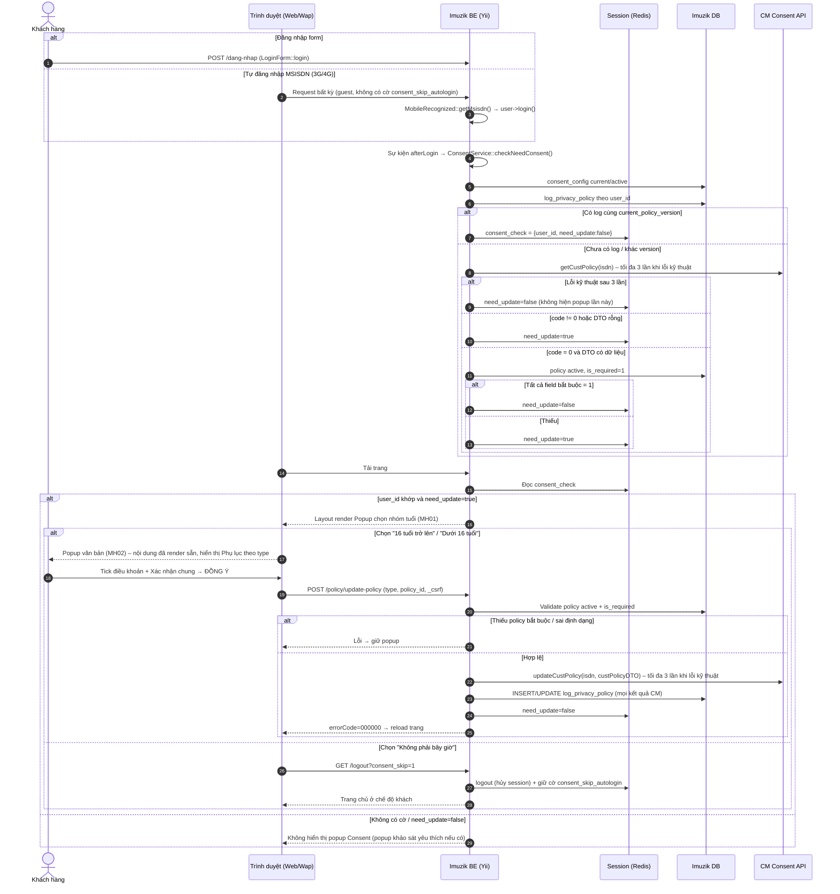

# TÀI LIỆU ĐẶC TẢ YÊU CẦU CHỨC NĂNG – KÊNH WEB/WAP

**Giải pháp cập nhật và quản lý Consent khách hàng trên Imuzik – áp dụng cho Website và Wapsite**

Tài liệu dẫn xuất từ `TLGP_Consent_Imuzik_v1.0`, điều chỉnh theo kiến trúc Web/Wap (Yii2 server-render, đăng nhập bằng session).

| Thông tin | Nội dung |
|---|---|
| Tên yêu cầu / dự án | Cập nhật và quản lý Consent khách hàng trên Imuzik – Web/Wap |
| Phiên bản | 1.1 (Web/Wap) |
| Tài liệu gốc | TLGP_Consent_Imuzik_v1.0 (05/10/2026) |
| Ngày cập nhật | 05/10/2026 |

## 1. Lịch sử thay đổi

| Ngày | Phiên bản | Phạm vi thay đổi | Mô tả |
|---|---|---|---|
| 05/10/2026 | 1.0 | Toàn bộ | Ban hành baseline giải pháp Consent Imuzik để triển khai FE/BE/DB và tích hợp CM |
| 05/10/2026 | 1.1 | Mục 2–6 | Tách luồng riêng triển khai Web/Wap và tích hợp CM |

## 2. Thông tin tổng quan

### 2.1 Khác biệt chính so với TLGP v1.0

| Hạng mục | TLGP v1.0 (App) | Bản Web/Wap |
|---|---|---|
| Xác thực | `token` + `authorization_code` | Session Yii (`Yii::$app->user`), CSRF cho POST |
| Kiểm tra Consent | FE gọi `GET policy/check-policy` sau login | **Web/Wap tự kiểm tra 1 lần tại sự kiện `afterLogin`**, lưu kết quả vào session; không có endpoint check-policy cho Web/Wap |
| Hiển thị popup | FE quyết định theo response | Layout `main.php` đọc cờ session và render popup |
| Lấy nội dung | `GET policy/list-policy` (API) | Server render trong layout (Văn bản + 02 Phụ lục ẩn + điều khoản); JS hiển thị Phụ lục theo `type` |
| Lưu Consent | `POST policy/policy` (API) | `POST /policy/update-policy` (AJAX, reuse route hiện có, bổ sung `type`) |
| Popup chọn nhóm tuổi | Radio + nút "Tiếp tục" | **3 nút theo design**: "16 tuổi trở lên" / "Dưới 16 tuổi" / "Không phải bây giờ" |
| Từ chối | Không mô tả | "Không phải bây giờ" → đăng xuất + tạm dừng tự đăng nhập MSISDN trong phiên |
| Mã lỗi nhóm tuổi | `130003` | **`130008`** (giữ `130003` = "Nhập id không tồn tại!" như hiện trạng) |

### 2.2 Phạm vi

**Trong phạm vi**

- Website (`frontend/`) và Wapsite (`wap/`) Imuzik.
- Mọi hình thức đăng nhập bằng số điện thoại trên Web/Wap:
  - Đăng nhập form (`LoginForm::login`);
  - Tự đăng nhập theo MSISDN nhận diện mạng 3G/4G (`AppController::beforeAction` → `MobileRecognized::getMsisdn()`).
- Kiểm tra cần Consent theo `CONSENT_CONFIG` → `log_privacy_policy` → CM.
- Popup chọn nhóm tuổi, popup Văn bản + Phụ lục + 06 điều khoản.
- Lưu Consent tại CM (`updateCustPolicy`) và `log_privacy_policy`.
- DB: tạo `consent_config`, `log_privacy_policy`; bổ sung `policy.is_editable`.
- Logic dùng chung đặt tại `common/` để giai đoạn sau App/Miniapp tái sử dụng.

**Ngoài phạm vi (giai đoạn này)**

- API App/Miniapp (`api/controllers/PolicyController.php`, `api/controllers/v2/PolicyController.php`, `frontend/api/`) – giữ nguyên luồng cũ.
- Đăng nhập Google/Facebook.
- CMS quản trị Văn bản/Phụ lục; xem lại/thay đổi/rút Consent; xác minh người giám hộ.
- Đồng bộ bù CM khi SAVE CM thất bại.
- Build lại bundle `js/build/app.min.js` (JS mới viết inline trong view).

### 2.3 Thành phần thay đổi

| Thành phần | Xử lý |
|---|---|
| `common/libs/ConsentService.php` (mới) | Toàn bộ rule nghiệp vụ: lấy config current, check local log, gọi CM, đối chiếu policy bắt buộc, build `custPolicyDTO`, ghi log |
| `common/libs/CmConsentClient.php` (mới) | SOAP client `getCustPolicy`/`updateCustPolicy` dựa trên `WsSoapClient`; timeout + tối đa 3 lần gọi |
| `common/models/v2/ConsentConfigBase.php`, `common/models/v2/LogPrivacyPolicyBase.php` (+ `db/*DB.php`) (mới) | ActiveRecord cho 2 bảng mới |
| `common/models/v2/db/PolicyDB.php` | Bổ sung thuộc tính `name`, `is_editable`, `note` |
| `common/config/params.php` | Cấu hình `consentCm` (wsdl, timeout, maxCalls) |
| `frontend/config/main.php`, `wap/config/main.php` | Gắn handler `on afterLogin` cho component `user` |
| `frontend/controllers/SiteController.php`, `wap/controllers/SiteController.php` | `actionLogout` hỗ trợ cờ `consent_skip_autologin` |
| `frontend/controllers/AppController.php`, `wap/controllers/AppController.php` | Bỏ qua tự đăng nhập MSISDN khi có cờ `consent_skip_autologin` |
| `frontend/controllers/PolicyController.php`, `wap/controllers/PolicyController.php` | Sửa `actionUpdatePolicy` theo luồng mới (nhận `type` trong `formData`, gọi `ConsentService::saveConsent`) |
| `frontend/views/layouts/_confirm-policy.php`, `wap/views/layouts/_confirm-policy.php` | Thay điều kiện hiển thị; thêm popup chọn nhóm tuổi; popup văn bản render từ `consent_config` + `policy`; JS inline |
| `frontend/web/js/coder.js`, `wap/web/js/coder.js` | **Không sửa** – giữ logic "Xác nhận chung"/đếm policy bắt buộc hiện có |
| `vt_member.is_update_policy`, `vt_member.policy_id` | Không dùng làm source of truth (xem đề xuất tương thích App tại Mục 7) |

### 2.4 Nguyên tắc giải pháp (kế thừa TLGP v1.0)

- `policy.id` là khóa kỹ thuật; `policy.name` là key mapping CM; `sortorder` xác định thứ tự Điều khoản 1–6.
- `is_required` xác định điều khoản bắt buộc; `is_editable` chỉ xác định trạng thái tick mặc định.
- `consent_config` có 01 Văn bản HTML dùng chung + 02 Phụ lục HTML theo `type` cho mỗi version.
- FE không tự chọn Phụ lục, không tự map policy sang CM.
- Local log cùng `current_policy_version` → coi như đã hoàn tất Consent, không đối chiếu `confirm_ids`, không gọi CM.
- Không dùng `consent`, `displayConsent`, `systemType` của CM.

## 3. Yêu cầu chức năng

### 3.1 UC01 – Kiểm tra và xác nhận Consent khi đăng nhập Web/Wap

| Thông tin | Nội dung |
|---|---|
| Actor | Khách hàng đăng nhập Web/Wap bằng số điện thoại (form hoặc tự nhận diện MSISDN) |
| Trigger | Sự kiện `afterLogin` của component `user` |
| Điều kiện đầu vào | Xác định được MSISDN của user (`vt_member.username`); đọc được `consent_config` current/active |
| Đầu ra thành công | User đáp ứng rule Consent hiện hành và dùng tiếp dịch vụ |
| Đầu ra không thành công | User chọn "Không phải bây giờ" → đăng xuất; hoặc lỗi hệ thống → giữ popup, hiển thị lỗi |

### 3.2 Sơ đồ luồng



### 3.3 Mô tả luồng xử lý

#### Bước 1 – Kích hoạt kiểm tra tại `afterLogin`

- Gắn handler cho sự kiện `yii\web\User::EVENT_AFTER_LOGIN` trong `frontend/config/main.php` và `wap/config/main.php`.
- Handler gọi `ConsentService::checkNeedConsent($member)` và ghi session:

```php
Yii::$app->session->set('consent_check', [
    'user_id'     => $member->id,
    'need_update' => true | false,
]);
```

- Dùng `afterLogin` thay vì `LoginForm`: dùng cả đăng nhập và tự động đăng nhập.
- Lưu kèm `user_id`: tránh dùng nhầm kết quả của số điện thoại khác nhau trong cùng session.

#### Bước 2 – `ConsentService::checkNeedConsent` (giữ nguyên rule TLGP v1.0 Bước 2)

1. Lấy `consent_config` có `is_current=1` và `status='active'` → `current_policy_version`.
   - Lỗi DB / không có bản ghi → ghi log lỗi, `need_update=false` (không chặn người dùng vì lỗi cấu hình) – *xem Mục 7, điểm 6*.
2. Tra `log_privacy_policy` theo `user_id`:
   - Có bản ghi và `policy_version = current_policy_version` → `need_update=false`.
   - Không có / khác version → Bước 3.
3. Gọi CM `getCustPolicy(isdn)`:
   - `code=0` + `custPolicyDTO` có dữ liệu → so sánh từng `policy.name` (active, `is_required=1`) với field cùng tên; tất cả `=1` → `false`, ngược lại → `true`.
   - `code=0` + DTO rỗng/null → `true`.
   - `code != 0` → `true` (không retry).
   - Timeout/lỗi kết nối/lỗi server → gọi lại, **tổng tối đa 3 lần**; vẫn lỗi → `false`.

#### Bước 3 – Layout hiển thị popup

`_confirm-policy.php` (render trong `layouts/main.php`) chỉ hiển thị Popup chọn nhóm tuổi khi đồng thời:

- User đã đăng nhập;
- `session['consent_check']` tồn tại, `user_id` = user hiện tại, `need_update = true`.

Các trường hợp khác:

| Trường hợp | Xử lý |
|---|---|
| Không có cờ (session đăng nhập trước thời điểm deploy) | Không kiểm tra, không hiển thị popup; sẽ kiểm tra ở lần đăng nhập kế tiếp |
| Có cờ nhưng `user_id` khác user hiện tại | Kiểm tra lại 1 lần (Bước 2) và ghi đè cờ |
| `need_update=false` | Không hiển thị popup Consent; nếu `session['showSurvey']` thì hiển thị popup khảo sát yêu thích như hiện tại |

Bỏ hoàn toàn điều kiện cũ `created_at >= 2023-07-01 && is_update_policy == 0`.

#### Bước 4 – Popup chọn nhóm tuổi (MH01)

<p align="center">
  <br>
  <b>MH01 – Popup xác minh người dùng (chọn nhóm tuổi)</b>
</p>

| Nút | Hành động |
|---|---|
| **16 tuổi trở lên** | `type=0` → Bước 5 |
| **Dưới 16 tuổi** | `type=1` → Bước 5 |
| **Không phải bây giờ** | Gọi `/logout` kèm cờ `consent_skip_autologin` → Bước 9 |

- Nội dung text theo design, thay "Myclip" bằng "Imuzik".
- Popup dạng `backdrop: static`, không đóng bằng click ngoài/ESC.

#### Bước 5 – Lấy nội dung (server render, không dùng AJAX)

> **Điều chỉnh khi triển khai:** logic checkbox hiện có trong `coder.js` (đóng gói trong `app.min.js`) gắn sự kiện cho các checkbox **tại thời điểm tải trang**. Để giữ nguyên `coder.js` và không build lại bundle, Web/Wap **render sẵn** Văn bản, **cả 02 Phụ lục** (ẩn) và danh sách điều khoản ngay khi tải trang có popup; khi khách hàng chọn nhóm tuổi, JS chỉ hiển thị Phụ lục tương ứng `type`. Không có endpoint `list-policy` cho Web/Wap. Kết quả nghiệp vụ không đổi so với TLGP (Phụ lục hiển thị đúng theo `type`, `type` được validate và lưu tại server).

**Xử lý BE** (`ConsentService::getContent()`, gọi trong `_confirm-policy.php` khi cần hiển thị popup)

1. Lấy `consent_config` current/active → không có → `000001`; `document_content` rỗng → `130004`.
2. `appendix_type_0_content`, `appendix_type_1_content` → rỗng → `130005`.
3. `SELECT * FROM policy WHERE is_active=1 ORDER BY sortorder` → rỗng → `130006`.
4. Có lỗi → không hiển thị popup lần này, ghi log category `consent` (cùng nguyên tắc Mục 7 điểm 6).

**Vị trí bảng điều khoản trong Phụ lục:** HTML Phụ lục chứa placeholder `{{POLICY_LIST}}`; phần trước placeholder hiển thị trên bảng điều khoản, phần sau hiển thị dưới bảng (giữ đúng thứ tự PDF: tiêu đề → câu dẫn → bảng → Lưu ý). Không có placeholder thì toàn bộ Phụ lục hiển thị trước bảng.

Bổ sung so với TLGP v1.0: hiển thị `policy.note` dưới điều khoản (theo design MH02).

#### Bước 6 – Popup Văn bản Consent (MH02)

<p align="center">
  <br>
  <b>MH02 – Popup Văn bản Consent</b>
</p>

- Render `document_content`, sau đó `appendix_content` (HTML từ DB, render nguyên bản – chỉ DBA/BA được ghi bảng `consent_config`).
- Render danh sách điều khoản theo thứ tự trả về, giữ cấu trúc DOM hiện có (`#form-confirm`, `.box-check`, `.container-checkbox.required-box|optional-box`, `#stt-check{n}`, `#footer-all-confirm`, `#confirm-all-policy`, `#btn-confirm`) để **tái sử dụng nguyên logic JS hiện có trong `coder.js`**:
  - Tick "Tôi xác nhận đồng ý…" (Xác nhận chung) → tự tick toàn bộ điều khoản;
  - Nút **ĐỒNG Ý** chỉ active khi toàn bộ điều khoản `is_required=1` đã tick.
- Hiển thị `note` (nếu có) dưới `description`.
- Tick mặc định theo `is_editable=1` (sau khi render, cập nhật bộ đếm cho khớp logic `coder.js`).
- Có nút quay lại Popup chọn nhóm tuổi *(đề xuất – xem Mục 7)*.

#### Bước 7 – AJAX lưu Consent: `POST /policy/update-policy`

**Request** (`application/x-www-form-urlencoded`, giữ nguyên contract `acceptConfirm()` hiện có trong `coder.js`)

| Field | Bắt buộc | Mô tả |
|---|---:|---|
| `_csrf` | Có | CSRF token Yii |
| `formData` | Có | JSON `serializeArray()` của `#form-confirm`: các phần tử `id_confirm[]` (= `policy.id` đã tick) và `type` (input ẩn, gán khi chọn nhóm tuổi) |

**Response**: `{"status": 1|0, "errorCode": "...", "message": "..."}` – `coder.js` dùng `status` (1 → chuyển về trang chủ; 0 → `alert(message)`).

**Xử lý BE** (`ConsentService::saveConsent($member, $type, $ids)`) – theo TLGP v1.0 Bước 9–11:

1. Chưa đăng nhập → `000002`.
2. `type ∉ {0,1}` → `130008`.
3. `policy_id` sai định dạng → `130002`; có id không tồn tại/không active → `130003`.
4. Thiếu policy bắt buộc → `130007` (không gọi CM).
5. Lấy `current_policy_version`.
6. Build `custPolicyDTO` 06 field theo `policy.name` (`1` nếu id có trong `policy_id`, ngược lại `0`) → `updateCustPolicy(isdn, dto)`:
   - `code=0` → tiếp tục;
   - `code!=0` → ghi log `code/description`, không retry, tiếp tục;
   - lỗi kỹ thuật → tổng tối đa 3 lần, vẫn lỗi → ghi log, tiếp tục.
7. INSERT/UPDATE `log_privacy_policy` (`user_id`, `isdn`, `confirm_ids`, `is_consent=1`, `type`, `policy_version`) → lỗi DB → `000001`.
8. Cập nhật `session['consent_check']['need_update'] = false`.

**Response**: `{"errorCode":"000000","message":"Successful","data":null}` → FE reload trang hiện tại.

#### Bước 8 – Xử lý lỗi tại FE

| `errorCode` | Message | Xử lý FE |
|---|---|---|
| `000001` | Hệ thống đang bận, vui lòng thử lại sau. | Giữ popup, hiển thị lỗi |
| `000002` | Require login. / Vui lòng đăng nhập để thực hiện chức năng này | Reload trang (phiên đã hết hạn) |
| `130002` | Sai định dạng tham số truyền vào! | Giữ popup, hiển thị lỗi |
| `130003` | Nhập id không tồn tại! | Giữ popup, hiển thị lỗi |
| `130004` | Không tìm thấy Văn bản Consent hiện hành. | Hiển thị lỗi hệ thống; không cho xác nhận |
| `130005` | Không tìm thấy Phụ lục Consent phù hợp. | Hiển thị lỗi hệ thống; không cho xác nhận |
| `130006` | Không tìm thấy danh sách điều khoản Consent. | Hiển thị lỗi hệ thống; không cho xác nhận |
| `130007` | Vui lòng xác nhận đầy đủ các điều khoản bắt buộc. | Giữ popup, hiển thị lỗi |
| `130008` | Nhóm tuổi không hợp lệ. | Quay lại Popup chọn nhóm tuổi |
| Lỗi mạng/HTTP | — | Hiển thị "Hệ thống đang bận, vui lòng thử lại sau!" |

Mã lỗi CM không trả về FE.

#### Bước 9 – "Không phải bây giờ" và tự đăng nhập MSISDN

Vấn đề: user dùng 3G/4G bị đăng xuất sẽ được `AppController` tự đăng nhập lại ở request kế tiếp → popup hiện lại liên tục.

Xử lý:

1. `actionLogout` nhận tham số `consent_skip=1` → sau `Yii::$app->user->logout()` (hủy session) ghi lại `session['consent_skip_autologin'] = true` (cùng cơ chế giữ `recent_keywords` hiện có).
2. `AppController::beforeAction`: bỏ qua nhánh tự đăng nhập MSISDN nếu có `consent_skip_autologin`.
3. User xem tiếp ở chế độ khách; khi user chủ động đăng nhập bằng form → xóa cờ `consent_skip_autologin` → luồng Consent chạy lại tại `afterLogin`.
4. Cờ hết hiệu lực khi session hết hạn.

## 4. Business Rules (Web/Wap)

| Rule | Mô tả |
|---|---|
| BR-W01 | Kiểm tra Consent đúng 1 lần cho mỗi lần đăng nhập (form hoặc MSISDN), tại `afterLogin`; không gọi CM theo từng lần tải trang |
| BR-W02 | Cờ session `consent_check` luôn gắn `user_id`; không dùng cờ của user khác |
| BR-W03 | Session tồn tại trước thời điểm deploy (chưa có cờ) không được kiểm tra; kiểm tra ở lần đăng nhập kế tiếp |
| BR-W04 | Popup chọn nhóm tuổi gồm 3 nút; "Không phải bây giờ" → đăng xuất (đáp ứng BR06 – chặn sử dụng khi chưa Consent) |
| BR-W05 | Sau "Không phải bây giờ", tạm dừng tự đăng nhập MSISDN trong phiên để tránh vòng lặp |
| BR-W06 | Logic JS checkbox hiện có (`coder.js`) được giữ nguyên; không build lại `app.min.js` trong phạm vi này |
| BR-W07 | Mã lỗi hiện có giữ nguyên ý nghĩa (`130002`, `130003`); lỗi nhóm tuổi dùng `130008` |
| BR-W08 | CM: mỗi operation tối đa 3 lần gọi (tính cả lần đầu), timeout 5s/lần, chỉ gọi lại khi lỗi kỹ thuật; không có cờ bật/tắt tích hợp |
| BR-W09 | Các rule BR01–BR17 của TLGP v1.0 giữ nguyên hiệu lực, trừ phần mô tả endpoint App |

## 5. Tích hợp và dữ liệu

### 5.1 Tích hợp CM (theo PYC-64913 mục 1.4.1, 1.4.2)

| Hạng mục | Giá trị |
|---|---|
| WSDL | `http://10.58.71.238:8701/SALE_SERVICE/bpm/sale/externalSystem/InterfaceSaleMyclip?wsdl` |
| `getCustPolicy` | Chỉ truyền `isdn`; dùng `code`, `custPolicyDTO.{6 field}` |
| `updateCustPolicy` | `isdn` + `custPolicyDTO` 06 field (`"1"`/`"0"`) |
| Client | `WsSoapClient` (`common/libs/WsSoapClient.php`) |
| Cấu hình | `params['consentCm'] = ['wsdl' => …, 'timeout' => 5, 'maxCalls' => 3]` |
| Log | Ghi log request/response (che MSISDN theo quy định) và mã lỗi CM vào category riêng `consent` |

Lưu ý từ PYC-64913: `updateCustPolicy` luôn lưu 2 điều khoản đầu = 1; `getCustPolicy` chỉ trả `custPolicyDTO` khi KH đã consent ≥ X điều khoản (X mặc định 2).

### 5.2 Bảng `policy` (DB `imuzik`) – reuse

Hiện trạng: id 1–6 `is_active=0` (bộ cũ, giữ nguyên); id 7–12 `is_active=1`, `sortorder` 1–6, `is_required` = 1,1,0,0,0,0; có cột `note`; chưa có `is_editable`.

```sql
ALTER TABLE policy ADD COLUMN is_editable TINYINT(1) NOT NULL DEFAULT 0;

UPDATE policy SET name = 'provideProduct'       WHERE id = 7;
UPDATE policy SET name = 'supportCustomer'      WHERE id = 8;
UPDATE policy SET name = 'improveQuality'       WHERE id = 9;
UPDATE policy SET name = 'marketingAdvertising' WHERE id = 10;
UPDATE policy SET name = 'researchMarket'       WHERE id = 11;
UPDATE policy SET name = 'tradePromotion'       WHERE id = 12;

-- Chờ chốt (Mục 7, điểm 1): giá trị tick mặc định
UPDATE policy SET is_editable = 1 WHERE id IN (7, 8);
```

### 5.3 Bảng `consent_config` (DB `imuzik`)

```sql
CREATE TABLE consent_config (
    id                      INT AUTO_INCREMENT PRIMARY KEY,
    policy_version          VARCHAR(20)  NOT NULL,
    document_content        LONGTEXT     NOT NULL,
    appendix_type_0_content LONGTEXT     NOT NULL,
    appendix_type_1_content LONGTEXT     NOT NULL,
    is_current              TINYINT(1)   NOT NULL DEFAULT 0,
    status                  VARCHAR(20)  NOT NULL DEFAULT 'active',
    created_at              DATETIME     NOT NULL DEFAULT CURRENT_TIMESTAMP,
    updated_at              DATETIME     NULL ON UPDATE CURRENT_TIMESTAMP,
    UNIQUE KEY uk_policy_version (policy_version),
    KEY idx_current (is_current, status)
) ENGINE=InnoDB DEFAULT CHARSET=utf8mb4;
```

Dữ liệu khởi tạo version `1.0`:

- `document_content`: Điều 1–12 của "Văn bản chấp thuận về xử lý và bảo vệ dữ liệu cá nhân tại VTT", HTML dùng class hiện có (`legal-doc`, `article-title`, `legal-num`, `legal-sub-num`, `legal-bullet`).
- `appendix_type_0_content`: Phụ lục 01 – tiêu đề, câu dẫn, "Lưu ý của Viettel".
- `appendix_type_1_content`: Phụ lục 02 – tiêu đề, câu dẫn, "Lưu ý của Viettel", "Xác nhận của người giám hộ, người đại diện theo pháp luật".
- Bảng 06 điều khoản **không** nằm trong HTML (render từ `policy`); bỏ dòng chữ ký/ngày ký.

### 5.4 Bảng `log_privacy_policy` (DB `imuzik`)

```sql
CREATE TABLE log_privacy_policy (
    id             BIGINT AUTO_INCREMENT PRIMARY KEY,
    user_id        BIGINT       NOT NULL,
    isdn           VARCHAR(20)  NOT NULL,
    confirm_ids    VARCHAR(255) NOT NULL,
    is_consent     TINYINT(1)   NOT NULL DEFAULT 1,
    type           TINYINT(1)   NOT NULL,
    policy_version VARCHAR(20)  NOT NULL,
    created_at     DATETIME     NOT NULL DEFAULT CURRENT_TIMESTAMP,
    updated_at     DATETIME     NULL ON UPDATE CURRENT_TIMESTAMP,
    UNIQUE KEY uk_user (user_id),
    KEY idx_isdn (isdn)
) ENGINE=InnoDB DEFAULT CHARSET=utf8mb4;
```

Mỗi user 1 bản ghi hiện hành (INSERT nếu chưa có, UPDATE nếu đã có).

## 6. Ràng buộc triển khai

| STT | Ràng buộc |
|---:|---|
| 1 | Chỉ áp dụng Web/Wap; API App/Miniapp giữ nguyên trong giai đoạn này |
| 2 | Server Web/Wap (test, prod) phải mở kết nối tới `10.58.71.238:8701` |
| 3 | Script DB (Mục 5) chạy trước khi deploy code |
| 4 | Không build lại `app.min.js`; JS mới viết inline trong `_confirm-policy.php` |
| 5 | Nội dung `consent_config` render nguyên bản HTML – chỉ DBA/BA có quyền ghi |
| 6 | Không triển khai CMS, xem lại/rút Consent, xác minh người giám hộ, đồng bộ bù CM |

## 7. Các điểm đã chốt (áp dụng theo đề xuất khi xác nhận)

| # | Nội dung | Đề xuất |
|---:|---|---|
| 1 | Giá trị `is_editable` từng điều khoản | id 7, 8 = 1; id 9–12 = 0 |
| 2 | Vị trí script SQL | Commit `docs/sql/PYC-84821_consent.sql` hoặc gửi DBA ngoài repo |
| 3 | Nội dung HTML `consent_config` | Chuyển từ PDF như Mục 5.3, `policy_version = '1.0'` |
| 4 | Tương thích App cũ | Khi Web/Wap lưu Consent, đồng thời cập nhật `vt_member.is_update_policy=1`, `policy_id` để App (luồng cũ) không hỏi lại – không dùng làm source of truth |
| 5 | Nút "Quay lại" trên popup văn bản | Có, quay về Popup chọn nhóm tuổi |
| 6 | Lỗi cấu hình `consent_config` khi check sau login | `need_update=false` + ghi log (không chặn user vì lỗi cấu hình) |
| 7 | Thông tin CM cần xác nhận | URL prod, xác thực, định dạng `isdn` (84…/0…), dùng chung interface `InterfaceSaleMyclip` |
| 8 | `session.gc_maxlifetime` thực tế trên server | Hỏi vận hành |
| 9 | Phạm vi Miniapp (TLGP md mới bổ sung) | Ngoài phạm vi giai đoạn Web/Wap |
