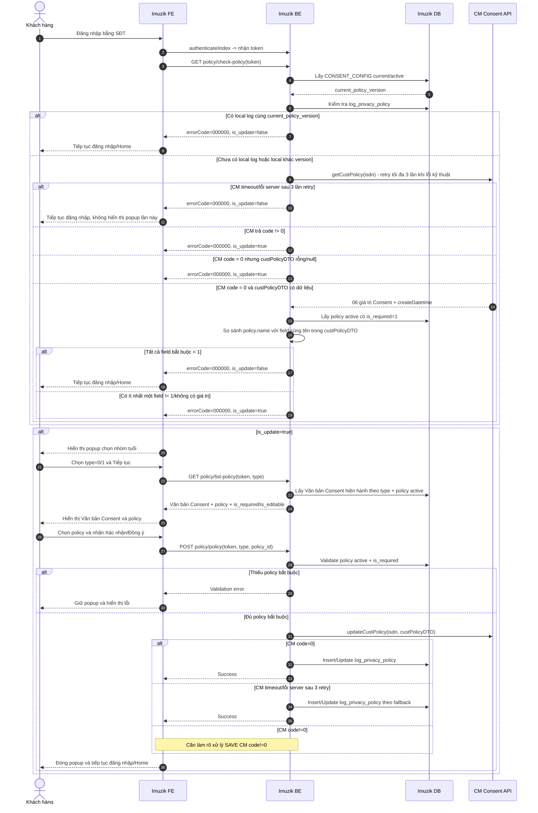

# TÀI LIỆU ĐẶC TẢ YÊU CẦU CHỨC NĂNG

**Giải pháp cập nhật và quản lý Consent khách hàng trên Imuzik**

Biểu mẫu rút gọn - áp dụng cho yêu cầu thay đổi/nâng cấp chức năng trên hệ thống đang vận hành.

| Thông tin | Nội dung |
|---|---|
| Tên yêu cầu / dự án | Cập nhật và quản lý Consent khách hàng trên Imuzik |
| Mã yêu cầu | Cần bổ sung |
| Đơn vị đề xuất | Cần bổ sung |
| Người đề xuất / Đầu mối liên hệ | Cần bổ sung |
| Ngày đề xuất | Cần bổ sung |
| Phiên bản | 0.20 - Chuẩn hóa luồng Bước 1-12, chốt kiểm tra local theo version và bổ sung đề xuất `CONSENT_CONFIG` |

## 1. Lịch sử thay đổi

| Ngày | Phiên bản | PIC | Mục, bảng, sơ đồ được thay đổi | Lý do | Mô tả |
|---|---|---|---|---|---|
| 01/10/2026 | 0.1 | SơnLH21 | Toàn bộ tài liệu | Xây dựng mới | Xây dựng giải pháp Consent Imuzik theo PYC, hiện trạng MyClip, API CM và nội dung Q&A Round 1 |
| 01/10/2026 | 0.2 | SơnLH21 | Mục 2.4-2.5; 3.1.2-3.1.3; 4; 5 | Bổ sung nguồn hiện trạng | Mapping API/FE xác nhận chính sách hiện tại của Imuzik vào giải pháp Consent mới; xác định phần reuse, phần thay đổi và nội dung bị ghi đè |
| 01/10/2026 | 0.3 | SơnLH21 | Mục 2.5; 3.1.2-3.1.3; 4.1-4.5; 5 | Chuẩn hóa định danh Consent và local log | Bổ sung `policy_key` theo key CM; bỏ `vt_member.is_update_policy` khỏi logic mới; bổ sung `log_privacy_policy` theo mô hình MyClip |
| 01/10/2026 | 0.4 | SơnLH21 | Mục 2.5; 3.1.2-3.1.3; 4.1-4.5; 5 | Chốt cơ chế định danh kép | Giữ đồng thời `policy.id` và `policy_key` theo mapping 1-1 cố định; API/DB dùng cả hai lớp định danh; `log_privacy_policy` lưu đồng thời `confirm_ids` và `confirm_keys` |
| 01/10/2026 | 0.5 | SơnLH21 | Mục 2.1-2.5; 3.1.2-3.1.4; 4.2; 4.5; 5 | Chốt nguồn cấu hình và thứ tự chọn nhóm tuổi | Toàn bộ rule/version Consent lấy từ DB, không dùng file config; khách hàng chọn nhóm tuổi trước `GET policy/list-policy`, FE truyền `type` để BE trả đúng Văn bản Consent và bộ điều khoản tương ứng |
| 01/10/2026 | 0.6 | SơnLH21 | Mục 2.5; 3.1.3; 4.1-4.6; 5 | Bổ sung thiết kế CSDL | Coi toàn bộ bảng Consent là bảng mới; tách bảng văn bản, danh mục policy, cấu hình policy theo văn bản/nhóm tuổi, cấu hình chung và log Consent tương tự MyClip |
| 01/10/2026 | 0.7 | SơnLH21 | Mục 2.5; 3.1.2-3.1.4; 4.2; 5 | Chốt xử lý FE và tối giản tích hợp CM | `GET policy/list-policy` trả rõ rule điều khoản bắt buộc để FE disable/enable nút xác nhận; bỏ `getCustPolicy` lần 2 trước `updateCustPolicy`, chỉ kiểm tra Consent CM một lần tại đầu luồng |
| 01/10/2026 | 0.8 | SơnLH21 | Mục 2.1-2.5; 3.1.2-3.1.4; 4.1-4.6; 5 | Chốt thứ tự đánh giá Consent và nguồn cấu hình DB | Check `log_privacy_policy` trước; chỉ gọi CM khi chưa có log local; CM không có dữ liệu thì xác định chưa Consent; giữ độc lập `is_required` và `is_required_display`; đổi `cm_create_datetime` thành `cm_checked_at` mang nghĩa thời điểm kiểm tra CM và chuyển quản lý văn bản/config sang cập nhật trực tiếp DB |
| 02/10/2026 | 0.9 | SơnLH21 | Mục 3.1.3 | Chuẩn hóa mô tả luồng triển khai | Viết lại toàn bộ luồng theo từng bước Actor/API/DB, Request, Response, xử lý và điều kiện rẽ nhánh; giữ nguyên các business rule đã chốt tại v0.8 |
| 02/10/2026 | 0.12 | SơnLH21 | Mục 2.5; 3.1.2-3.1.4; 4.1-4.6 | Mapping FE MyClip và tối ưu mô hình dữ liệu | Reuse pattern FE MyClip cho bước kiểm tra/chọn nhóm tuổi/xác nhận; không reuse cơ chế article JSON/FE tự parse; rút logical data model xuống 3 bảng đề xuất và ghi rõ các bảng này chưa xác nhận tồn tại trên Imuzik, sẽ chốt ở bước thiết kế DB |
| 02/10/2026 | 0.13 | SơnLH21 | Mục 3.1.2-3.1.3; 3.1.4; 5 | Chốt retry tích hợp CM | Mọi lần gọi CM (`getCustPolicy`, `updateCustPolicy`) retry tối đa 3 lần khi lỗi/timeout; sau 3 lần vẫn thất bại thì trả lỗi ngay, không fallback cho đăng nhập và không ghi Consent local thành công |
| 02/10/2026 | 0.14 | SơnLH21 | Mục 3.1.2-3.1.3; 3.1.4; 4; 5 | Điều chỉnh fallback khi CM lỗi kỹ thuật theo MyClip | `getCustPolicy` timeout/lỗi server sau 3 lần retry → `/check-policy` vẫn trả success với `is_update=false`; `updateCustPolicy` timeout/lỗi server sau 3 lần retry → vẫn ghi `log_privacy_policy` local tương tự MyClip. `code != 0` có response được tách riêng khỏi timeout/lỗi server. |
| 02/10/2026 | 0.15 | SơnLH21 | Mục 3.1.3 - Bước 2.1-3.3; 4.1.4 | Clean luồng gọi CM và response lỗi | Chuẩn hóa case thiếu cấu hình current thành lỗi hệ thống `000001`; bỏ `cm_checked_at`; viết gọn luồng `getCustPolicy`; mapping các mã lỗi CM đã biết trực tiếp sang `errorCode/message` trả FE; giữ timeout/lỗi server sau 3 retry → `/check-policy` success với `is_update=false`. |
| 02/10/2026 | 0.16 | SơnLH21 | Mục 3.1.2-3.1.3; 3.1.4; 4.3; 5 | Chốt xử lý response lỗi nghiệp vụ từ `getCustPolicy` | Khi CM trả `code != 0`, Imuzik không trả lỗi CM ra FE mà xử lý nghiệp vụ tương đương chưa có Consent: `/policy/check-policy` trả success với `is_update=true`. Timeout/lỗi server sau 3 retry vẫn giữ `is_update=false`. Quyết định này ghi đè mapping lỗi CM → FE tại v0.15. |
| 02/10/2026 | 0.17 | SơnLH21 | Mục 3.1.2-3.1.3; 3.1.5; 4.2-4.3 | Chuẩn hóa điều kiện đọc dữ liệu Consent từ CM | Với `code=0`, chỉ tiếp tục đánh giá 06 giá trị Consent khi `custPolicyDTO` có dữ liệu. Nếu `custPolicyDTO` không có dữ liệu thì xác định cần Consent lại (`is_update=true`). |
| 02/10/2026 | 0.18 | SơnLH21 | Mục 2.5-2.6; 3.1.2-3.1.3; 4.1-4.5; 5 | Tối giản data model policy | Bỏ logical table `CONSENT_POLICY`; reuse/mở rộng bảng `policy` hiện tại của Imuzik. Bổ sung `policy_key`, `is_required_display`, `is_editable`; `current_policy_version` và nguồn Văn bản Consent tiếp tục lấy từ cấu hình DB, chưa khóa thành bảng vật lý riêng. |
| 02/10/2026 | 0.19 | SơnLH21 | Mục 2.2; 2.5-2.6; 3.1.2-3.1.5; 4.1-4.5; 5 | Chốt với Dev rule policy và mapping CM | Bỏ hoàn toàn `is_required_display` và `policy_key`; `is_required` là rule duy nhất xác định Consent bắt buộc để đi tiếp; `is_editable` xác định trạng thái mặc định tick trên FE; dùng `policy.name` lưu trực tiếp key CM và `sortorder` xác định thứ tự Điều khoản 1-6. |
| 02/10/2026 | 0.20 | SơnLH21 | Mục 2.5-2.6; 3.1.2-3.1.5; 4.1-4.5; 5 | Chuẩn hóa end-to-end flow theo format BA đã chốt | Local log cùng `current_policy_version` → `is_update=false` mà không đối chiếu lại `confirm_ids`; CM `code=0` + `custPolicyDTO` có dữ liệu → đối chiếu `policy.name` active/required với field cùng tên; bổ sung Bước 4 chọn nhóm tuổi trước `list-policy`; chuẩn hóa Bước 4-12; `is_editable` chỉ dùng xác định trạng thái mặc định tick; đề xuất thêm `CONSENT_CONFIG` để quản lý version/văn bản Consent. |
| 02/10/2026 | 0.10 | SơnLH21 | Mục 3.1.3 - Bước 1 đến Bước 6 | Chuẩn hóa riêng luồng `GET policy/check-policy` | Bước 1 chỉ mô tả FE gọi API và request; gom logic BE cũ Bước 2-5 thành Bước 2.1-2.4; Bước 6 đổi thành Bước 3 mô tả response/xử lý response; bổ sung các response lỗi đã có trong tài liệu XML hiện trạng. Chưa cập nhật các bước phía sau |

## 2. Thông tin tổng quan

### 2.1 Hiện trạng và lý do thay đổi

Imuzik cần cập nhật luồng xin Consent khách hàng trên Web/Wap/App và đồng bộ dữ liệu Consent theo số thuê bao về hệ thống CM.

CM hiện cung cấp API kiểm tra và lưu Consent, dữ liệu nghiệp vụ chính gồm 06 giá trị tương ứng 06 mục đích xử lý dữ liệu cá nhân. CM không cung cấp `policyVersion` của văn bản Consent cho từng dịch vụ. Các trường `consent`, `displayConsent` do CM tự tính theo cấu hình CM không được sử dụng làm nguồn quyết định nghiệp vụ của Imuzik trong phương án này.

Theo nội dung Q&A Round 1:

- Imuzik tự quản lý toàn bộ rule/version Consent tại DB hệ thống; không dùng file config/file deploy làm nguồn cấu hình nghiệp vụ.
- CM chỉ đóng vai trò lưu và trả dữ liệu Consent dùng chung.
- Imuzik tự quyết định có hiển thị popup, có cho đóng popup và có cho đăng nhập tiếp hay không.
- Khi Imuzik chưa có `log_privacy_policy`, Consent của dịch vụ khác có thể được công nhận theo 06 giá trị CM nếu đáp ứng toàn bộ policy active có `is_required=1` của Imuzik. Việc quy đổi dữ liệu CM sang `policy_version` Imuzik vẫn là **Cần làm rõ**.
- Văn bản Consent do từng dịch vụ quản lý riêng, nhưng các lựa chọn được mapping về cùng 06 trường Consent trên CM.
- Imuzik không xây dựng CMS quản lý Văn bản Consent trong phạm vi hiện tại.

### 2.2 Mục đích và phạm vi

- Kiểm tra trạng thái Consent của khách hàng khi thực hiện đăng nhập Imuzik bằng số điện thoại.
- Áp dụng trên Website, Wapsite và App Imuzik.
- Không áp dụng đăng nhập Google/Facebook.
- Không bổ sung Mini App/Tammi/MyViettel hoặc kênh khác trong phiên bản 0.9.
- Imuzik gọi CM để lấy 06 giá trị Consent hiện hành theo số thuê bao.
- Imuzik tự so sánh dữ liệu CM với cấu hình Consent lưu trong DB Imuzik để quyết định luồng tiếp theo; không đọc rule/version Consent từ file config.
- Sử dụng một rule bắt buộc duy nhất tại bảng `policy`:
  - `is_required=1`: khách hàng phải Consent điều khoản tương ứng để được đi tiếp; rule này được dùng cả khi kiểm tra trạng thái hiện tại và khi validate submit popup.
  - `is_editable`: xác định điều khoản được mặc định tick trên FE; không tham gia quyết định `is_update`.
- Cho phép khách hàng tự chọn nhóm tuổi:
  - Từ 16 tuổi trở lên.
  - Dưới 16 tuổi.
- Lưu nhóm tuổi tại log Consent của Imuzik; không lưu nhóm tuổi lên CM.
- Quản lý `current_policy_version` tại Imuzik tương tự cơ chế MyClip.
- CM không thay đổi API, không bổ sung `systemCode` hoặc `policyVersion` theo yêu cầu của Imuzik.
- Khi lưu Consent mới/cập nhật Consent, ưu tiên đồng bộ CM; nếu `updateCustPolicy` timeout/lỗi server sau 3 lần retry thì vẫn lưu `log_privacy_policy` local theo cơ chế tham chiếu MyClip.
- Chưa bao gồm chức năng thay đổi/rút Consent sau khi đã đăng nhập; nội dung này để làm rõ ở vòng tiếp theo.

### 2.3 Thuật ngữ viết tắt

| STT | Thuật ngữ | Mô tả |
|---:|---|---|
| 1 | Imuzik FE | Frontend Website/Wapsite/App Imuzik |
| 2 | Imuzik BE | Backend Imuzik xử lý đăng nhập và nghiệp vụ Consent |
| 3 | CM | Hệ thống quản lý tập trung dữ liệu Consent |
| 4 | Consent | Xác nhận/lựa chọn của khách hàng đối với các mục đích xử lý dữ liệu cá nhân |
| 5 | `current_policy_version` | Phiên bản Văn bản Consent hiện hành do Imuzik quản lý |
| 6 | `policy_version` | Phiên bản Văn bản Consent được ghi nhận tại log local của khách hàng |
| 7 | `createDatetime` | Thời điểm tạo bản ghi Consent đang được CM trả về |
| 8 | Policy bắt buộc Consent | Policy active có `is_required=1`; khách hàng phải Consent để được đi tiếp |
| 9 | `policy.name` | Business/integration key của policy; 06 giá trị tương ứng trực tiếp 06 field CM |

### 2.4 Tài liệu tham khảo

| STT | Tên | Phiên bản | Đường dẫn/Ghi chú |
|---:|---|---|---|
| 1 | PYC cập nhật Văn bản Consent Imuzik | Hiện hành | Nguồn yêu cầu nghiệp vụ |
| 2 | PYC/API CM kiểm tra, lưu Consent | PYC-64913 | Nguồn API và xử lý dữ liệu CM |
| 3 | Văn bản chấp thuận xử lý và bảo vệ dữ liệu cá nhân tại VTT | Hiện hành | Nguồn nội dung 06 mục đích xử lý dữ liệu |
| 4 | API MyClip / luồng Consent hiện tại | Hiện hành | Nguồn tham khảo cơ chế local log và version |
| 5 | Q&A Consent - Round 1 | 01/10/2026 | Nguồn xác nhận nghiệp vụ hiện tại |
| 6 | Viettel.vn | Cần bổ sung tài liệu tham chiếu | Hiện KH yêu cầu tham chiếu thêm; chưa có đặc tả chính thức trong bộ tài liệu đầu vào |
| 7 | API xác nhận chính sách.xml | Hiện trạng Imuzik | Nguồn chuẩn về endpoint REST hiện tại, request/response, validation và cập nhật DB local |
| 8 | FE xác nhận chính sách.xml | Hiện trạng Imuzik | Nguồn chuẩn về hành vi popup, rule bắt buộc và mapping UI hiện tại |

### 2.5 Hiện trạng API/FE xác nhận chính sách Imuzik và định hướng reuse

Imuzik hiện đã có module **Popup xác nhận chính sách**. Phương án v0.20 ưu tiên reuse contract API hiện có để giảm ảnh hưởng FE, đồng thời tham chiếu cách tổ chức luồng FE của MyClip. Logic quyết định Consent theo thứ tự **cấu hình Consent hiện hành → `log_privacy_policy` local → CM khi cần đối soát**.

| API/Thành phần hiện tại | Hiện trạng | Xử lý v0.20 |
|---|---|---|
| `GET policy/check-policy` | Nhận `authorization_code` optional, `token` required; logic cũ kiểm tra `vt_member.created_at` và `is_update_policy`; response có `is_update` | **Reuse endpoint/contract chính**. Giữ `is_update` để FE biết có hiển thị popup hay không; BE lấy `current_policy_version`, check local log trước và chỉ gọi CM khi chưa có local log hoặc local khác `current_policy_version` |
| `GET policy/list-policy` | Lấy policy active theo `sortorder` | **Reuse endpoint**, bổ sung tham số bắt buộc `type` (`0` = từ 16 tuổi trở lên, `1` = dưới 16 tuổi). Mỗi policy sử dụng `is_required` để xác định Consent bắt buộc và `is_editable` để xác định trạng thái mặc định tick trên FE. `policy.name` dùng nội bộ BE để map CM, không bắt buộc FE phải biết |
| `POST policy/policy` | Nhận `policy_id`; hiện tại cập nhật trực tiếp `vt_member.is_update_policy=1`, `policy_id`, `updated_at` | **Reuse endpoint**, tiếp tục nhận danh sách `policy_id` để tương thích contract hiện tại. BE tra cứu `policy.name` của từng ID để build đủ 06 field CM; `sortorder` xác định thứ tự Điều khoản 1-6. Xử lý: validate `is_required` → SAVE CM → nếu `code=0` hoặc timeout/lỗi server sau 3 retry theo rule fallback thì ghi `log_privacy_policy`. Không update `vt_member.is_update_policy` làm nguồn trạng thái Consent |
| `vt_member.policy_id` | Lưu danh sách `policy.id` khách hàng đã chọn | **Legacy**. Không dùng làm source of truth cho luồng mới; giữ lại nếu chức năng cũ còn tham chiếu và xử lý deprecated theo kế hoạch migration |
| `vt_member.is_update_policy` | Cờ local 0/1 quyết định popup theo luồng cũ | **Deprecated khỏi logic Consent mới**. Không đọc field này để quyết định popup và không cần cập nhật field này trong luồng mới |
| Bảng `policy` hiện tại | Reuse bảng hiện tại | **Không tạo `CONSENT_POLICY` riêng**. Chốt với Dev: dùng `is_required` làm rule Consent bắt buộc; dùng `is_editable` cho trạng thái mặc định tick; cập nhật giá trị `name` của 06 policy thành đúng 06 field CM; dùng `sortorder` xác định thứ tự Điều khoản 1-6 |
| `log_privacy_policy` | Chưa có trong module Imuzik hiện tại | **Bổ sung theo hướng MyClip** để lưu snapshot Consent local theo user/MSISDN, nhóm tuổi, version và danh sách `policy.id` đã chọn |

**Nội dung hiện trạng bị ghi đè/cập nhật trong v0.20:**

- Bỏ rule `vt_member.created_at < 01/07/2023 => không hiển thị popup`.
- Bỏ `vt_member.is_update_policy` khỏi toàn bộ logic quyết định popup Consent mới.
- Bỏ `policy_key`. Sử dụng trực tiếp `policy.name` làm key mapping CM; dữ liệu `name` của 06 policy lần lượt là `provideProduct`, `supportCustomer`, `improveQuality`, `marketingAdvertising`, `researchMarket`, `tradePromotion`.
- Bỏ hoàn toàn `is_required_display`. FE/BE dùng duy nhất `is_required` cho rule Consent bắt buộc; `is_editable` chỉ phục vụ trạng thái mặc định tick trên FE.
- Quyết định cuối cùng sử dụng dữ liệu CM, cấu hình DB Imuzik và `log_privacy_policy`/version local theo tài liệu này.

### 2.6 Mapping FE MyClip và định hướng tối ưu cho Imuzik

MyClip được sử dụng làm nguồn tham chiếu về **cách tổ chức luồng FE**, không phải nguồn để sao chép nguyên contract/API hoặc cấu trúc lưu nội dung. Tài liệu FE MyClip cho thấy luồng tách rõ: API kiểm tra có cần xác nhận, bước chọn nhóm tuổi, API lấy nội dung/policy và API ghi nhận Consent. MyClip truyền `type=0` cho nhóm từ 16 tuổi trở lên và `type=1` cho nhóm dưới 16 tuổi; khi submit truyền danh sách `confirmIds` cùng `type`.

**Tối ưu data model cho Imuzik:** MyClip không cần một bảng policy riêng cho 06 mục đích trong luồng FE mà lấy danh sách mục đích từ cấu hình nội dung. Imuzik hiện đã có bảng `policy` phục vụ chính endpoint `list-policy`, vì vậy phương án v0.20 reuse bảng này thay vì tạo thêm bảng policy khác.

| Nội dung | MyClip | Imuzik v0.20 |
|---|---|---|
| Kiểm tra có cần Consent | API check trả `isRequireConfirm` | Reuse `GET policy/check-policy`, giữ `data.is_update` để giảm impact FE |
| Chọn nhóm tuổi | FE hiển thị chọn nhóm tuổi trước khi tải nội dung phù hợp | Reuse; FE chọn `type` trước `GET policy/list-policy` |
| Giá trị `type` | `0`: từ 16 tuổi trở lên; `1`: dưới 16 tuổi | Reuse nguyên |
| Lấy nội dung Consent | MyClip lấy article JSON và FE parse `parent_contents`/`privacy_policy_purpose` | **Không reuse**; Imuzik BE trả sẵn đúng document + policies theo `type` |
| Rule bắt buộc | MyClip dùng `require=true/false` | Mapping sang `is_required`; FE chỉ dùng để enable/disable nút xác nhận |
| Trạng thái mặc định policy | MyClip có rule riêng theo nội dung/note | Imuzik dùng `is_editable` để FE xác định policy mặc định tick |
| Submit | `confirmIds` + `type` | Reuse tư tưởng; Imuzik giữ `policy_id` + `type`, BE tra `policy.name` để map trực tiếp sang field CM |
| Scroll hết mới xác nhận / checkbox tổng auto-select | Có trong FE MyClip | **Không đưa vào Imuzik nếu chưa có yêu cầu** |
| Default tick toàn bộ | Có trong MyClip | **Không mặc định reuse**; trạng thái tick ban đầu của từng policy lấy theo `is_editable` của Imuzik |

**Nguyên tắc tối ưu FE Imuzik:** FE chỉ thực hiện render và validation hiển thị cơ bản theo response BE; không tự parse JSON article, không tự chọn phụ lục theo index, không tự hard-code policy bắt buộc và không tự map policy sang key CM.

## 3. Yêu cầu về chức năng

### 3.1 UC01 - Kiểm tra và xác nhận Consent khi đăng nhập Imuzik

#### 3.1.1 Mô tả chung

| Thông tin | Nội dung |
|---|---|
| Actor chính | Khách hàng đăng nhập Imuzik bằng số điện thoại |
| Mục đích / Mô tả | Kiểm tra dữ liệu Consent hiện có, đối chiếu với rule/version của Imuzik và yêu cầu khách hàng xác nhận lại khi chưa đáp ứng |
| Hệ thống thực hiện | Imuzik FE, Imuzik BE, DB/Cấu hình DB Imuzik, CM |
| Trigger | Khách hàng thực hiện đăng nhập bằng số điện thoại |
| Điều kiện đầu vào | Imuzik xác định được số thuê bao đăng nhập; hệ thống đọc được cấu hình Consent hiện hành |
| Điều kiện đầu ra thành công | Khách hàng đáp ứng rule Consent hiện hành và tiếp tục đăng nhập |
| Điều kiện đầu ra không thành công | Không cho hoàn tất đăng nhập khi khách hàng chưa đáp ứng rule bắt buộc hoặc API Imuzik trả lỗi nghiệp vụ/kỹ thuật không thuộc case fallback đã mô tả |
| Link Figma | Cần bổ sung |

#### 3.1.2 Sơ đồ luồng Sequence Diagram



#### 3.1.3 Mô tả luồng xử lý

##### 3.1.3.1 Mapping API Imuzik hiện tại vào luồng mới

| Bước nghiệp vụ | API/DB sử dụng | Xử lý chính | Thay đổi so với hiện trạng |
|---|---|---|---|
| Kiểm tra có cần Consent | `GET policy/check-policy`; `CONSENT_CONFIG`; `log_privacy_policy`; CM `getCustPolicy` | Xác thực user → lấy `current_policy_version` → check local log → chỉ gọi CM khi chưa có log hoặc local khác version → trả `is_update` | Bỏ logic quyết định dựa trên `vt_member.created_at`/`vt_member.is_update_policy` |
| Chọn nhóm tuổi | FE local state | KH chọn `type=0/1` | Thực hiện ngay sau khi `check-policy` trả `is_update=true`, trước `GET policy/list-policy` |
| Lấy Văn bản và điều khoản | `GET policy/list-policy?type=...`; `CONSENT_CONFIG`; bảng `policy` | Trả đúng Văn bản Consent theo nhóm tuổi/version và danh sách policy active | FE không parse article JSON; BE trả `is_required`, `is_editable`; `policy.name` dùng nội bộ để map CM |
| Xác nhận Consent | `POST policy/policy`; CM `updateCustPolicy`; `log_privacy_policy` | Validate policy bắt buộc → build 06 field CM → SAVE CM → ghi local log theo rule đã chốt | Không gọi `getCustPolicy` lần 2 trước SAVE; không update `vt_member.is_update_policy` làm source of truth |

**Nguyên tắc chung**

- `policy.id` là khóa kỹ thuật/contract `policy_id` hiện tại.
- `policy.name` lưu trực tiếp key CM và được dùng để mapping field trong `custPolicyDTO`.
- `policy.sortorder` xác định thứ tự Điều khoản 1-6 và thứ tự hiển thị.
- `is_required` xác định policy khách hàng bắt buộc phải Consent để được đi tiếp.
- `is_editable` chỉ xác định trạng thái mặc định tick của policy trên FE; không tham gia quyết định `is_update`.
- Không sử dụng `is_required_display` hoặc `policy_key`.
- `consent`, `displayConsent`, `systemType` từ CM không dùng để quyết định nghiệp vụ Imuzik trong phạm vi hiện tại.

##### Bước 1 - Imuzik FE: Gọi API kiểm tra Consent

Sau khi khách hàng đăng nhập Imuzik thành công bằng số điện thoại, FE gọi API kiểm tra có cần hiển thị luồng Consent hay không.

**API**

```http
GET policy/check-policy
```

**Request**

| Field | Bắt buộc | Nguồn | Mô tả |
|---|---:|---|---|
| `token` | Có | API `authenticate/index` | Token xác thực người dùng; BE sử dụng để xác định user/MSISDN |
| `authorization_code` | Không | Cơ chế authorization hiện tại | Giữ theo contract API hiện tại |

Ví dụ:

```http
GET policy/check-policy?token=<token>&authorization_code=<authorization_code>
```

FE không tự đánh giá trạng thái Consent tại bước này. Toàn bộ logic xác định `is_update` được xử lý tại Imuzik BE ở Bước 2.

##### Bước 2 - Imuzik BE: Xử lý kiểm tra Consent

###### Bước 2.1 - Lấy cấu hình Consent hiện hành từ DB

*Đề xuất xây dựng thêm bảng `CONSENT_CONFIG` (Mô tả tại mục 4.1.3), Dev rà soát và đánh giá thêm cấu trúc bảng.*

Imuzik BE thực hiện:

1. Query bản ghi `CONSENT_CONFIG` đang `is_current=1` và `status=active`.
2. Lấy `policy_version` của bản ghi này và gán nội bộ thành `current_policy_version`.
3. Nếu lỗi truy vấn DB **hoặc truy vấn thành công nhưng không tồn tại cấu hình current/active** → coi là lỗi cấu hình/hệ thống, dừng xử lý và trả `errorCode=000001`.

**Output nội bộ**

```text
current_policy_version = <CONSENT_CONFIG.policy_version của bản ghi current>
```

###### Bước 2.2 - Kiểm tra `log_privacy_policy`

*Đề xuất xây dựng thêm bảng `log_privacy_policy` (Mô tả tại mục 4.1.4), Dev rà soát và đánh giá thêm cấu trúc bảng.*

*Bổ sung/cập nhật dữ liệu các field trong bảng `policy` để xác định các điều khoản khách hàng xác nhận (Mô tả tại mục 4.1.2).*

Imuzik BE thực hiện kiểm tra thông tin Consent của user trong bảng `log_privacy_policy`:

- **TH1: Không tồn tại bản ghi của user đăng nhập:**
  - User chưa từng thực hiện Consent tại Imuzik → chuyển Bước 2.3 để gọi CM kiểm tra Consent tập trung.

- **TH2: Có tồn tại bản ghi của user đăng nhập và `log_privacy_policy.policy_version = current_policy_version`:**
  - User đã thực hiện Consent version mới nhất tại Imuzik → Response `is_update=false`.

- **TH3: Có tồn tại bản ghi của user đăng nhập và `log_privacy_policy.policy_version != current_policy_version`:**
  - User chưa thực hiện Consent version mới nhất tại Imuzik → chuyển Bước 2.3 để gọi CM kiểm tra Consent tập trung.

###### Bước 2.3 - Thực hiện gọi hàm `getCustPolicy` bên CM

*API**

```soap
getCustPolicy
```

**Request**

```text
isdn = <MSISDN của user đang đăng nhập>
```

**Response**

CM trả response SOAP, Imuzik chỉ sử dụng các dữ liệu sau cho luồng kiểm tra Consent:

```json
{
  "code": "0",
  "description": "success",
  "custPolicyDTO": {
    "provideProduct": "1",
    "supportCustomer": "1",
    "improveQuality": "1",
    "marketingAdvertising": "0",
    "researchMarket": "0",
    "tradePromotion": "0",
    "createDatetime": "2026-10-02T15:02:49+07:00"
  }
}
```

**Xử lý kết quả gọi CM**

1. `code = 0` và `custPolicyDTO` có dữ liệu:
   - Lấy danh sách `policy.name` thỏa mãn:
     - `policy.is_active = 1`;
     - `policy.is_required = 1`.
   - Đối chiếu từng `policy.name` với field cùng tên trong `custPolicyDTO` do CM trả về.
   - Nếu tất cả các field tương ứng đều có giá trị `1`:
     - Xác định User đã Consent đầy đủ các điều khoản bắt buộc.
     - Response `is_update=false`.
   - Nếu có ít nhất một field tương ứng có giá trị khác `1` hoặc không có giá trị:
     - Xác định User chưa Consent đầy đủ các điều khoản bắt buộc.
     - Response `is_update=true`.
   - `custPolicyDTO.createDatetime` tạm thời giữ lại để phục vụ đánh giá rule reconcile/version; chưa sử dụng để quyết định `is_update` trong phiên bản hiện tại.

2. `code = 0` nhưng `custPolicyDTO` không có dữ liệu (`null`/rỗng):
   - Xác định User chưa Consent đầy đủ các điều khoản bắt buộc.
   - Response `is_update=true`.

3. CM trả `code != 0`:
   - Xác định User chưa Consent đầy đủ các điều khoản bắt buộc.
   - Response `is_update=true`.

4. Timeout/lỗi server/lỗi kết nối:
   - Retry tối đa 3 lần gọi `getCustPolicy`.
   - Nếu trong quá trình retry nhận được response từ CM thì xử lý theo mục 1, 2 hoặc 3 tương ứng.
   - Nếu sau 3 lần vẫn lỗi kỹ thuật thì `GET policy/check-policy` trả success với `is_update=false`.

**Các mã `code != 0` CM đã xác định trong luồng chỉ truyền `isdn`**

| Code CM | Description |
|---|---|
| `PYC_62335_1` | `Phải truyền một trong hai tham số isdn hoặc idNo` |
| `PYC_62335_3` | `Thuê bao không tồn tại hoặc không hoạt động trên hệ thống` |
| `PYC_62335_5` | `Không tìm thấy thông tin giấy tờ của khách hàng` |

`PYC_62335_2` và `PYC_62335_4` chỉ phát sinh khi truyền `idNo`/`idType`, không thuộc request Imuzik hiện tại.

##### Bước 3 - Imuzik BE/FE: Trả response và xử lý response `GET policy/check-policy`

###### Bước 3.1 - Response thành công

**Response**

```json
{
  "errorCode": "000000",
  "message": "Successful",
  "data": {
    "is_update": true
  }
}
```

Trong đó:

- `is_update=false`: khách hàng đã đáp ứng điều kiện Consent hiện hành → FE không hiển thị popup, tiếp tục luồng đăng nhập/Home, kết thúc luồng nghiệp vụ
- `is_update=true`: cần thực hiện luồng Consent → Chuyển sang bước 4, FE hiển thị **Popup xác nhận nhóm tuổi**. 

###### Bước 3.2 - Response lỗi của API Imuzik hiện tại

Các response dưới đây được giữ theo tài liệu XML của `GET policy/check-policy`.

| `errorCode` | `message` | Trường hợp | Xử lý FE |
|---|---|---|---|
| `000001` | `Hệ thống đang bận, vui lòng thử lại sau.` | Lỗi kết nối/xử lý DB Imuzik | Hiển thị lỗi hệ thống; không tiếp tục luồng Consent |
| `000003` | `Unknown method` | Gọi sai HTTP method, khác `GET` | Hiển thị lỗi kỹ thuật/không tiếp tục xử lý |
| `300002` | `Invalid authorization code` | Có truyền `authorization_code` nhưng không hợp lệ/hết hiệu lực | Dừng xử lý; thực hiện lại cơ chế authorization theo luồng hiện tại |
| `000002` | `Require login.` | Không truyền `token`/không có thông tin đăng nhập hợp lệ | Yêu cầu đăng nhập lại |
| `000008` | `Token không hợp lệ.` | `token` truyền lên không tồn tại hoặc hết hiệu lực | Yêu cầu đăng nhập lại |


##### Bước 4 - Imuzik FE: Hiển thị popup xác nhận nhóm tuổi

Khi `GET policy/check-policy` trả `is_update=true`, FE hiển thị popup để khách hàng xác nhận nhóm tuổi trước khi lấy Văn bản Consent.

**Nội dung hiển thị**

| Giá trị | Nhóm tuổi |
|---|---|
| `type = 0` | Từ 16 tuổi trở lên |
| `type = 1` | Dưới 16 tuổi |

**Xử lý tại FE**

- Mặc định chưa chọn nhóm tuổi.
- Button **Tiếp tục** disable khi chưa chọn nhóm tuổi.
- Sau khi khách hàng chọn một nhóm tuổi -> enable button **Tiếp tục**.
- Khi khách hàng nhấn **Tiếp tục** → chuyển Bước 5.


##### Bước 5 - Imuzik FE: Gọi API lấy Văn bản Consent và danh sách policy

Sau khi khách hàng xác nhận nhóm tuổi, FE gọi API lấy Văn bản Consent và danh sách policy tương ứng.

**API**

```http
GET policy/list-policy
```

**Request**

| Field | Bắt buộc | Nguồn | Mô tả |
|---|---:|---|---|
| `type` | Có | Giá trị khách hàng chọn tại Bước 4 | `0`: từ 16 tuổi trở lên; `1`: dưới 16 tuổi |
| `token` | Có | API `authenticate/index` | Token xác thực người dùng |
| `authorization_code` | Không | Cơ chế authorization hiện tại | Giữ theo contract API hiện tại |

Ví dụ:

```http
GET policy/list-policy?type=0&token=<token>&authorization_code=<authorization_code>
```

##### Bước 6 - Imuzik BE: Xử lý lấy Văn bản Consent và danh sách policy

Imuzik BE thực hiện:

1. Validate thông tin request:
   - `token` hợp lệ;
   - `type ∈ {0,1}`.
2. Lấy cấu hình `CONSENT_CONFIG` hiện hành tương ứng `current_policy_version` và `type` khách hàng đã chọn.
3. Lấy Văn bản Consent tương ứng nhóm tuổi/version hiện hành.
4. Lấy danh sách policy thỏa mãn `policy.is_active = 1`.
5. Sắp xếp danh sách policy theo `policy.sortorder ASC`.
6. Trả Văn bản Consent và danh sách policy về FE.

**Response đề xuất**

```json
{
  "errorCode": "000000",
  "message": "Successful",
  "data": {
    "policy_version": "<current_policy_version>",
    "type": 0,
    "document": {
      "id": "<document_id>",
      "file_url": "<consent_document_url>"
    },
    "policies": [
      {
        "id": 1,
        "description": "<Nội dung điều khoản>",
        "is_required": 1,
        "is_editable": 0
      }
    ]
  }
}
```

Trong đó:

- `is_required`: xác định policy bắt buộc khách hàng phải Consent để được tiếp tục.
- `is_editable`: xác định trạng thái mặc định tick của policy trên FE.
- `sortorder`: sử dụng tại BE để xác định thứ tự Điều khoản 1-6 và thứ tự trả danh sách policy.
- `policy.name`: sử dụng tại BE để mapping với field cùng tên của CM; không bắt buộc trả về FE.
- Cấu trúc `document.id`/`document.file_url`: **Cần Dev chốt theo cấu trúc lưu Văn bản Consent thực tế**.

##### Bước 7 - Imuzik FE: Hiển thị Văn bản Consent

Sau khi `GET policy/list-policy` trả thành công, FE hiển thị Văn bản Consent và danh sách policy theo dữ liệu BE trả về.

**Xử lý tại FE**

- Hiển thị Văn bản Consent tương ứng với nhóm tuổi khách hàng đã chọn.
- Hiển thị danh sách policy theo thứ tự BE trả về.
- Thiết lập trạng thái tick mặc định của từng policy theo `is_editable`.
- Kiểm tra các policy có `is_required = 1`:
  - nếu còn ít nhất một policy bắt buộc chưa được tick → disable button **Xác nhận/Đồng ý**;
  - nếu toàn bộ policy bắt buộc đã được tick → enable button **Xác nhận/Đồng ý**.
- Các policy có `is_required = 0` không ảnh hưởng điều kiện cho phép khách hàng tiếp tục.

Khi khách hàng nhấn **Xác nhận/Đồng ý** → chuyển Bước 8.

##### Bước 8 - Imuzik FE: Gọi API lưu Consent

FE gửi danh sách policy khách hàng đã Consent về Imuzik BE.

**API**

```http
POST policy/policy
```

**Request**

```json
{
  "token": "<token>",
  "authorization_code": "<authorization_code>",
  "type": 0,
  "policy_id": "1,2,3"
}
```

| Field | Bắt buộc | Nguồn | Mô tả |
|---|---:|---|---|
| `token` | Có | API `authenticate/index` | Xác định user/MSISDN |
| `authorization_code` | Không | Cơ chế authorization hiện tại | Giữ theo contract API hiện tại |
| `type` | Có | Giá trị khách hàng chọn tại Bước 4 | Phải cùng nhóm tuổi đã dùng để lấy Văn bản Consent |
| `policy_id` | Có | Danh sách policy khách hàng đã tick | Danh sách `policy.id`, phân tách bằng dấu `,` |

##### Bước 9 - Imuzik BE: Validate thông tin Consent

Sau khi nhận request `POST policy/policy`, Imuzik BE thực hiện:

1. Validate `token` và xác định user/MSISDN.
2. Validate `type ∈ {0,1}`.
3. Validate định dạng `policy_id`.
4. Kiểm tra toàn bộ `policy_id` truyền lên tồn tại và có `policy.is_active = 1`.
5. Lấy danh sách policy bắt buộc thỏa mãn:
   - `policy.is_active = 1`;
   - `policy.is_required = 1`.
6. Kiểm tra toàn bộ policy bắt buộc có trong danh sách `policy_id` khách hàng gửi lên:
   - Nếu đầy đủ → tiếp tục Bước 10.
   - Nếu thiếu ít nhất một policy bắt buộc → trả lỗi cho FE, không gọi CM.

##### Bước 10 - Imuzik BE: Gọi CM lưu Consent

Sau khi validate thành công, Imuzik BE lấy thông tin các policy đang active và build `custPolicyDTO`.

**Nguyên tắc mapping**

- Lấy `policy.name` để xác định field tương ứng trong `custPolicyDTO`.
- Nếu `policy.id` có trong danh sách `policy_id` khách hàng đã Consent → field CM cùng tên = `1`.
- Nếu `policy.id` không có trong danh sách `policy_id` khách hàng đã Consent → field CM cùng tên = `0`.

Ví dụ:

```json
{
  "provideProduct": "1",
  "supportCustomer": "1",
  "improveQuality": "1",
  "marketingAdvertising": "0",
  "researchMarket": "0",
  "tradePromotion": "0"
}
```

Imuzik BE gọi hàm `updateCustPolicy` bên CM.

**Request**

```text
isdn = <MSISDN của user đang đăng nhập>
custPolicyDTO = <06 giá trị Consent>
```

**Xử lý kết quả gọi CM**

1. CM trả `code = 0`:
   - Xác định lưu Consent CM thành công.
   - Chuyển Bước 11 để ghi nhận Consent tại Imuzik.

2. Timeout/lỗi server/lỗi kết nối:
   - Retry tối đa 3 lần gọi `updateCustPolicy`.
   - Nếu trong quá trình retry nhận được response `code = 0` → chuyển Bước 11.
   - Nếu sau 3 lần vẫn lỗi kỹ thuật:
     - không block luồng Consent;
     - vẫn chuyển Bước 11 để ghi nhận Consent tại Imuzik.

3. CM trả `code != 0`:
   - **Cần làm rõ:** trả lỗi cho FE hay vẫn ghi nhận Consent local tương tự trường hợp timeout/lỗi server.
   - Không tự xử lý `code != 0` giống timeout khi chưa chốt nghiệp vụ.

##### Bước 11 - Imuzik BE: Ghi nhận Consent tại `log_privacy_policy`

Imuzik BE insert/update thông tin Consent local khi:

- `updateCustPolicy` trả `code = 0`; hoặc
- CM timeout/lỗi server/lỗi kết nối sau tối đa 3 lần retry nhưng vẫn không thành công.

**Dữ liệu lưu**

| Field | Giá trị |
|---|---|
| `user_id` | User đang đăng nhập |
| `isdn` | MSISDN của user |
| `confirm_ids` | Danh sách `policy.id` khách hàng đã Consent |
| `is_consent` | `1` |
| `type` | Nhóm tuổi khách hàng đã chọn |
| `policy_version` | `current_policy_version` tại thời điểm Consent |
| `created_at` | Thời điểm tạo bản ghi |
| `updated_at` | Thời điểm cập nhật bản ghi |

Nếu user chưa có bản ghi → INSERT.

Nếu user đã có bản ghi → UPDATE bản ghi hiện tại theo Consent mới nhất.

##### Bước 12 - Imuzik BE/FE: Trả response và hoàn tất luồng Consent

Sau khi ghi `log_privacy_policy` thành công, Imuzik BE trả response thành công cho FE.

**Response**

```json
{
  "errorCode": "000000",
  "message": "Successful",
  "data": null
}
```

**Xử lý tại FE**

- Đóng popup Consent.
- Xác định khách hàng đã hoàn tất luồng Consent.
- Tiếp tục luồng đăng nhập và điều hướng vào Home.

Nếu API trả lỗi:

- FE giữ popup Consent.
- Hiển thị thông báo lỗi tương ứng.
- Không cho khách hàng tiếp tục vào Home cho đến khi xử lý Consent thành công, ngoại trừ các trường hợp fallback kỹ thuật đã được mô tả tại Bước 10.

#### 3.1.4 Màn hình liên quan

**MH01 - Popup chọn nhóm tuổi**

| STT | Thành phần | Loại dữ liệu | Nguồn | Mặc định | Mô tả |
|---:|---|---|---|---|---|
| 1 | 16 tuổi trở lên | Radio/Option | Người dùng chọn | Chưa chọn | Lưu vào log local |
| 2 | Dưới 16 tuổi | Radio/Option | Người dùng chọn | Chưa chọn | Không yêu cầu nhập thông tin giám hộ trong v0.20 |
| 3 | Tiếp tục | Button | Trạng thái lựa chọn | Disable | Enable khi đã chọn một nhóm tuổi |

**MH02 - Popup/Văn bản Consent**

| STT | Thành phần | Loại dữ liệu | Nguồn | Mặc định | Mô tả |
|---:|---|---|---|---|---|
| 1 | Nội dung Văn bản Consent | Text/WebView/HTML theo triển khai hiện tại | Imuzik | Theo version hiện hành | Không làm CMS trong v0.20 |
| 2 | Điều khoản 1 | Checkbox/Readonly state | DB + mapping `provideProduct` | Theo DB | Không cho người dùng sửa |
| 3 | Điều khoản 2 | Checkbox/Readonly state | DB + mapping `supportCustomer` | Theo DB | Không cho người dùng sửa |
| 4 | Điều khoản 3 | Checkbox | `improveQuality` | Theo dữ liệu CM/DB | Editable theo DB |
| 5 | Điều khoản 4 | Checkbox | `marketingAdvertising` | Theo dữ liệu CM/DB | Editable theo DB |
| 6 | Điều khoản 5 | Checkbox | `researchMarket` | Theo dữ liệu CM/DB | Editable theo DB |
| 7 | Điều khoản 6 | Checkbox | `tradePromotion` | Theo dữ liệu CM/DB | Editable theo DB |
| 8 | Xác nhận/Tiếp tục | Button | `is_required` | Disable nếu còn policy bắt buộc chưa Consent | Khi bấm, FE gửi lựa chọn sang BE để validate và lưu CM |
| 9 | Thông báo lỗi | Message | BE/CM | Không có | Hiển thị khi chưa đủ điều khoản hoặc lưu CM thất bại |

#### 3.1.5 Business Rules

| Rule ID | Mô tả quy tắc | Ghi chú |
|---|---|---|
| BR01 | CM chỉ được sử dụng như nguồn lưu và trả dữ liệu Consent; Imuzik tự quyết định nghiệp vụ hiển thị/chặn | Không phụ thuộc `consent`/`displayConsent` CM |
| BR02 | `is_required` là rule duy nhất xác định policy khách hàng phải Consent để được đi tiếp | Không còn `is_required_display` |
| BR03 | Nếu `getCustPolicy` trả `code=0` nhưng `custPolicyDTO` không có dữ liệu thì không công nhận đã Consent | Chuyển luồng hiển thị popup |
| BR04 | Điều khoản 1 và 2 không cho phép người dùng chỉnh sửa trên UI | Theo Round 1 |
| BR05 | Điều khoản 3-6 bắt buộc/tùy chọn theo cấu hình DB Imuzik | Không phụ thuộc config CM |
| BR06 | Chỉ cho phép hoàn tất popup khi toàn bộ policy active có `is_required=1` đã được Consent | Nếu không đạt thì chặn đăng nhập |
| BR07 | Ưu tiên `log_privacy_policy`: nếu local log cùng `current_policy_version` → `is_update=false`; nếu chưa có log hoặc khác version mới gọi CM để kiểm tra | Không đối chiếu lại `confirm_ids` khi local đã cùng version |
| BR08 | `consent`, `displayConsent` và `systemType` của CM không dùng để quyết định nghiệp vụ trong v0.20 | `systemType` chờ tài liệu CM bổ sung |
| BR09 | Khi chưa có local log và `custPolicyDTO` có dữ liệu, Consent từ dịch vụ khác có thể được công nhận nếu toàn bộ field CM tương ứng policy active có `is_required=1` đều đã Consent | Chưa tự quy đổi CM `createDatetime` thành `policy_version` Imuzik |
| BR10 | Văn bản Consent và version do từng dịch vụ quản lý riêng | Imuzik chỉ quản lý version của Imuzik |
| BR11 | Imuzik quản lý `current_policy_version` local; CM không lưu `policyVersion` | Cơ chế tham khảo MyClip |
| BR12 | Nhóm tuổi do người dùng tự chọn; chỉ lưu local Imuzik | Không lưu CM |
| BR13 | Người dưới 16 tuổi trong v0.20 chỉ khác nhánh nội dung/option; không thu thập định danh người giám hộ | Theo Round 1 |
| BR14 | Khi khách hàng submit Consent hợp lệ, BE ưu tiên SAVE CM; nếu CM timeout/lỗi server/lỗi kết nối sau 3 lần retry thì vẫn ghi `log_privacy_policy` local và cho phép tiếp tục đăng nhập | Tham chiếu xử lý MyClip; chưa có cơ chế pending/resync trong v0.20 |
| BR15 | `GET policy/list-policy` phải trả `is_required` và `is_editable`; FE dùng `is_required` cho điều kiện đi tiếp, `is_editable` cho trạng thái mặc định tick; BE validate lại `is_required` khi submit | Không hard-code danh sách policy bắt buộc trên FE |
| BR15.1 | `policy.name` của 06 policy phải chứa đúng key CM; `sortorder` xác định thứ tự Điều khoản 1-6 | Không dùng `policy.id` hoặc vị trí response để suy ra mapping CM |
| BR16 | Không gọi `getCustPolicy` lần 2 ngay trước `updateCustPolicy`; nếu check-policy không cần gọi CM do đã có local log thì cũng không phát sinh GET chỉ để SAVE | Chấp nhận rủi ro concurrent update thấp trong phạm vi hiện tại |
| BR16.1 | `getCustPolicy`: `code!=0` → `/check-policy` trả success, `is_update=true`; timeout/lỗi server sau 3 retry → `/check-policy` trả success, `is_update=false`. `updateCustPolicy` timeout/lỗi server sau 3 retry → vẫn ghi `log_privacy_policy` local | `code!=0` có response và timeout/lỗi kỹ thuật là hai nhánh xử lý khác nhau |
| BR17 | Local log Consent được cập nhật/ghi đè bản hiện hành tương tự MyClip | Chưa yêu cầu lưu lịch sử đầy đủ |
| BR18 | Phạm vi kênh v0.20: Web, Wapsite, App Imuzik; đăng nhập bằng SĐT | Không Google/Facebook, không kênh khác |
| BR19 | Chức năng thay đổi/rút Consent sau đăng nhập chưa thuộc phạm vi v0.20 | Cần làm rõ vòng sau |

## 4. Yêu cầu tích hợp và dữ liệu

### 4.1 Mapping 06 điều khoản với CM

Chốt với Dev: **không bổ sung `policy_key`**. Sử dụng trực tiếp cột `policy.name` để lưu key CM và tiếp tục dùng `policy.sortorder` để xác định thứ tự Điều khoản 1-6.

| `sortorder` | `policy.name` | Field CM | Giá trị |
|---:|---|---|---|
| 1 | `provideProduct` | `custPolicyDTO.provideProduct` | `1/0` |
| 2 | `supportCustomer` | `custPolicyDTO.supportCustomer` | `1/0` |
| 3 | `improveQuality` | `custPolicyDTO.improveQuality` | `1/0` |
| 4 | `marketingAdvertising` | `custPolicyDTO.marketingAdvertising` | `1/0` |
| 5 | `researchMarket` | `custPolicyDTO.researchMarket` | `1/0` |
| 6 | `tradePromotion` | `custPolicyDTO.tradePromotion` | `1/0` |

**Nguyên tắc mapping:**

- `sortorder` xác định policy là Điều khoản số 1-6 và thứ tự hiển thị.
- `name` chứa trực tiếp key field CM tương ứng; BE dùng `name` để đọc/ghi `custPolicyDTO`.
- `id` chỉ là khóa kỹ thuật/contract `policy_id`, không dùng để suy ra Điều khoản 1-6.
- Không tạo `CONSENT_POLICY` riêng và không bổ sung `policy_key`.

#### 4.1.1 Phạm vi thiết kế DB tại phiên bản này

Phương án v0.20 theo hướng:

1. **Reuse bảng `policy` hiện tại** - sử dụng `name`, `is_required`, `is_editable`, `is_active`, `sortorder` cho 06 mục đích Consent.
2. **Đề xuất bổ sung `CONSENT_CONFIG`** - quản lý `policy_version`, trạng thái current/active và nguồn Văn bản Consent theo nhóm tuổi; cấu trúc chi tiết cần Dev/DBA rà soát trước khi chốt DDL.
3. **Đề xuất bổ sung `log_privacy_policy`** - lưu snapshot Consent local của user, tham chiếu cách MyClip đang lưu.
4. Không tạo `CONSENT_POLICY` riêng; không bổ sung `policy_key`; không sử dụng `is_required_display`.

#### 4.1.2 Bảng `policy` hiện tại - reuse

Bảng `policy` hiện tại tiếp tục là nguồn cấu hình 06 mục đích Consent.

| Field | Xử lý | Mô tả |
|---|---|---|
| `id` | Giữ | ID policy local; dùng cho contract `policy_id` hiện tại |
| `name` | **Cập nhật dữ liệu** | Lưu trực tiếp key CM: `provideProduct`, `supportCustomer`, `improveQuality`, `marketingAdvertising`, `researchMarket`, `tradePromotion` |
| `description` | Giữ | Nội dung điều khoản hiển thị |
| `is_required` | Giữ/sử dụng | `1`: khách hàng bắt buộc phải Consent policy này để được đi tiếp |
| `is_editable` | Giữ/sử dụng theo chốt Dev | Xác định trạng thái mặc định tick của policy trên FE; không tham gia quyết định `is_update` |
| `is_active` | Giữ | Policy đang hiệu lực |
| `sortorder` | Giữ | Xác định thứ tự Điều khoản 1-6 và thứ tự hiển thị |

**Mapping bắt buộc của dữ liệu**

| `sortorder` | `name` | Điều khoản |
|---:|---|---|
| 1 | `provideProduct` | Điều khoản 1 |
| 2 | `supportCustomer` | Điều khoản 2 |
| 3 | `improveQuality` | Điều khoản 3 |
| 4 | `marketingAdvertising` | Điều khoản 4 |
| 5 | `researchMarket` | Điều khoản 5 |
| 6 | `tradePromotion` | Điều khoản 6 |

**Rule**

- BE dùng `policy.id` để nhận request hiện tại, tra `policy.name` để đọc/ghi field tương ứng trong `custPolicyDTO`.
- `sortorder` dùng để xác định thứ tự Điều khoản 1-6 và thứ tự hiển thị.
- `is_required` dùng để xác định policy bắt buộc Consent.
- `is_editable` chỉ dùng xác định trạng thái mặc định tick trên FE.
- FE không cần biết mapping CM; `name` không bắt buộc trả ra FE nếu FE không sử dụng.

#### 4.1.3 Đề xuất bảng `CONSENT_CONFIG`

Bảng này dùng để quản lý version Consent hiện hành và Văn bản Consent theo nhóm tuổi. Cấu trúc dưới đây là logical design, Dev/DBA cần rà soát schema/config hiện tại trước khi chốt vật lý.

| Field logical | Mô tả |
|---|---|
| `id` | Định danh cấu hình |
| `policy_version` | Version Văn bản Consent |
| `document_type_0` | Văn bản Consent áp dụng cho nhóm từ 16 tuổi trở lên |
| `document_type_1` | Văn bản Consent áp dụng cho nhóm dưới 16 tuổi |
| `is_current` | `1`: version hiện hành |
| `status` | Trạng thái cấu hình, trong luồng hiện tại sử dụng bản ghi `active` |
| `created_at`, `updated_at` | Thời điểm tạo/cập nhật |

**Rule**

- `GET policy/check-policy` lấy `current_policy_version` từ bản ghi đang `is_current=1` và `status=active`.
- `GET policy/list-policy` dùng `type` để lấy đúng Văn bản Consent trong bản ghi current tương ứng.
- Nếu không tồn tại cấu hình current/active hoặc lỗi truy vấn → xử lý lỗi hệ thống `000001` tại `GET policy/check-policy`.
- Tên field lưu document ở trên là logical; DDL, unique/index và cách lưu file/text: **Cần Dev/DBA chốt**.

#### 4.1.4 Logical table `log_privacy_policy` - Snapshot Consent local

Cấu trúc bám theo MyClip ở các trường cốt lõi: user, ISDN, danh sách policy đã chọn, `type`, `policy_version`, thời gian tạo/cập nhật.

| Field logical | Mô tả |
|---|---|
| `id` | Định danh log |
| `user_id` | User Imuzik |
| `isdn` | Số thuê bao |
| `confirm_ids` | Danh sách `policy.id` đã xác nhận, ví dụ `1,2,3` |
| `is_consent` | Trạng thái Consent local |
| `type` | `0`: từ 16 tuổi trở lên; `1`: dưới 16 tuổi |
| `policy_version` | Version tại thời điểm xác nhận |
| `created_at`, `updated_at` | Thời điểm tạo/cập nhật |

**Cơ chế ghi**

- Chưa có log: INSERT.
- Đã có log: UPDATE snapshot hiện hành tương tự MyClip.
- Chỉ ghi local sau khi user submit hợp lệ và đi qua rule SAVE CM tại Bước 10-11.
- Nếu `updateCustPolicy` CM timeout/lỗi server/lỗi kết nối sau 3 lần retry vẫn ghi local theo rule fallback đã chốt.
- Khi check login, nếu tồn tại local log và `policy_version = current_policy_version` → `is_update=false`; không đối chiếu lại `confirm_ids` với tập `is_required=1`.
- Không dùng `vt_member.is_update_policy` hoặc `vt_member.policy_id` làm source of truth cho luồng mới.

**Quan hệ dữ liệu tối giản**

```text
CONSENT_CONFIG
  └─ policy_version + type + Văn bản Consent + current/status

policy (existing)
  └─ 06 policy + name(CM key) + is_required + is_editable + sortorder

log_privacy_policy
  └─ snapshot policy_version + type + confirm_ids
```

### 4.2 API nội bộ Imuzik được reuse/thay đổi

#### 4.2.1 `GET policy/check-policy`

| Thuộc tính | Nội dung v0.20 |
|---|---|
| Mục đích | Quyết định FE có cần hiển thị popup Consent |
| Auth | `token` bắt buộc; `authorization_code` optional theo contract hiện tại |
| Input mới bắt buộc | Không bổ sung nếu BE xác định được MSISDN từ token |
| Xử lý mới | Check `log_privacy_policy` trước. Nếu có log cùng `current_policy_version` → `is_update=false`; nếu chưa có log hoặc local khác version → GET CM. Khi CM `code=0` và có `custPolicyDTO`, lấy `policy.name` active/required và đối chiếu field cùng tên; tất cả = `1` → `is_update=false`, còn lại → `is_update=true` |
| Response giữ lại | `errorCode`, `message`, `data.is_update` |
| Đề xuất bổ sung | Không bổ sung field response cho `check-policy` trong phạm vi hiện tại |
| Không sử dụng | Không dùng `vt_member.created_at`, `vt_member.is_update_policy` hoặc `vt_member.policy_id` để quyết định |

**Semantics `is_update`:**

- `true`: cần hiển thị/xác nhận Consent.
- `false`: không cần hiển thị popup, tiếp tục đăng nhập.

#### 4.2.2 `GET policy/list-policy`

| Thuộc tính | Nội dung v0.20 |
|---|---|
| Mục đích | Trả đúng Văn bản Consent và danh sách 06 mục đích xử lý dữ liệu theo nhóm tuổi đã xác nhận |
| Auth | `token` required; `authorization_code` optional |
| Input bắt buộc mới | `type`: `0` = từ 16 tuổi trở lên; `1` = dưới 16 tuổi |
| Validate | Thiếu/sai `type` thì không trả mặc định một bộ policy; mã lỗi theo convention API Imuzik cần Dev chốt |
| Nguồn Văn bản Consent | Cấu hình DB theo `current_policy_version + type`; cấu trúc vật lý lưu nội dung/file chưa chốt |
| Nguồn policy/description | Bảng `policy` hiện tại, chỉ lấy bản ghi `is_active=1` |
| `is_required` | Rule duy nhất xác định policy khách hàng bắt buộc Consent để được đi tiếp |
| Bắt buộc trả thêm | `is_editable` và metadata Văn bản Consent; FE dùng `is_required` cho điều kiện đi tiếp và `is_editable` cho trạng thái mặc định tick |
| Thứ tự | Theo `policy.sortorder` hiện tại |

**Response đề xuất backward-compatible:**

```json
{
  "errorCode": "000000",
  "message": "Successful",
  "data": {
    "type": 0,
    "policy_document": {
      "version": "<current_policy_version>",
      "file": "<Thông tin file/URL/path - Dev chốt contract>"
    },
    "policies": [
      {
        "id": 1,
        "description": "<Nội dung điều khoản hiện hành>",
        "is_required": 1,
        "is_editable": 0
      }
    ]
  }
}
```

#### 4.2.3 `POST policy/policy`

| Thuộc tính | Nội dung v0.20 |
|---|---|
| Mục đích | Xác nhận và lưu Consent |
| Auth | `token` required; `authorization_code` optional |
| Input giữ lại | `policy_id`: danh sách `policy.id` khách hàng chọn theo contract hiện tại |
| Input bắt buộc mới | `type`: `0` = từ 16 tuổi trở lên; `1` = dưới 16 tuổi; phải cùng giá trị đã dùng khi gọi `GET policy/list-policy` |
| Validate | `type` hợp lệ; toàn bộ `policy_id` tồn tại/active trong bảng `policy`; toàn bộ policy active `is_required=1` phải được Consent; `policy.name`/`sortorder` phải đúng mapping 06 field CM |
| Mapping | BE tra bảng `policy` để lấy `name` theo `policy_id`, sau đó set field `custPolicyDTO` cùng tên; `sortorder` xác định thứ tự Điều khoản 1-6; không map CM theo `id` |
| Thứ tự SAVE | Validate request/rule DB → `updateCustPolicy` CM → nếu success hoặc timeout/lỗi server sau 3 retry → insert/update `log_privacy_policy` |
| Local update | `log_privacy_policy.confirm_ids`, `is_consent`, `isdn`, `type`, `policy_version`, `created_at/updated_at` |
| Legacy | Không cập nhật `vt_member.is_update_policy`/`policy_id` cho nghiệp vụ mới, trừ khi Dev xác nhận cần đồng bộ tạm thời để tránh ảnh hưởng module cũ |
| Nếu CM timeout/lỗi server sau 3 retry | Vẫn ghi `log_privacy_policy` local và trả success cho FE; chưa có cơ chế resync CM trong scope hiện tại |

Các mã lỗi validation hiện tại (`000001`, `000002`, `000003`, `000008`, `300002`, `130002`) tiếp tục reuse theo đúng ý nghĩa hiện hành. Đối với `getCustPolicy`, không bổ sung/mapping mã lỗi CM ra FE: `code!=0` được quy về `is_update=true`, còn timeout/lỗi kỹ thuật sau 3 retry quy về `is_update=false`. Mã lỗi cho `updateCustPolicy code!=0` vẫn **Cần Dev/BA chốt** nếu luồng SAVE quyết định trả lỗi FE.

### 4.3 API kiểm tra Consent CM

| Nội dung | Mô tả |
|---|---|
| Operation | `getCustPolicy` |
| Giao thức | SOAP |
| Input Imuzik sử dụng | `isdn` |
| Dữ liệu nghiệp vụ sử dụng | `code`, `description`, `custPolicyDTO`; khi `custPolicyDTO` có dữ liệu thì sử dụng `createDatetime` và 06 giá trị Consent |
| Dữ liệu không dùng quyết định nghiệp vụ | `consent`, `displayConsent`, `systemType` |
| Rule `code != 0` | Không công nhận đã có Consent trên CM; `/policy/check-policy` trả success với `is_update=true` |
| Rule thiếu dữ liệu | `code=0` nhưng `custPolicyDTO` không có dữ liệu (`null`/rỗng) => `is_update=true` |
| Rule timeout/lỗi kỹ thuật | Retry tối đa 3 lần; vẫn lỗi thì `/policy/check-policy` trả success với `is_update=false` |

### 4.4 API lưu Consent CM

| Nội dung | Mô tả |
|---|---|
| Operation | `updateCustPolicy` |
| Giao thức | SOAP |
| Input | `isdn`, `custPolicyDTO` gồm đủ 06 field |
| Thành công | `code=0` |
| Thất bại | `code!=0`, timeout hoặc lỗi hệ thống |
| Rule Imuzik | Ưu tiên SAVE CM; nếu timeout/lỗi server sau 3 retry thì fallback ghi local `log_privacy_policy` và tiếp tục đăng nhập |

### 4.5 Ghi chú thiết kế dữ liệu

- `policy` là bảng **hiện có** của Imuzik và được reuse; không tạo `CONSENT_POLICY` riêng.
- `log_privacy_policy` là bảng local log đề xuất bổ sung mới theo hướng MyClip.
- Đề xuất bổ sung `CONSENT_CONFIG` để quản lý `current_policy_version`, trạng thái current/active và Văn bản Consent theo `type`; cấu trúc vật lý cần Dev/DBA rà soát trước khi chốt.
- Dữ liệu `policy.name` của 06 policy phải được cập nhật đúng 06 key CM; DDL/index của `CONSENT_CONFIG`, `log_privacy_policy` và cơ chế lưu nội dung file/text: **Cần Dev/DBA cập nhật sau**.
- Nếu sau này cần lưu lịch sử nhiều bộ policy theo version hoặc quản trị độc lập document/policy, có thể tách thêm bảng mapping/version ở phase mở rộng.

## 5. Ràng buộc và vấn đề tồn đọng

| Loại | Mô tả | Ghi chú/Mức độ ảnh hưởng |
|---|---|---|
| Cần làm rõ | Chưa có tài liệu/flow chính thức của Viettel.vn để đối chiếu | Không tự suy diễn rule Viettel.vn trong v0.20 |
| Cần làm rõ | Khi chưa có local log nhưng CM đáp ứng đủ toàn bộ policy `is_required=1`, có tạo `log_privacy_policy` ngay hay chỉ bỏ popup cho phiên hiện tại | Không tự gán `policy_version=current_policy_version` nếu chưa chốt rule này |
| Đã chốt phương án | Xử lý `getCustPolicy` và retry/fallback CM | `getCustPolicy code!=0` → `/check-policy` trả `is_update=true`; timeout/lỗi server sau 3 retry → `is_update=false`; `updateCustPolicy` timeout/lỗi server sau 3 retry → vẫn lưu `log_privacy_policy` local |
| Cần làm rõ | Đồng bộ bù CM sau khi `updateCustPolicy` thất bại nhưng local log đã lưu | Nếu không có cơ chế resync, local current version có thể khiến các lần login sau không gọi lại CM |
| Cần làm rõ | Xử lý khi local đã có log nhưng `policy_version != current_policy_version` | Tạm thời chưa dùng `createDatetime` CM để tự nâng version local |
| Cần làm rõ | Chức năng xem lại/thay đổi/rút Consent sau đăng nhập | Chưa thuộc scope v0.20 |
| Đã chốt phương án | Reuse bảng `policy` hiện tại; không tạo `CONSENT_POLICY` riêng | Đề xuất bổ sung `CONSENT_CONFIG` và `log_privacy_policy`; cấu trúc vật lý cần Dev/DBA rà soát/chốt |
| Cần Dev/DBA chốt | DDL/unique/index của `CONSENT_CONFIG`, kiểu dữ liệu/format `policy_version`, cấu trúc lưu Văn bản Consent và thời điểm hiệu lực nếu cần | Dữ liệu được quản lý trên DB; không có file config/CMS |
| Ràng buộc bị ghi đè | Rule cũ `created_at < 01/07/2023 => không hiển thị popup` không còn áp dụng | Quyết định theo CM + cấu hình DB + version mới |
| Ràng buộc bị ghi đè | `vt_member.is_update_policy=1` không còn được dùng trong logic Consent mới | Field legacy; chỉ giữ nếu module cũ còn phụ thuộc |
| Cần cập nhật dữ liệu | `policy.description` hiện tại có nội dung cũ, chưa khớp hoàn toàn bộ 06 mục đích mới | Cần update dữ liệu trước Dev/UAT |
| Cần Dev chốt | Contract vật lý `GET policy/list-policy`: tên field `type`, cấu trúc thông tin file Văn bản Consent; `POST policy/policy` tiếp tục giữ `policy_id` | Ảnh hưởng contract FE-BE; nghiệp vụ đã chốt phải chọn nhóm tuổi trước `list-policy` |
| Cần Dev/DBA chốt | Ràng buộc dữ liệu để bảo đảm 06 `policy.name` đúng key CM, `sortorder` đúng 1-6 và DDL/index/unique của `CONSENT_CONFIG`, `log_privacy_policy` | Không thay đổi ý nghĩa nghiệp vụ đã chốt |
| Rủi ro | Nhiều dịch vụ cùng cập nhật 06 field trên CM có thể ghi đè lựa chọn của nhau | **Chấp nhận trong phạm vi hiện tại**; không gọi GET CM lần 2 trước SAVE. Nếu cần kiểm soát concurrent update chặt hơn thì CM phải bổ sung version/ETag/compare-and-swap |
| Rủi ro | `createDatetime` của CM không chứng minh trực tiếp version Văn bản Consent Imuzik | Vì vậy v0.20 chưa dùng timestamp này để tự nâng `policy_version` local |
| Ràng buộc | CM không thay đổi để phục vụ riêng Imuzik trong v0.20 | Không thêm systemCode/policyVersion |
| Ràng buộc | Imuzik không phụ thuộc `consent`/`displayConsent` do CM tính | Rule nằm tại cấu hình DB Imuzik |
| Ràng buộc | Toàn bộ rule/version/ngày hiệu lực Consent lấy từ DB Imuzik, không dùng file config | Thay đổi cấu hình nghiệp vụ không yêu cầu sửa file deploy |
| Ràng buộc | Khi SAVE CM timeout/lỗi server sau 3 retry, Imuzik vẫn ghi `log_privacy_policy` local và cho phép tiếp tục đăng nhập | Chưa có pending/resync; cần đánh giá cơ chế đồng bộ bù CM nếu yêu cầu đồng bộ cuối cùng |
| Ràng buộc | Điều khoản 1 và 2 không cho người dùng chỉnh sửa trên UI | Giá trị nghiệp vụ theo DB/CM, UI ở trạng thái locked |

